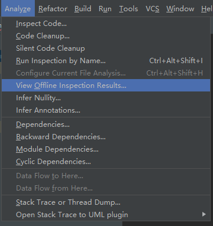
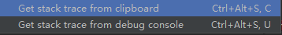

# analyze
> 这个调调是as 自带的代码分析工具

* inspect code   代码检测

* code cleanup 代码清理

* silent code cleanup 代码清理

* run inspection by name  通过名称运行一些功能

* configure current file analysis

* view offlien inspection results

* infer nullity

* infer annotations 

* dependencies

* backward dependencies

* module dependencies

* cyclic dependencies

* data flow to  here

* data flow  form here

* stack trace or thread dump 

* open stack trace to uml plugin 

  

  * get stack trace form clipboard 
  * get stack trace form debug console

## inspect code

> 代码检测，可以检测这个module或者project。感觉比findBug 和阿里编码规范更好用。这个调调会扫描已有的代码，不会扫描到maven或者jar 里面去。

 以 Android 开头的组，例如

· Android > Lint > Correctness (可能影响程序正确性)

· Android > Lint > Performance (可能影响程序性能)

· Android > Lint > Security (可能影响程序安全性)

· 等等

· Class structure 组：指出类的设计上可能存在的问题

· Code style issues 组：有助于提供代码书写规范

· Probable bugs 组：有助于发现隐藏的问题

## code cleanup 

> 代码清理 

## silent code cleanup

> 应该也是代码清理

## run inspection by name

### 检测未被使用的资源文件
* analyze ->run inspection by name ->输入 unused resources
### 检测未被使用的class及其函数
* analyze ->run inspection by name ->输入 unused declaration