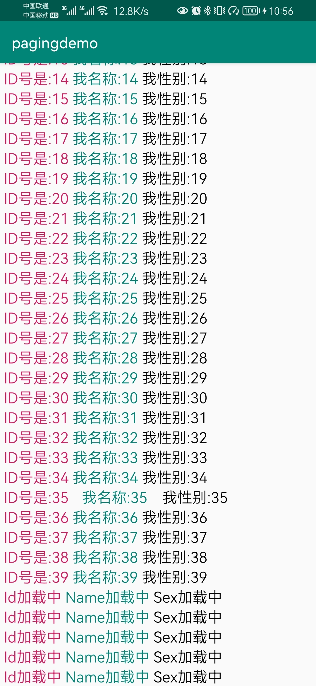

## 前言
这个通常和recyclerView 一起使用，recyclerView 的adapter天然支持这个玩意。文档上说的是按需载入部分数据会减少网络带宽和系统资源的使用量。
使用场景：列表数据或者列表界面样式。
# 正文
paging的3大组件。
* dataSource 数据源，获取数据需要通过他去实现。
* pagedList 数据源获取到数据最终靠pageList来承载。他是一页数据的集合，每请求一页数据，就是一个新的对象。
* pagedListAdapter。recyclerView 的adapter.
## 数据源
数据源：因为我们有些列表的数据是一次性拉取下来的，有的支持分页。
* 单点源：positionalDataSource: 是指一次获取出来所有的数据，当数据源里面数据有更改的时候，观察者自动更新。
* 连续源：contiguousDataSource: 连续源是我们分页加载，当下滑到一定的位置的时候，就自动获取新的一页数据。

### 单点源

#### positionalDataSource

这种模式下，需要优先知道能够加载的数据的多少，比如一个列表和服务器协商后，最多50条，或者加载本地数据库里面的数据。
他的前置条件就焊死了，需要知道有多少数据。
> 这里有一个问题，如果说，他要10条，你没有给满10条，就会报错。
> 如果不返回数据，那么就有几条占位的数据。

#### 代码示例

通常流程是：

* 找一个类继承于positionalDataSource
  * 在loadInitial 中对于LoadInitialCallback 设置当前第一页的数据，并且设置最大的长度 
  * 在loadRange 请求剩下的数据，并且控制返回回调
* 新建一个类继承于DataSource.Factory。实现create，并且返回positionalDataSource
* 基于 LivePagedListBuilder生成一个LiveData 
* 在界面中监听liveData 
* 新建一个adapter 继承于PagedListAdapter
  * 绑定数据
  * 设置diff刷新对象 

通过上述流程我们知道，我们其实是没有对于数据请求进行管理的，而paddding 便是帮助我们处理了这个流程。还有一个问题便是，我们如何处理刷新和loading 样式与交互。

##### positionalDataSource

````
public class StudentDataSource extends PositionalDataSource<Student> {

    /**
     * 同学们可以理解是加载第一页数据的时候，会执行此函数来完成
     * 加载初始化数据，可以这么来理解，加载的是第一页的数据。
     * 形象的说，当我们第一次打开页面，需要回调此方法来获取数据。
     * @param params
     * @param callback
     */
    @Override
    public void loadInitial(@NonNull LoadInitialParams params, @NonNull LoadInitialCallback<Student> callback) {
        // @1 数据源     @2 位置     @3 总大小
        Log.i("test", "loadInitial: "+new Gson().toJson(params));
        callback.onResult(getStudents(0, Flag.SIZE), 0, 45);
    }

    /**
     * 当有了初始化数据之后，滑动的时候如果需要加载数据的话，会调用此方法。
     * @param params
     * @param callback
     */
    @Override
    public void loadRange(@NonNull LoadRangeParams params, @NonNull LoadRangeCallback<Student> callback) {


        Log.i("test","数据加载..."+params.startPosition+"------"+params.loadSize+" "+new Gson().toJson(params));
        // @1 从哪里开始加载(位置 内部算的)     @2 size(size 内部算的)
        if (params.startPosition>=40){
            // 如果这里没有返回，就会出现数据占位的item样式 
        }else {
            callback.onResult(getStudents(params.startPosition, params.loadSize));
        }

    }

    /**
     * 这里可以理解这里是数据源，数据的来源（数据库，文件，网络服务器响应  等等）
     * 模拟的API调用
     *
     * @param startPosition
     * @param pageSize
     * @return
     */
    private List<Student> getStudents(int startPosition, int pageSize) {
        List<Student> list = new ArrayList<>();
        for (int i = startPosition; i < startPosition + pageSize; i++) {
            Student student = new Student();
            student.setId("ID号是:" + i);
            student.setName("我名称:" + i);
            student.setSex("我性别:" + i);
            list.add(student);
        }
        return list;
    }
}

````



我们上面判断了大于等于40就没有返回，所以就有5条占位数据。

##### DataSource.Factory

```
public class StudentDataSourceFactory extends DataSource.Factory<Integer, Student> {

    @NonNull
    @Override
    public DataSource<Integer, Student> create() {
        StudentDataSource studentDataSource = new StudentDataSource();
        return studentDataSource;
    }
}
```

##### ViewModel

```
public class StudentViewModel extends ViewModel {

    // 看源码：@1 listLiveData 数据怎么来的
    private final LiveData<PagedList<Student>> listLiveData;

    public StudentViewModel() {
        StudentDataSourceFactory factory = new StudentDataSourceFactory();
        // 初始化 ViewModel,如何生产一页数据出来给我！
        this.listLiveData = new LivePagedListBuilder<Integer, Student>(factory, Flag.SIZE)
                .setBoundaryCallback(new MyBoundaryCallback())
                .build();
    }

    // TODO 暴露数据出去
    public LiveData<PagedList<Student>> getListLiveData() {
        return listLiveData;
    }
}
```


### 连续源的几种表现形式

这主要是分页的加载逻辑有关。不同的分页请求方式，对应不同的分页写法。

#### itemKeyedDataSource

这种模式下，他数据的请求依托于一个对象的id什么的。比如无限级树和当前评论的评论列表什么的。流程上还是：

* 新建一个类，继承于ItemKeyedDataSource 
  * 需要确定 key 的类型，和当前请求的数据的模型
  * 实现方法：loadInitial。第一次请求会调用这个。
  * 实现方法：getKey  调用的时候，会传递一个数据模型进来。
  * 实现方法：loadBefore  会调用一次getKey
  * 实现方法：loadAfter 会调用一次getKey

这种可以作为 positionalDataSource 不知道长度的变种形式。

#### pageKeyedDataSource

