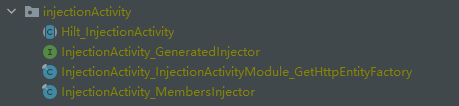
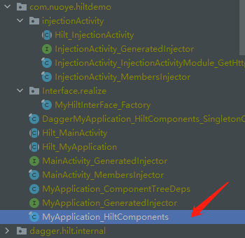

# 前言

Hilt 是 Android 的依赖项注入库，可减少在项目中执行手动依赖项注入的样板代码。执行[手动依赖项注入](https://developer.android.com/training/dependency-injection/manual) 要求您手动构造每个类及其依赖项，并借助容器重复使用和管理依赖项。

Hilt 通过为项目中的每个 Android 类提供容器并自动管理其生命周期，提供了一种在应用中使用 DI（依赖项注入）的标准方法。Hilt 在热门 DI 库 [Dagger](https://developer.android.com/training/dependency-injection/dagger-basics)  的基础上构建而成，因而能够受益于 Dagger 的编译时正确性、运行时性能、可伸缩性和 [Android Studio 支持](https://medium.com/androiddevelopers/dagger-navigation-support-in-android-studio-49aa5d149ec9)。如需了解详情，请参阅 [Hilt 和 Dagger](https://developer.android.com/training/dependency-injection/hilt-android#hilt-and-dagger)。同时Hilt支持注入接口的实现。

我们在使用dagger 的时候，需要写很多component，同时处理多个component注入到同一类中的情况，而hilt减少了我们对于component的使用，同时也规避了处理component注入到同一个类中的情况，在使用过程中，我只需要关心module的创建及其使用位置即可，但是这个是有一个使用前提的，那就是在注入以下的类中才不用我们自己写component。

## 资料

* [android 依赖注入](https://developer.android.com/training/dependency-injection)
* [依赖注入-维基百科](https://en.wikipedia.org/wiki/Dependency_injection)
* [google hilt-android](https://developer.android.com/training/dependency-injection/hilt-android)
* [将 Hilt 和其他 Jetpack 库一起使用 ](https://developer.android.com/training/dependency-injection/hilt-jetpack)
* [dagger2 github 地址](https://github.com/google/dagger)
* [dagger2 文档](https://dagger.dev/dev-guide/)  

### 导包

```java
// 导入插件
classpath 'com.google.dagger:hilt-android-gradle-plugin:2.38.1'
// 使用插件
plugins {
  id 'kotlin-kapt'
  id 'dagger.hilt.android.plugin'
}
// 导入包
dependencies {
    implementation "com.google.dagger:hilt-android:2.38.1"
    kapt "com.google.dagger:hilt-compiler:2.38.1"
}
```

# 正文

## 隔离层设计

主要是防止APP 直接调用某些可能发生变化的提供者，然后通过某些手段去中转一次，用于实现使用者不关系具体实现的逻辑。

隔离层的设计的实现方案：

* 代理模式（静态代理+动态代理）
  * 比较轻量，耦合度较高
* Hilt注入
  * 使用第3方框架，比较重，耦合度高。
  * hint 一般使用在APP中，对于提供给第3方使用的内容，一般不使用hint 
* SPI机制 
  * 标准的0耦合机制，内存性能和上面两种更高 

## hint 的使用

Hilt 是 Android 的依赖项注入库，可减少在项目中执行手动依赖项注入的样板代码。执行[手动依赖项注入](https://developer.android.com/training/dependency-injection/manual) 要求您手动构造每个类及其依赖项，并借助容器重复使用和管理依赖项。

Hilt 通过为项目中的每个 Android 类提供容器并自动管理其生命周期，提供了一种在应用中使用 DI（依赖项注入）的标准方法。Hilt 在热门 DI 库 [Dagger](https://developer.android.com/training/dependency-injection/dagger-basics)  的基础上构建而成，因而能够受益于 Dagger 的编译时正确性、运行时性能、可伸缩性和 [Android Studio 支持](https://medium.com/androiddevelopers/dagger-navigation-support-in-android-studio-49aa5d149ec9)。如需了解详情，请参阅 [Hilt 和 Dagger](https://developer.android.com/training/dependency-injection/hilt-android#hilt-and-dagger)。同时Hilt支持注入接口的实现。

我们在使用dagger 的时候，需要写很多component，同时处理多个component注入到同一类中的情况，而hilt减少了我们对于component的使用，同时也规避了处理component注入到同一个类中的情况，在使用过程中，我只需要关心module的创建及其使用位置即可，但是这个是有一个使用前提的，那就是在注入以下的类中才不用我们自己写component：

Hilt 目前支持以下 Android 类：

- `Application`（通过使用 `@HiltAndroidApp`）
- `ViewModel`（通过使用 `@HiltViewModel`）
- `Activity`
- `Fragment`
- `View`
- `Service`
- `BroadcastReceiver`

如果需要注入到非这些类中的时候，就需要自己写component了。

 ### 导包

#### 根目录下的build.gradle 添加 classPath

````
classpath 'com.google.dagger:hilt-android-gradle-plugin:2.38.1'
````

#### module的build.gradle 添加插件

````
plugins {
    id 'dagger.hilt.android.plugin'
}
````

#### 导入hint 包和annotationProcessor

```
implementation "com.google.dagger:hilt-android:2.38.1"
annotationProcessor "com.google.dagger:hilt-compiler:2.38.1"
```

如果使用了kotlin的话，需要使用kapt 替代annotationProcessor,同时导入kapt:id 'kotlin-kapt'

### hilt初始化

hint 的使用需要在項目的Application 中添加注解：

```java
@HiltAndroidApp
public class MyApplication extends Application {
}
```

因为hilt帮我们处理了component，所以这个@HiltAndroidApp 这个注解就非常重要，比如要有，hilt需要通过这个注解帮我们去生成了对应的component 相关的代码。

**需要注意的是下面代码中对于HttpEntity 都是默认存在于不同的包中，同一个对象需要注入到不同的类中需要特殊处理一下。**

### hilt 的使用

使用dagger的时候，我们知道逻辑意义上，可以注入到任何class中。在Android上，部分支持的类可以不自己写component。Hilt 目前支持以下 Android 类：

- `Application`（通过使用 `@HiltAndroidApp`）
- `ViewModel`（通过使用 `@HiltViewModel`）
- `Activity`
- `Fragment`
- `View`
- `Service`
- `BroadcastReceiver`

如果您使用 `@AndroidEntryPoint` 为某个 Android 类添加注释，则还必须为依赖于该类的 Android 类添加注释。例如，如果您为某个 fragment 添加注解，则还必须为使用该 fragment 的所有 activity 添加注解。

**注意**：在 Hilt 对 Android 类的支持方面适用以下几项例外情况：Hilt 仅支持扩展 [`ComponentActivity`](https://developer.android.com/reference/kotlin/androidx/activity/ComponentActivity) 的 activity，如 [`AppCompatActivity`](https://developer.android.com/reference/kotlin/androidx/appcompat/app/AppCompatActivity)。Hilt 仅支持扩展 `androidx.Fragment` 的 Fragment。Hilt 不支持保留的 fragment。

所以我们需要某个注解去标记生成上面那些类型的component，hilt提供的注解就是：@InstallIn 

@InstallIn 常见的值

* ActivityComponent。用于标记使用在activity上。
* ActivityRetainedComponent 
* FragmentComponent
* ServiceComponent
* ViewComponent
* ViewModelComponent
* ViewWithFragmentComponent

在dagger 的使用过程中，我们的注入class 也是在component中实现的，hilt减少了我们写component的过程，那么我们就需要提供一个标记去让dagger知道要注入的class的位置。而hilt提供的注解就是：@AndroidEntryPoint  这个注解用于标记注入的位置。标记在主要注入的class上。

#### activity 中的简单使用

示例代码：

```
@AndroidEntryPoint
public class InjectionActivity extends AppCompatActivity {

    @Inject HttpEntity entity1;
    @Inject HttpEntity entity2;

    @Override
    protected void onCreate(Bundle savedInstanceState) {
        super.onCreate(savedInstanceState);
        setContentView(R.layout.activity_injection);
        Log.e(TAG, "onCreate: "+entity1.hashCode() );
        Log.e(TAG, "onCreate: "+entity2.hashCode() );
    }
    @InstallIn({ActivityComponent.class})
    @Module
    public static class InjectionActivityModule{

        @Provides
        HttpEntity getHttpEntity(){
           return new HttpEntity();
        }
    }
}
```

可以看到，我们没有在activity中没有像使用dagger 一样写初始化代码，也没有写component相关的代码。结合使用dagger的经验，我们从生成的文件入手。生成的文件位置：**生成的class 在build-generated-（ap-generated-sourecs)-(bulidType)-out-包名 目录下** 



emmmm？怎么和dagger2 生成的东西感觉不一样，dagger 只会生成3个文件啊。比如像这个样子：


虽然没看到component，但是看到了Factory和两个injector和一个Hilt_injectionActivity。

起码Factory 就很熟悉。

```
public final class InjectionActivity_InjectionActivityModule_GetHttpEntityFactory implements Factory<HttpEntity> {
  private final InjectionActivity.InjectionActivityModule module;

  public InjectionActivity_InjectionActivityModule_GetHttpEntityFactory(
      InjectionActivity.InjectionActivityModule module) {
    this.module = module;
  }

  @Override
  public HttpEntity get() {
    return getHttpEntity(module);
  }

  public static InjectionActivity_InjectionActivityModule_GetHttpEntityFactory create(
      InjectionActivity.InjectionActivityModule module) {
    return new InjectionActivity_InjectionActivityModule_GetHttpEntityFactory(module);
  }

  public static HttpEntity getHttpEntity(InjectionActivity.InjectionActivityModule instance) {
    return Preconditions.checkNotNullFromProvides(instance.getHttpEntity());
  }
}
```

这很熟悉，和dagger2生成的factory几乎一模一样，Injector除了帮我们定义了一个dagger 的注册接口以外，

```
@OriginatingElement(
    topLevelClass = InjectionActivity.class
)
@GeneratedEntryPoint
@InstallIn(ActivityComponent.class)
public interface InjectionActivity_GeneratedInjector {
  void injectInjectionActivity(InjectionActivity injectionActivity);
}
```

生成的文件也一模一样。

```
public final class InjectionActivity_MembersInjector implements MembersInjector<InjectionActivity> {
  private final Provider<HttpEntity> entity1Provider;

  private final Provider<HttpEntity> entity2Provider;

  public InjectionActivity_MembersInjector(Provider<HttpEntity> entity1Provider,
      Provider<HttpEntity> entity2Provider) {
    this.entity1Provider = entity1Provider;
    this.entity2Provider = entity2Provider;
  }

  public static MembersInjector<InjectionActivity> create(Provider<HttpEntity> entity1Provider,
      Provider<HttpEntity> entity2Provider) {
    return new InjectionActivity_MembersInjector(entity1Provider, entity2Provider);
  }

  @Override
  public void injectMembers(InjectionActivity instance) {
    injectEntity1(instance, entity1Provider.get());
    injectEntity2(instance, entity2Provider.get());
  }

  @InjectedFieldSignature("com.nuoye.hiltdemo.injectionActivity.InjectionActivity.entity1")
  public static void injectEntity1(InjectionActivity instance, HttpEntity entity1) {
    instance.entity1 = entity1;
  }

  @InjectedFieldSignature("com.nuoye.hiltdemo.injectionActivity.InjectionActivity.entity2")
  public static void injectEntity2(InjectionActivity instance, HttpEntity entity2) {
    instance.entity2 = entity2;
  }
}
```

那么就剩下最后一个Hilt_InjectionActivity了。

```
abstract class Hilt_InjectionActivity extends AppCompatActivity implements GeneratedComponentManagerHolder {
  private volatile ActivityComponentManager componentManager;

  private final Object componentManagerLock = new Object();

  private boolean injected = false;

  Hilt_InjectionActivity() {
    super();
    _initHiltInternal();
  }

  Hilt_InjectionActivity(int arg0) {
    super(arg0);
    _initHiltInternal();
  }

  private void _initHiltInternal() {
    addOnContextAvailableListener(new OnContextAvailableListener() {
      @Override
      public void onContextAvailable(Context context) {
        inject();
      }
    });
  }

  @Override
  public final Object generatedComponent() {
    return this.componentManager().generatedComponent();
  }

  protected ActivityComponentManager createComponentManager() {
    return new ActivityComponentManager(this);
  }

  @Override
  public final ActivityComponentManager componentManager() {
    if (componentManager == null) {
      synchronized (componentManagerLock) {
        if (componentManager == null) {
          componentManager = createComponentManager();
        }
      }
    }
    return componentManager;
  }

  protected void inject() {
    if (!injected) {
      injected = true;
      ((InjectionActivity_GeneratedInjector) this.generatedComponent()).injectInjectionActivity(UnsafeCasts.<InjectionActivity>unsafeCast(this));
    }
  }

  @Override
  public ViewModelProvider.Factory getDefaultViewModelProviderFactory() {
    return DefaultViewModelFactories.getActivityFactory(this, super.getDefaultViewModelProviderFactory());
  }
}
```

在尝试解读这个class之前，我们需要回顾一下component生成文件主要的功能是什么？

* 传入需要注入的class，然后把值赋值到注入的class中。
* 链接了我们自定义的module和生成的Factory

那么我们只需要在找到调用上面这两个class的位置就找到了对应的component。



通过对于函数的调用关系，可以发现他生成在MyApplication_HiltComponents 文件的内部类中了，所以dagger2 的component也找到了，那么还有一个问题，他生成的Hilt_InjectionActivity 的父类是AppCompatActivity，我们自己写的activity的父类也是AppCompatActivity。而且我们hilt注入的初始化全在Hilt_InjectionActivity  中实现的和调用的，那么一定是有什么地方去改变了我们class的父类。

dagger2的实现是通过注解处理器的实现的，hilt是dagger2的Android优化版本。但是我们使用hilt的使用需要导入一个gradle插件

````
classpath 'com.google.dagger:hilt-android-gradle-plugin:2.38.1'
````

那么我就可以继续往编译层找下去，我们在**\build\intermediates\transforms**目录下看到了我们的class。

```
@AndroidEntryPoint
public class InjectionActivity extends Hilt_InjectionActivity {
    @Inject
    HttpEntity entity1;
    @Inject
    HttpEntity entity2;

    public InjectionActivity() {
    }

    protected void onCreate(Bundle savedInstanceState) {
        super.onCreate(savedInstanceState);
        this.setContentView(2131427356);
        Log.e("hilt:", "onCreate: " + this.entity1.hashCode());
        Log.e("hilt:", "onCreate: " + this.entity2.hashCode());
    }

    @Module
    @InstallIn({ActivityComponent.class})
    public static class InjectionActivityModule {
        public InjectionActivityModule() {
        }

        @Provides
        HttpEntity getHttpEntity() {
            return new HttpEntity();
        }
    }
}
```

emmmm？他将我们的class的父类替换掉了。

#### fragment中使用

需要在显示的fragment中添加 @AndroidEntryPoint注解。

```
@AndroidEntryPoint
public class InjectionFragmentActivity extends AppCompatActivity {}
```

```
@AndroidEntryPoint
public class InjectionFragment extends Fragment {

  @Inject HttpEntity entity;
  @Inject HttpEntity entity1;

    public InjectionFragment() {

    }
    
    @Override
    public View onCreateView(LayoutInflater inflater, ViewGroup container,
                             Bundle savedInstanceState) {
        return inflater.inflate(R.layout.fragment_injection, container, false);
    }

    @Override
    public void onViewCreated(@NonNull @NotNull View view, @Nullable @org.jetbrains.annotations.Nullable Bundle savedInstanceState) {
        super.onViewCreated(view, savedInstanceState);
        Log.e(TAG, "onViewCreated: "+entity.hashCode() );
        Log.e(TAG, "onViewCreated: "+entity1.hashCode() );
    }

    @InstallIn({FragmentComponent.class})
    @Module
    public static class InjectionModule{
        @Provides
        HttpEntity getHttpEntity(){
            return new HttpEntity();
        }
    }
}
```

注意点：

* 使用的activity中需要 添加@AndroidEntryPoint 注解

#### view 中使用

```
@InstallIn(ViewComponent.class)
@Module
public class MyViewShowModule {

    @Provides
    public MyViewShow getShow() {
        return new MyViewShow("QQQQQ");
    }
}
```

注意点：

* 使用的activity中需要 添加@AndroidEntryPoint 注解

#### viewModel 中使用

想上面几个一样，在viewModel 中标记：@AndroidEntryPoint，编译的时候

````
 @AndroidEntryPoint base class must extend ComponentActivity, (support) Fragment, View, Service, or BroadcastReceiver.
````

通过仔细阅读文档的时候发现，ViewModel 需要使用 @HiltViewModel注解，同时HiltViewModelclass的注释上详细描述了viewModel 的使用方式。

代码示例：

```
@HiltViewModel
public class InjectionViewModule extends ViewModel {
    @Inject HttpEntity entity;
    @Inject HttpEntity entity1;

    @Inject
    public InjectionViewModule(){

    }
    @InstallIn({ViewModelComponent.class})
    @Module
    public static class InjectionModule{
        @Provides
        HttpEntity getHttpEntity(){
            return new HttpEntity();
        }
    }
}

@AndroidEntryPoint
public class InjectionViewModuleActivity extends AppCompatActivity {

    @Override
    protected void onCreate(Bundle savedInstanceState) {
        super.onCreate(savedInstanceState);
        setContentView(R.layout.activity_injection_view_module);
        InjectionViewModule module= new ViewModelProvider(this).get(InjectionViewModule.class);
        Log.e(TAG, "onCreate: "+module.entity.hashCode() );
        Log.e(TAG, "onCreate: "+module.entity1.hashCode() );
    }
}

```

注意点：

* activity需要使用@AndroidEntryPoint
* viewModel 需要标记@HiltViewModel
* viewModel 的构造函数需要使用@Inject 标记
* module 需要使用 @InstallIn({ViewModelComponent.class}) 
* viewModel 的获取需要使用 new ViewModelProvider(this).get(InjectionViewModule.class); 

#### class 生命周期单例和全局单例

在dagger 中，我们使用@Singleton标记需要生命周期内单例，而单例的实现是注解处理器生成了对应的class实现了对应的效果，既然单例的声明周期全靠生成的代码决定，所以在hint 中对于class 类的单例和全局单例做了处理。对于class 内部单例有生命周期的class 会自动调用对应的声明周期去销毁。所以不同的生命周期的单例注解不一样。目前提供以下用于标记生命周期的注解：

* ActivityRetainedScoped
* ActivityScoped
* FragmentScoped
* ServiceScoped
* ViewModelScoped
* ViewScoped 

### 注入的时机与生命周期

| Generated component         | Created at               | Destroyed at            |
| :-------------------------- | :----------------------- | :---------------------- |
| `SingletonComponent`        | `Application#onCreate()` | `Application` destroyed |
| `ActivityRetainedComponent` | `Activity#onCreate()`    | `Activity#onDestroy()`  |
| `ViewModelComponent`        | `ViewModel` created      | `ViewModel` destroyed   |
| `ActivityComponent`         | `Activity#onCreate()`    | `Activity#onDestroy()`  |
| `FragmentComponent`         | `Fragment#onAttach()`    | `Fragment#onDestroy()`  |
| `ViewComponent`             | `View#super()`           | `View` destroyed        |
| `ViewWithFragmentComponent` | `View#super()`           | `View` destroyed        |
| `ServiceComponent`          | `Service#onCreate()`     | `Service#onDestroy()`   |

### 同一个class注入到不同的class中


### hilt接口注入

我们对于某些功能进行抽离的时候，往往需要抽离出一个接口，然后提供不同的实现。而hilt 就可以直接将实现类注入进去，减少了我们使用设计模式的情景。@binds 。

#### 代码示例

```
// 定于的接口
public interface HiltInterFace {
    void run();
}
// 接口的实现 
public class MyHiltInterFace implements HiltInterFace {
    @Inject
    public MyHiltInterFace() {
    }

    @Override
    public void run() {
        Log.e(MyHiltInterFace.class.getName(), "run: " );
    }
}
// module 的定义
@InstallIn(ActivityComponent.class)
@Module
public abstract class MyHiltModule {
    @Binds
    public abstract HiltInterFace bindHiltInterFace(MyHiltInterFace face);
}
// 使用
@AndroidEntryPoint
public class MainActivity extends AppCompatActivity {
    @Inject
    HiltInterFace face;
    @Override
    protected void onCreate(Bundle savedInstanceState) {
        super.onCreate(savedInstanceState);
        setContentView(R.layout.activity_main);
        face.run();

    }
}

```

通过对比可以知道，这个和对象的注入差不多，不同的地方在于接口的实现类的构造函数上添加了注解：

```
@Inject
public MyHiltInterFace() {
}
```

同时在module中的函数注解由providers变成了binds,同时通过函数的入参提供了实现类的对象。当然了整个的class 也是abstract。

```
@Binds
public abstract HiltInterFace bindHiltInterFace(MyHiltInterFace face);
```

因为标记了构造函数，所以实现类就无法实现通过构造函数传入变量了，而hilt 提供了@ApplicationContext和ActivityContext提供上下文。

#### 一个接口多个实现类

