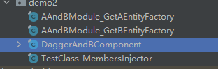

# 前言

Hint 使用的是dagger2实现。主要是用于IOC注入：
IOC注入是将原来由程序代码中主动获取的资源转变为由第三方获取，并使原来主动的代码转换为被动接收的方式，以达到解耦的效果。称为控制反转。
dagger2 是Google 提供的dagger的2.0 以上版本。，
## 资料
* [dagger2](https://github.com/google/dagger)
* [dagger2 文档](https://dagger.dev/dev-guide/)  
* [神兵利器Dagger2一站式全解（详细总结）](https://blog.csdn.net/valada/article/details/106225715)
* 导包:
````html
 implementation 'com.google.dagger:dagger:2.4'
    annotationProcessor 'com.google.dagger:dagger-compiler:2.4'
````
# 正文
* 注入的位置不能用多态。
* 默认对象是不是同一个，为了使得对象使用同一个，而不使用单例可以使用 @singleton 
* 通过@singleton 的单例是有生命周期的，绑定到那个class就和当前生命周期绑定。如果要app 单例就将component 做成单例去注入。同时因为doubleCheck的get函数的原因，所以说线程安全。
## 简单使用
IOC注入是将原来由程序代码中主动获取的资源转变为由第三方获取，并使原来主动的代码转换为被动接收的方式，以达到解耦的效果。称为控制反转。
<br>
通过上述的这句话，我们可以知道，dagger2是用于提供对象的，通常而言，我们的JAVA 对象通过工厂，反射，单例，代理，直接通过构造函数进行创建，但是存在耦合性的问题。
通过工厂模式则可以降低耦合，但是需要写工厂模式的相关代码，同时调用的时候是主动触发获取。是否能够出现一种解决方案可以满足下列条件:
* 我只需要声明我要什么？
* 我不想关心对象怎么来的？
* 我不想去创建或者主动调用对象的生成  
* 我这个对象一个class或者整个什么周期只会存在一个或是少量几个。

我们将需求分析一下，只需要申明那需要注解，不关心对象怎么来的可以调用工厂，不想去创建，我可以生成对应的代码主动给你，前提是你总得调用我的代码吧，和databinding 或者viewbinding类似，域内唯一可以参考viewModel。
当然了dagger比databinding或者viewbinding更早。基于这个逻辑，dagger 便出现了。
dagger 将上述的需求分为以下几个角色:
* 用于标记赋值的变量：@inject
* 用于提供对象@module
* 用于生成工厂的代码 @providers  
* 用于生成主动赋值的代码 @Component
* 用于标记生命周期内部的单例 @singleton
### 代码示例
比如，我MainActivity.claas 中需要通过dagger自动完成HttpObject 的赋值，那么我们需要先定义一个HttpObject的claas
#### 定义HttpObject 的class
````html
public class HttpObject {
}

````
#### 在MainActivity中使用赋值标记@inject
````html
public class MainActivity extends AppCompatActivity {

    @Inject
    HttpObject httpObject;
}
````
#### 创建一个类用于提供HttpObject @Module和 @Provides
````html
@Module
public class HttpModule {
    @Provides
    public HttpObject providerHttpObject(){
        //todo 处理逻辑。
        return new HttpObject();
    }
}
````
#### 注册赋值类的生成标记
````html

@Component(modules = {HttpModule.class})
public interface HttpComponent {
//注入的位置就写在参数上        不能用多态
void injectMainActivity(MainActivity mainActivity);
}
````
### 生成的文件解析
> 我android stuido 默认使用的jdk 版本不是java 8所以运行annotationProcessor的时候出现了一个异常。
> Unable to load class ‘javax.annotation.Generated‘.主要的解决思路就是：切换jdk 版本到1.8 <br>
> file->project structure -> sdk location -> jdk location 切换，部分as 版本 可能不一致。

通过上面的的简单的示例代码，我们直接编译，如果成功的化，就可以生成对应的claas了，编译成功尤其重要，因为我们需要调用编译成功的class 去注册。类似于viewbinding 一样。
#### module和provider
我们上面定义class的时候，module 标记在了class 上。Provides标记在了函数上。所以这两个注解生成的class也是同一个。
````html
public final class HttpModule_ProviderHttpObjectFactory implements Factory<HttpObject> {
  private final HttpModule module;

  public HttpModule_ProviderHttpObjectFactory(HttpModule module) {
    assert module != null;
    this.module = module;
  }

  @Override
  public HttpObject get() {
    return Preconditions.checkNotNull(
        module.providerHttpObject(), "Cannot return null from a non-@Nullable @Provides method");
  }

  public static Factory<HttpObject> create(HttpModule module) {
    return new HttpModule_ProviderHttpObjectFactory(module);
  }
}
````
这上面的代码意思就很简单，将我们定义的 HttpModule 对象丢在一个工厂里面，这个工厂提供了一个get函数用于返回HttpModule.providerHttpObject() 返回的参数。
所以，所以我们需要知道HttpModule 在什么情况下被创建出来的。从我们自己写的代码逻辑上看，唯一和HttpModule有关系的是，我们定义 HttpComponent 的时候，在注解中使用了HttpModule，所以，HttpModule是否是在HttpComponent的生成
class 中使用了。
#### Component
```html
public final class DaggerHttpComponent implements HttpComponent {
  private Provider<HttpObject> providerHttpObjectProvider;

  private MembersInjector<MainActivity> mainActivityMembersInjector;

  private DaggerHttpComponent(Builder builder) {
    assert builder != null;
    initialize(builder);
  }

  public static Builder builder() {
    return new Builder();
  }

  public static HttpComponent create() {
    return builder().build();
  }

  @SuppressWarnings("unchecked")
  private void initialize(final Builder builder) {

    this.providerHttpObjectProvider =
        HttpModule_ProviderHttpObjectFactory.create(builder.httpModule);

    this.mainActivityMembersInjector =
        MainActivity_MembersInjector.create(providerHttpObjectProvider);
  }

  @Override
  public void injectMainActivity(MainActivity mainActivity) {
    mainActivityMembersInjector.injectMembers(mainActivity);
  }

  public static final class Builder {
    private HttpModule httpModule;

    private Builder() {}

    public HttpComponent build() {
      if (httpModule == null) {
        this.httpModule = new HttpModule();
      }
      return new DaggerHttpComponent(this);
    }

    public Builder httpModule(HttpModule httpModule) {
      this.httpModule = Preconditions.checkNotNull(httpModule);
      return this;
    }
  }
}
```
通过上面生成的代码，我们可以将功能分为两个部分，1部分是Builder去创建对象，一部分是注册函数。
在Builder 中我们可以看到 如果外部没有传入一个HttpModule的时候，就会通过无参构造函数创建一个，所以默认的生成的对象中在module 对象没有被共享的时候，生成的对象是不一样的。
这个就可以回答上面的问题“HttpModule是如何创建出来的”。<br>
我们继续看注册函数，主要是下面两个函数：
```html
  private void initialize(final Builder builder) {

    this.providerHttpObjectProvider =
        HttpModule_ProviderHttpObjectFactory.create(builder.httpModule);

    this.mainActivityMembersInjector =
        MainActivity_MembersInjector.create(providerHttpObjectProvider);
  }

  @Override
  public void injectMainActivity(MainActivity mainActivity) {
    mainActivityMembersInjector.injectMembers(mainActivity);
  }

```
在创建DaggerHttpComponent的时候，会创建HttpModule_ProviderHttpObjectFactory的对象并且传入了HttpModule,和创建MainActivity_MembersInjector的对象并且传入了HttpModule_ProviderHttpObjectFactory的对象。
<br> 在injectMainActivity 函数中要求传入一个MainActivity去调用MainActivity_MembersInjector的injectMembers函数，那么injectMembers 执行了什么呢？
#### @Inject 
我们在需要被动赋值的class 中标记@Inject，而这个class 也会生成一个class
````html

public final class MainActivity_MembersInjector implements MembersInjector<MainActivity> {
  private final Provider<HttpObject> httpObjectProvider;

  public MainActivity_MembersInjector(Provider<HttpObject> httpObjectProvider) {
    assert httpObjectProvider != null;
    this.httpObjectProvider = httpObjectProvider;
  }

  public static MembersInjector<MainActivity> create(Provider<HttpObject> httpObjectProvider) {
    return new MainActivity_MembersInjector(httpObjectProvider);
  }

  @Override
  public void injectMembers(MainActivity instance) {
    if (instance == null) {
      throw new NullPointerException("Cannot inject members into a null reference");
    }
    instance.httpObject = httpObjectProvider.get();
  }

  public static void injectHttpObject(
      MainActivity instance, Provider<HttpObject> httpObjectProvider) {
    instance.httpObject = httpObjectProvider.get();
  }
}
````
我们通过DaggerHttpComponent的injectMainActivity函数可以知道，他执行调用这个class的injectMembers函数。
这个函数的内部实现也很简单，先判断空，然后将HttpModule_ProviderHttpObjectFactory 的get函数的返回值赋予给instance.httpObject。
### 尝试得出总结
通过上面简单的Demo和生成文件进行分析可以得出以下结论：
* 我们需要在主动调用DaggerHttpComponent去注册一次 然后才能对于标记对象进行赋值。
* 他获取值的时候是 注册的时候就赋值了的。 
* 他允许HttpModule通过外部传入进去。

所以注册函数可以这么写：
```java
 DaggerHttpComponent.create().injectMainActivity(this);
```
还可以这么写：
````java
 DaggerHttpComponent.builder().httpModule(new HttpModule()).build().injectMainActivity(this);
````

类关系图：


## 进阶

通过上面的简单使用，我们对于dagger2 有了一个简单的理解。但是具体的业务开发往往比这种Demo更加复杂。

### 一个module 中返回多个provider

这种情况好像出现的比较常见，但是我在调试的时候，多个component 不能注册到同一个class 里面。

#### 代码示例

````
@Module
public class AAndBModule {
    @Provides
    public AEntity getAEntity(){
        return new AEntity();
    }
    @Provides
    public BEntity getBEntity(){
        return new BEntity();
    }
}

@Component(modules = {AAndBModule.class})
public interface AndBComponent {
    void inject(TestClass testClass);
}

public class TestClass {
    @Inject
    AEntity entity;
    @Inject
    BEntity bEntity;

    public TestClass() {
        //DaggerAndBComponent.create().inject(this);
        DaggerAndBComponent.builder().aAndBModule(new AAndBModule()).build().inject(this);
    }
}
````

通过上面的代码我们可以知道，只有 AAndBModule和简单Demo 发生了改变，他提供了两个provider 函数，其他情况没有啥变化。

#### 生成文件



通过生成的文件进行，我们发现，一个module中定义了多个Provider 就会生成多个Factory。我们知道获取对象都是基于factory 调用get函数，然后调用module中对应的函数的，所以其他生成文件中也将添加传入 多个Factory的方式。

component 改变内容：

````
  private void initialize(final Builder builder) {

    this.getAEntityProvider = AAndBModule_GetAEntityFactory.create(builder.aAndBModule);

    this.getBEntityProvider = AAndBModule_GetBEntityFactory.create(builder.aAndBModule);

    this.testClassMembersInjector =
        TestClass_MembersInjector.create(getAEntityProvider, getBEntityProvider);
  }
````

inject 的构造函数和create 也发生了改变。