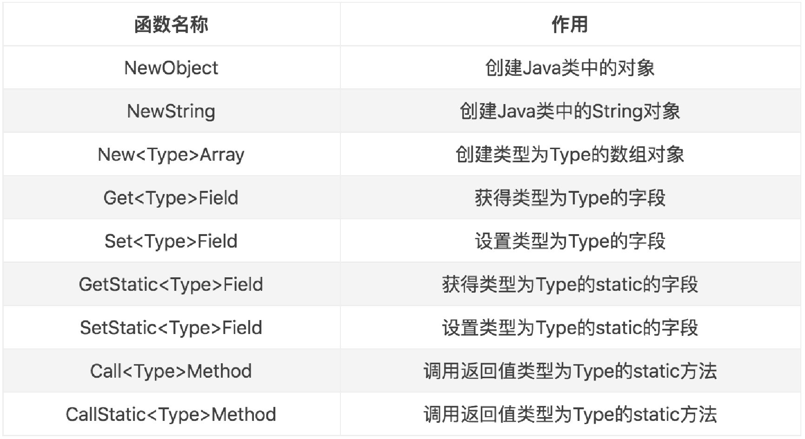
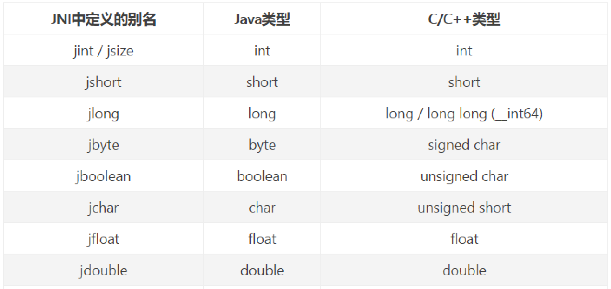
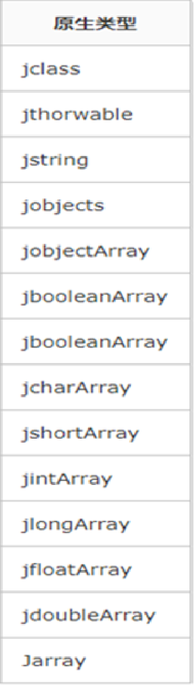
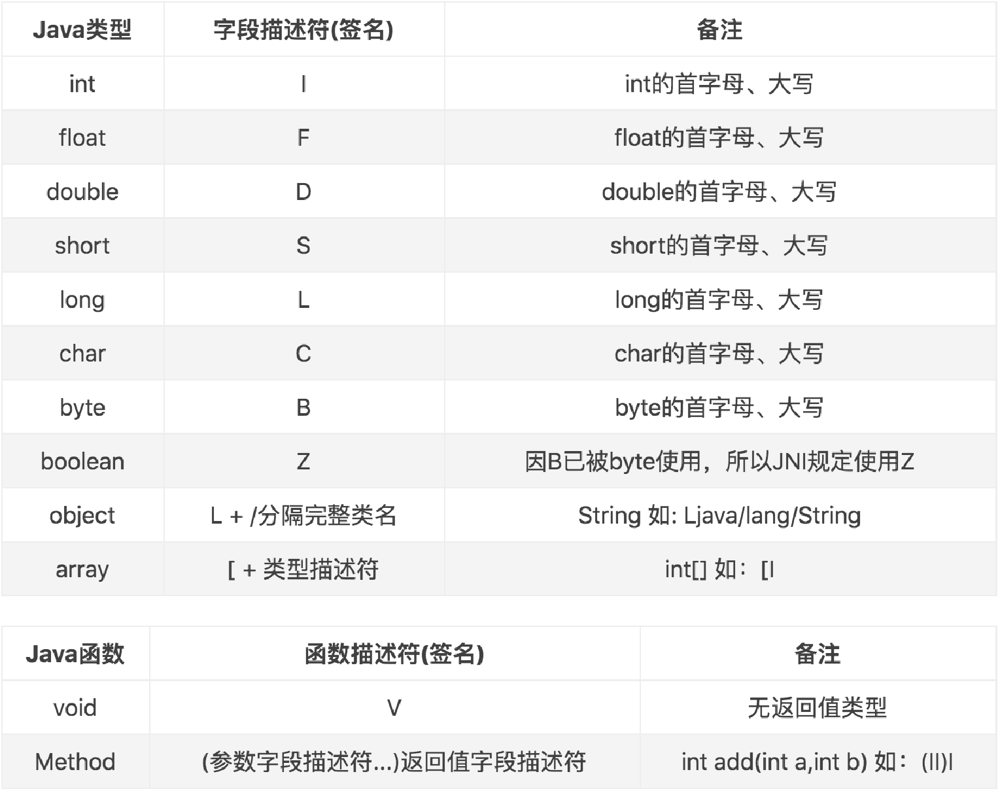

## 资料
* [android NDK工具常用汇总.md](../android NDK工具常用汇总.md)
* [静态注册与动态注册](https://blog.csdn.net/qq_42186263/article/details/114322784)
* [android Cmake详解CmakeLists.txt](https://blog.csdn.net/weixin_42252757/article/details/119317296)
* [JNI官方文档](https://docs.oracle.com/javase/7/docs/technotes/guides/jni/spec/jniTOC.html)
* [JNIEnv 提供功能文档](https://docs.oracle.com/javase/7/docs/technotes/guides/jni/spec/functions.html)
# 正文
## Native工程
### 在build.gradle 
Android 闭包中添加:
````java
externalNativeBuild{
  cmake{
      path file('src/main/cpp/cMakeLists.txt')
      version '3.18.1'  
  }   
}
````
path file 中的文件路径一定要正确。没有的话要创建。<br>

在defaultConfig中添加:
````java
externalNativeBuild{
    cmake{
        cppFlags ‘’   
    }    
}
````
### cMakeLists 内容描述
* cmake_minimum_required(VERSION 3.18.1) :ndk 版本号
* project(“so文件的文件名”)
* add_library(“工程名”,"静态库还是动态库","源文件") 添加源文件 
### .cpp 文件描述

> cpp 是c++ 工程代码，因为c++ 里面可以写C代码。

* JNI是C代码，但是是C++工程，所以需要添加 extern "C"，如果不添加这个调调会出现函数找不到。
* extern "C"{} 可以导入C文件  
* C语言的编译器是gcc，后缀是.c
* C++的编译时G++
* 如果定义native 方法有返回值，但是Native 函数没有返回值，编译不会报错，但是运行会报错。
* C不支持重载，C++ 支持重载(对打包指令函数的更改的基础上的)
* JNIEXPORT 方法宏定义包含两个值，default和hidden，hidden表示方法不可见。
* JNICALL 表示这个方法是JNI函数
* 函数名为：java_包名+class名+方法名 为静态注册。
* JAVA 函数调用Native 函数传值中，传入的是JAVA的地址，需要通过JNI转换后获得。例如：env->GetStringUTFChars(data,0)，0表示不拷贝对象。
* C变量转换为JAVA 变量：env-> newStringUTF()
* C和C++的变量不一样。
* JAVA 不能try catch Native
* C反射几乎接近于直接调用

#### JNIEnv 代表了JAVA环境

JNIEnv 可以对JAVA 对象进行如下操作：

* 创建JAVA 对象
* 调用JAVA对象的方法
* 获取JAVA 对象的属性

常用函数：



#### jclass与jobject

C也可以调用JAVA的代码，原理通过反射。在JNI定义的函数中，会存在两个固定入参：(JNIEnv * env,jobject thiz)获取(JNIEnv * env,jclass thiz),第2个入参是jobject还是jclass是合JNI函数类型有关，如果说静态函数
则是jclass。









下列代码是反射：text 变量，然后改变其值。

````
jclaas activityClass=env->getObjectClass(thiz);
//入参 claas,变量名，方法签名
jfieldID idText=env->GetFileID(activityClass,"text","Ljava/lang/String;");
env->SetObjectFile(thiz,idText,"navtive 层修改")
````

#### 引用JAVA 对象

通常而言，JAVA对象和Native 对象之间通过复制传递，原因是JAVA 对象传递到Native层是内存引用，Native 内存无法直接使用JAVA 内存，所以需要通过JNIEnv 复制一个出来，同时JVM需要跟踪这个对象，防止被GC掉，同时Native 对象也必须要提供一种方法来告诉VM 是否需要回收这些对象。

#### 本地和全局对象引用

本地引用在本地方法调用期间有效，并在本地方法返回后自动释放？（不是说C需要自己销毁吗）。全局引用在被显式释放前一直有效。

对象作为Native引用传递给Native方法，JNI函数返回的所有JAVA 对象都是Native引用。JNI允许从Native引用创建全局引用。

### 动态注册

相对于静态注册而言，效率更高，反编译更难。

#### JNI_Onload 

当JAVA 调用这个so 库的时候就会调用这个函数。返回值代表最低支持的NDK版本。

通过调用env去注册native 方法。可以用JavaVM 获取到env.


示例方法：

````
JNIEXPORT jint JNICALL JNI_OnLOad(JavaVM *vm,void * reserved){
// 注册
return JNI_VERSION_1_6;
}
````

