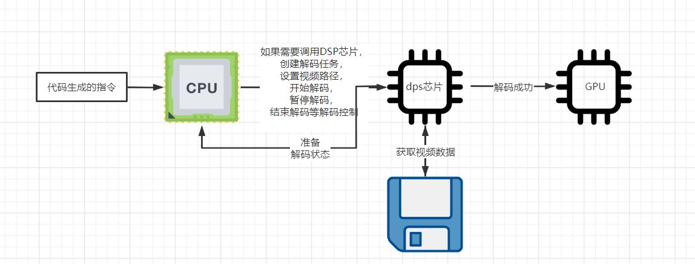

## 资料
* [google Android media 官网](https://developer.android.com/reference/android/media/package-summary)
* [google MediaExtractor官网](https://developer.android.com/reference/android/media/MediaExtractor)
* [google MediaCodec ](https://developer.android.com/reference/android/media/MediaCodec)
* [使用MediaCodec解码使用SurfaceView显示视频](http://t.zoukankan.com/CoderTian-p-6221944.html)
# 正文
通过上篇笔记[Android媒体处理MediaMuxer与MediaExtractor]((1)Android媒体处理MediaMuxer与MediaExtractor.md) 我们可以知道，可以通过MediaExtractor获取到视频轨的数据。
因为视频是被编码器编码后的数据，所以，当我们获取到每一帧数据的时候，这个数据是被压缩了的，所以我们需要将压缩的数据还原为YUV数据，然后渲染到SurfaceView 中。
这个功能似乎和mediaPlayer 一样。我们通过这种模式去尝试理解视频播放器的整体机制。

解码流程：



## 获得一个生命周期可用的Surface
````java
    surface1.getHolder().addCallback(new SurfaceHolder.Callback() {
            @Override
            public void surfaceCreated(SurfaceHolder holder) {
                // 可用的Surface
                Surface surface = holder.getSurface();
            }

            @Override
            public void surfaceChanged(SurfaceHolder holder, int format, int width, int height) {

            }

            @Override
            public void surfaceDestroyed(SurfaceHolder holder) {

            }
        });
````
## 获取视频的解码器
````java
 mediaExtractor = new MediaExtractor();
        mediaExtractor.setDataSource(path);
        int trackCount = mediaExtractor.getTrackCount();
        for (int i = 0; i < trackCount; ++i) {
            MediaFormat format = mediaExtractor.getTrackFormat(i);
            Log.e(TAG.TAG, "run: " + new Gson().toJson(format));
            // 姑且不处理音频。
            if (format.getString(MediaFormat.KEY_MIME).startsWith("video")) {
                if (videoMediaCodec==null){
                    track=i;
                    videoMediaCodec = MediaCodec.createDecoderByType(format.getString(MediaFormat.KEY_MIME));
                    videoMediaCodec.configure(format,surface,null,0);
                    inPutSize = format.getInteger(MediaFormat.KEY_MAX_INPUT_SIZE);
                }
            }
        }
````
## 切换到目标视频轨
````java
   mediaExtractor.selectTrack(track);
   ByteBuffer byteBuffer = ByteBuffer.allocate(inPutSize);
````
## 循环中解码视频帧
````java
 // 因为不是每一帧都是按照顺序并且可用的，所以。
        ByteBuffer[] inputBuffers = videoMediaCodec.getInputBuffers();
        videoMediaCodec.getOutputBuffers();
        boolean first = false;
        long startWhen = 0;
        while (true) {
            // 将样本数据存储到字节缓存区
            int inputIndex = videoMediaCodec.dequeueInputBuffer(10000);
            if (inputIndex >= 0) {
                ByteBuffer inputBuffer = inputBuffers[inputIndex];
                int readSampleSize = mediaExtractor.readSampleData(inputBuffer, 0);
                // 如果没有可获取的样本，退出循环
                if (readSampleSize < 0) {
                    mediaExtractor.unselectTrack(track);
                    break;
                }
                videoMediaCodec.queueInputBuffer(inputIndex, 0, readSampleSize, mediaExtractor.getSampleTime(), 0);
                // 读取下一帧数据
                mediaExtractor.advance();
            }
            //
            int outIndex = videoMediaCodec.dequeueOutputBuffer(bufferInfo, 10000);
            switch (outIndex) {
                case MediaCodec.INFO_OUTPUT_BUFFERS_CHANGED:
                    Log.e(TAG.TAG, "INFO_OUTPUT_BUFFERS_CHANGED");
                    videoMediaCodec.getOutputBuffers();
                    break;

                case MediaCodec.INFO_OUTPUT_FORMAT_CHANGED:
                    Log.e(TAG.TAG, "INFO_OUTPUT_FORMAT_CHANGED format : " + videoMediaCodec.getOutputFormat());
                    break;

                case MediaCodec.INFO_TRY_AGAIN_LATER:
                Log.e(TAG.TAG, "INFO_TRY_AGAIN_LATER");
                    break;
                default:
                    if (!first) {
                        startWhen = System.currentTimeMillis();
                        first = true;
                    }
                    try {
                        long sleepTime = (bufferInfo.presentationTimeUs / 1000) - (System.currentTimeMillis() - startWhen);
                        Log.d(TAG.TAG, "info.presentationTimeUs : " + (bufferInfo.presentationTimeUs / 1000) + " playTime: " + (System.currentTimeMillis() - startWhen) + " sleepTime : " + sleepTime);
                        if (sleepTime > 0) {
                            // 睡眠一会
                            Thread.sleep(sleepTime);
                        }
                    } catch (InterruptedException e) {
                        e.printStackTrace();
                    }
                    videoMediaCodec.releaseOutputBuffer(outIndex, true);
                    break;
            }

            // 所有解码帧都已渲染，现在可以停止播放
            if ((bufferInfo.flags & MediaCodec.BUFFER_FLAG_END_OF_STREAM) != 0) {
                Log.d(TAG.TAG, "OutputBuffer BUFFER_FLAG_END_OF_STREAM");
                break;
            }

        }
````
## 播放完成释放资源
````java
        // 释放资源
        videoMediaCodec.stop();
        videoMediaCodec.release();
        mediaExtractor.release();
````
## 完整代码
````java
public class VideoPlayer implements Runnable {
    Surface surface;
    String path;
    private MediaCodec videoMediaCodec;
    MediaExtractor mediaExtractor;
    int track = -1;


    public VideoPlayer(Surface surface, String path) {
        this.surface = surface;
        this.path = path;

    }

    /**
     * 初始化。
     *
     * @throws IOException
     */
    public void init() throws IOException {
        mediaExtractor = new MediaExtractor();
        mediaExtractor.setDataSource(path);
        int trackCount = mediaExtractor.getTrackCount();
        for (int i = 0; i < trackCount; ++i) {
            MediaFormat format = mediaExtractor.getTrackFormat(i);
            Log.e(TAG.TAG, "run: " + new Gson().toJson(format));
            // 姑且不处理音频。
            if (format.getString(MediaFormat.KEY_MIME).startsWith("video")) {
                if (videoMediaCodec == null) {
                    track = i;
                    videoMediaCodec = MediaCodec.createDecoderByType(format.getString(MediaFormat.KEY_MIME));
                    // 第3个参数是加密的算法 
                    videoMediaCodec.configure(format, surface, null, 0);
                    videoMediaCodec.start();
                }
            }
        }
    }

    /**
     * 开始播放
     */
    public void Play() {
        if (null != videoMediaCodec) {
            new Thread(this).start();
        }
    }

    @Override
    public void run() {
        // 选中视频轨道
        mediaExtractor.selectTrack(track);
        MediaCodec.BufferInfo bufferInfo = new MediaCodec.BufferInfo();
        // 获取所有的可用的解码器列表。这个调调是全手机设备都公用的。
        ByteBuffer[] inputBuffers = videoMediaCodec.getInputBuffers();
        videoMediaCodec.getOutputBuffers();
        boolean first = false;
        long startWhen = 0;
        while (true) {
            // 将样本数据存储到字节缓存区
            // 获取一个可用的解码器，的下标，超时时间为10000
            int inputIndex = videoMediaCodec.dequeueInputBuffer(10000);
            if (inputIndex >= 0) {
                ByteBuffer inputBuffer = inputBuffers[inputIndex];
                int readSampleSize = mediaExtractor.readSampleData(inputBuffer, 0);
                // 如果没有可获取的样本，退出循环
                if (readSampleSize < 0) {
                    mediaExtractor.unselectTrack(track);
                    break;
                }
                videoMediaCodec.queueInputBuffer(inputIndex, 0, readSampleSize, mediaExtractor.getSampleTime(), 0);
                // 读取下一帧数据
                mediaExtractor.advance();
            }
            //
            int outIndex = videoMediaCodec.dequeueOutputBuffer(bufferInfo, 10000);
            switch (outIndex) {
                case MediaCodec.INFO_OUTPUT_BUFFERS_CHANGED:
                    Log.e(TAG.TAG, "INFO_OUTPUT_BUFFERS_CHANGED");
                    videoMediaCodec.getOutputBuffers();
                    break;

                case MediaCodec.INFO_OUTPUT_FORMAT_CHANGED:
                    Log.e(TAG.TAG, "INFO_OUTPUT_FORMAT_CHANGED format : " + videoMediaCodec.getOutputFormat());
                    break;

                case MediaCodec.INFO_TRY_AGAIN_LATER:
                Log.e(TAG.TAG, "INFO_TRY_AGAIN_LATER");
                    break;
                default:
                    if (!first) {
                        startWhen = System.currentTimeMillis();
                        first = true;
                    }
                    try {
                        long sleepTime = (bufferInfo.presentationTimeUs / 1000) - (System.currentTimeMillis() - startWhen);
                        Log.d(TAG.TAG, "info.presentationTimeUs : " + (bufferInfo.presentationTimeUs / 1000) + " playTime: " + (System.currentTimeMillis() - startWhen) + " sleepTime : " + sleepTime);
                        if (sleepTime > 0) {
                            // 睡眠一会
                            Thread.sleep(sleepTime);
                        }
                    } catch (InterruptedException e) {
                        e.printStackTrace();
                    }
                    videoMediaCodec.releaseOutputBuffer(outIndex, true);
                    break;
            }

            // 所有解码帧都已渲染，现在可以停止播放
            if ((bufferInfo.flags & MediaCodec.BUFFER_FLAG_END_OF_STREAM) != 0) {
                Log.d(TAG.TAG, "OutputBuffer BUFFER_FLAG_END_OF_STREAM");
                break;
            }

        }
        // 释放资源
        videoMediaCodec.stop();
        videoMediaCodec.release();
        mediaExtractor.release();
    }
}
````
## 总结
其实这个只是一个简单的Demo，在实际开发过程中使用肯定比这个更加复杂，而且还有很多问题，例如：
* 我们只是处理了简单的解码，播放还是通过线程睡眠达到的。
* 视频渲染出来有拉伸
* 没有设置解码的时候的视频大小，比如服务器给一个8K的视频，这代码还是原封不动的解码的。没有做屏幕适配。
* 没有解码音频
* 没有处理暂停逻辑

类似的问题还有很多，我们只是通过这种代码去尝试还原一个播放器的大致流程，去理解别人的播放器的实现。只有这样，我们才可以去对于播放器无法播放问题进行兼容等处理。

为啥mediaCodec没有提供回调监听？是因为存在跨设备的情况，CPU 调用了DSP芯片
