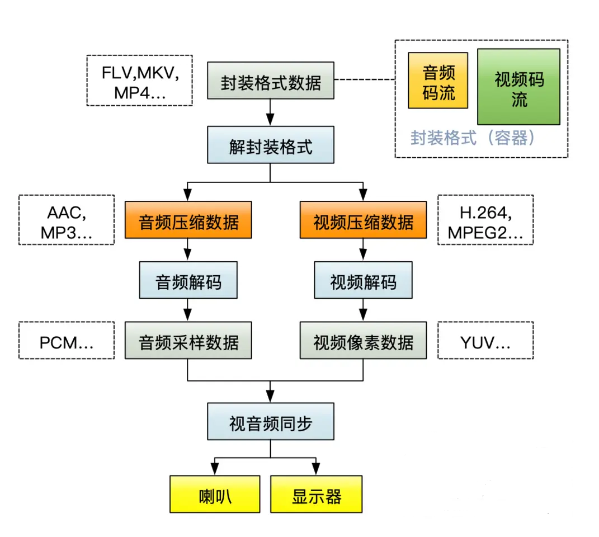

## 为什么要分享？
> 在日常的开发过程中，难免遇到一些和音视频开发相关的知识点，期望通过一次次的分享汇总，把这些知识点汇总起来。
> 同时，视频播放，音频播放，拍照，视频录制，美颜等等都算音视频相关开发。

## Android音视频技术栈大纲 

* Camera, 相机拍摄和录制，识别等。
* MediaCodec, 编码与解码
* MediaRecorder,视频录制
* AutioRecorder, 音频录制
* MediaPlayer, 视频播放
* exoPlayer,视频播放
* soundPool ：音频播放，短的音频片段播放
* audiotrack:低延时播放音频。
* OpenSE ES 音频处理
* OpenGL ES 视频渲染，转码，滤镜等。
  * EGL， openGL ES 便捷搭建API
  * GLSL 语法 openGL  着色器语言
  * GPUImage 美颜
  * lib_SDL  上下文 搭建 
* FFmpeg 软解。
* sox 声音处理
* 直播处理与协议
* LAME 音频处理
* libfdk_aac aac 音频转码
* lib_png 视频水印png 转换
* lib_x264。 h264转码
* lib_yuv ，RGB和yuv 互相转换
* MayerFFT 快速傅里叶变换变换 
* 哥伦布编码

## 视频解码流程

## 理论基础

### 常用的视频封装容器
* [文档00-音视频格式封装原理.md](../资料/文档00-音视频格式封装原理.md)

### 音频编码
* [音频原理.md](../资料/音频原理.md)
* 
### 视频编码
* [文档01-视频压缩原理.pdf](../资料/文档01-视频压缩原理.pdf)
* [文档02-帧内预测.pdf](../资料/文档02-帧内预测.pdf)

### 音视频同步

### RGB与YUV

### PCM与AAC

