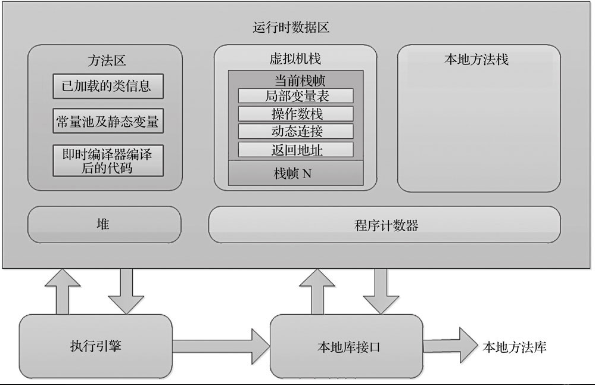
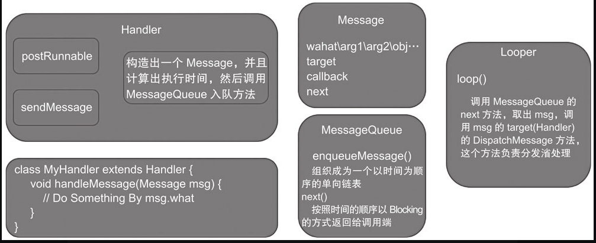

> Memory Analyzer Tool.MAT（Memory Analyzer Tool）工具是一款功能强大的]ava堆内存分析器。可以用于查找内存泄漏以及查看内存消耗情况。MAT是基于Eclipse开发的，不仅可以单独使用，还可以作为插件的形式嵌入在Eclipse中使用。是一款免费的性能分析工具，使用起来非常方便。
## 资料
* [eclipse](https://www.eclipse.org/downloads/) 
* [mat 下载地址](https://www.eclipse.org/mat/downloads.php)
* [csdn MAT 教程](https://blog.csdn.net/lyd135364/article/details/121449969)
* [csdn android MAT 使用教程](https://blog.csdn.net/qq_33475125/article/details/110423414)
# 正文
> 在Android 开发过程中，稍有不慎就会产生ＯＯＭ，虽然JAVA有垃圾回收机制，但是也不能杜绝内存泄露，内存溢出等问题。Android系统会分配给每一个应用程序一个Dalvik虚拟机。当开发的APP占用的内存超过设置上限的时候，就会产生OOM.一般在Android程序中，占用内存最大的就是图片的缓存。因为bitmap 是存储在内存中的。

Dalvik虚拟机对于内存的分配情况：

当类加载器将一个类的字节码加载到虚拟机中的时候，首先会将这个类的信息存入到方法区，这个类的静态变量也存在于方法区。当这个类创建对象时候，这个对象就存储在堆内存中。方法区内存区域和堆内存区域都是线程共享的数据区域。

## 内存泄露

### 方法区静态变量引起内存泄露

一个类的静态变量处于虚拟机内存的方法区，属于根对象集合的一部分。开发中，应尽量避免给静态变量赋值activity类型的实例。

### 匿名内部类引起的内存泄露

在JAVA中，无论是匿名内部类还是内部类，都可以引用所在类中的实例变量或者方法，内部类对所在类的实例对象有一个引用，并且这个引用是一个强引用关系，如果这个内部类构建的对象没有被释放调，那么内部类所引用的外部类创建的对象就永远不会被释放。

handler,messageQueue,looper的结构关系图：

关于handler 内部类内存泄露解决方式：

* 在destory 方法中，执行handler.removeCallBacksAndMessages(null)
* 将这个内部类改成一个静态内部类。而在handler中又需要调用所在类的方法执行一些界面绘制操作。那么就需要给Handler 增加一个所在类的虚引用类型(weakReference)的实例变量。而虚引用会在垃圾回收器进行FullGC 的时候回收掉，也就相当于切断了Handler这个类的实例引用。

### 本地方法栈引起的内存泄露

在开发中，如果Native层调用了JAVA层的方法，一般都会在JNI 层建立一个全局的对象引用并存储到全局变量中。