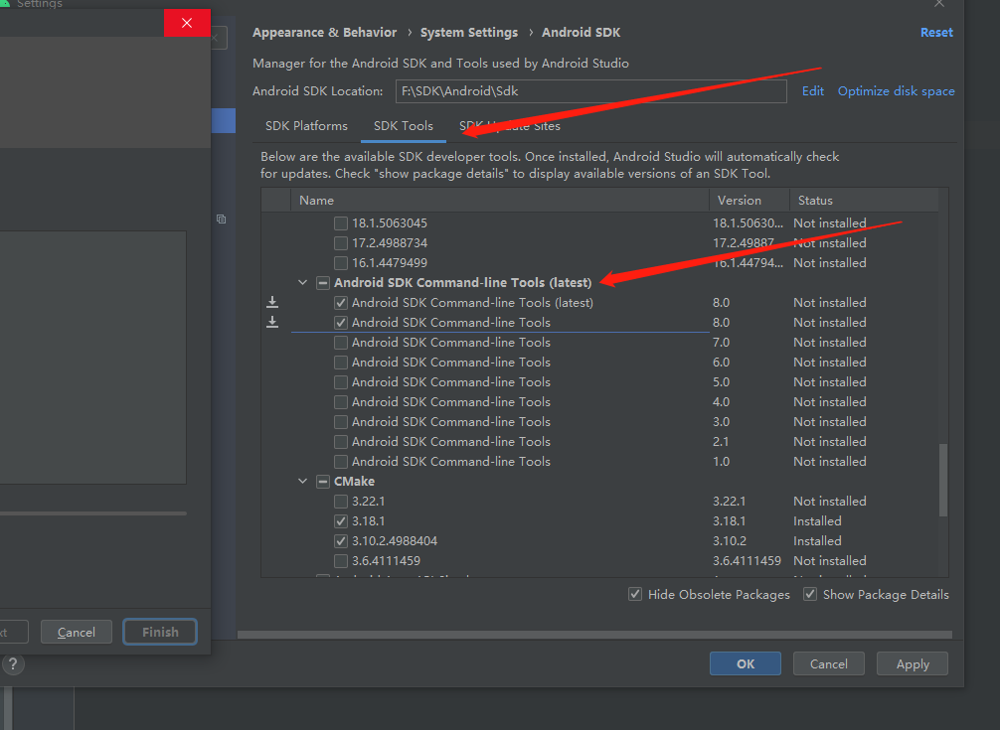

# 前言
apk 分析器。
## 资料
* [apkanalyzer](https://developer.android.com/studio/command-line/apkanalyzer)

  > 位于 `android_sdk/cmdline-tools/version/bin/apkanalyzer`） 这个调调要不配置环境变量，要不就直接切换到这个目录下面。
  >
  > 但是默认是没有这个调调的。需要下载：
  >
  > 
# 正文
## 语法 
apkanalyzer 的语法为：
````aidl
apkanalyzer [global-options] subject verb [options] apk-file [apk-file2]
````
subject 是要查询的内容，可以是整改apk 也可以是APK 的一部分。
* apk: 分析apk 的文件属性。
* files: 分析APK 文件内的文件
* manifest: 分析apk 文件内的清单内容
* dex: 分析apk文件内的dex 文件
* resources：分析APK 内的文本图像等静态资源 
## 命令

常见的命令。

| 查看 APK 文件属性                                            | 说明                                                         |
| :----------------------------------------------------------- | :----------------------------------------------------------- |
| `apk summary apk-file`                                       | 输出应用 ID、版本代码和版本名称。输出示例：`com.myapp 5 1.1-beta` |
| `apk file-size apk-file`                                     | 输出 APK 的总文件大小。                                      |
| `apk download-size apk-file`                                 | 输出 APK 的下载大小估计值。                                  |
| `apk features [--not-required] apk-file`                     | 输出 APK 用来触发 [Play 商店过滤](https://developer.android.com/google/play/filters#manifest-filters)的功能。添加 `--not-required` 选项可在输出中包含标记为“非必需”的功能。输出示例：`android.hardware.type.watch android.hardware.microphone implied:    requested android.permission.RECORD_AUDIO permission` |
| `apk compare [options] apk-file apk-file2`                   | 比较 `apk-file` 和 `apk-file2` 的大小。您可以添加以下选项：`--different-only`：输出存在差异的目录和文件。`--files-only`：不输出目录条目。`--patch-size`：逐个显示每个文件的补丁大小估计值，而不是原始差异。输出示例（旧大小/新大小/大小差异/路径）：`39086736 48855615 9768879 / 10678448 11039232 360784 /classes.dex 18968956 18968956 0 /lib/ 110576 110100 -476 /AndroidManifest.xml ...` |
| 查看 APK 文件系统                                            | 说明                                                         |
| `files list apk-file`                                        | 列出 APK 中的所有文件。输出示例：`/ /classes2.dex /classes.dex /assets/ /assets/asset.data /AndroidManifest.xml /resources.arsc /res/ ...` |
| `files cat --file path apk-file`                             | 输出文件内容。您必须使用 `--file path` 选项（如 `--file /AndroidManifest.xml`）指定 APK 内的路径。 |
| 查看清单中的信息                                             | 说明                                                         |
| `manifest print apk-file`                                    | 以 XML 格式输出 APK 清单。                                   |
| `manifest application-id apk-file`                           | 输出应用 ID 值。                                             |
| `manifest version-name apk-file`                             | 输出版本名称值。                                             |
| `manifest version-code apk-file`                             | 输出版本代码值。                                             |
| `manifest min-sdk apk-file`                                  | 输出最低 SDK 版本。                                          |
| `manifest target-sdk apk-file`                               | 输出目标 SDK 版本。                                          |
| `manifest permissions apk-file`                              | 输出权限列表。                                               |
| `manifest debuggable apk-file`                               | 输出应用是否可调试。                                         |
| 访问 DEX 文件信息                                            | 说明                                                         |
| `dex list apk-file`                                          | 输出 APK 中的 DEX 文件列表。                                 |
| `dex references [--files path] [--files path2] apk-file`     | 输出指定 DEX 文件中的方法引用数。 默认包含所有 DEX 文件。添加 `--files` 选项可指明要包含的特定文件。输出示例：`classes.dex 59598 classes2.dex 8042` |
| `dex packages [option1 option2 ...] apk-file`                | 输出 DEX 中的类树。在输出中，`P`、`C`、`M` 和 `F` 分别表示软件包、类、方法和字段。`x`、`k`、`r` 和 `d` 分别表示已移除、保留、引用和定义的节点。添加以下选项可优化输出：`--defined-only`：在输出中仅包含 APK 中定义的类。`--files`：指定要包含的 DEX 文件名。默认：所有 DEX 文件。`--proguard-folder file`：指定用于搜索映射的 Proguard 输出文件夹。`--proguard-mappings file`：指定 Proguard 映射文件。`--proguard-seeds file`：指定 Proguard 种子文件。`--proguard-usages file`：指定 Proguard 用法文件。`--show-removed`：显示由 Proguard 移除的类和成员。输出示例（类型/状态/定义的方法/引用的方法/字节大小/名称）：`P d 1 1 85 g P d 1 1 85 g.a C d 1 1 85 g.a.a M d 1 1 45 g.a.a java.lang.Object get() C r 0 1 40 byte[] M r 0 1 40 byte[] java.lang.Object clone()` |
| `dex code --class class [--method method]`                   | 以 smali 格式输出类或方法的字节码。输出中必须包含类名，并且要输出完全限定类名以进行反编译。添加 `--method` 选项可指定要反编译的方法。方法反编译的格式为 `name(params)returnType`，例如 `someMethod(Ljava/lang/String;I)V`。 |
| 查看存储在 res/ 和 resources.arsc 中的资源                   | 说明                                                         |
| `resources packages`                                         | 输出资源表中定义的软件包列表。                               |
| `resources configs --type type [--package package] apk-file` | 输出指定 `type` 的配置列表。 `type` 是资源类型，如 `string`。 如果要指定资源表软件包名称，请添加 `--package` 选项，否则系统将使用第一个定义的软件包。 |
| `resources value --config config --name name --type type [--package package] apk-file` | 输出由 `config`、`name` 和 `type` 指定的资源的值。`type` 选项是资源类型，如 `string`。如果要指定资源表软件包名称，请添加 `--package` 选项，否则系统将使用第一个定义的软件包。 |
| `resources names --config config --type type [--package package] apk-file` | 输出属于某个配置和类型的资源名称列表。`type` 选项是资源类型，如 `string`。 如果要指定资源表软件包名称，请添加 `--package` 选项，否则系统将使用第一个定义的软件包。 |
| `resources xml --file path apk-file`                         | 以简单易懂的形式输出 XML 二进制文件。 添加 `file` 选项可指定文件的路径。 |

## JAVA 执行
> 因为这个调调bat脚本，所以需要全路径去执行。

````aidl
        File root=new File("F:\\SDK\\Android\\Sdk\\cmdline-tools\\8.0\\bin");
        Process process = Runtime.getRuntime().exec("cmd /c apkanalyzer.bat manifest version-name "+apkPath,null,root);
````
而且需要设置 ：cmd /c 
# 总结 
