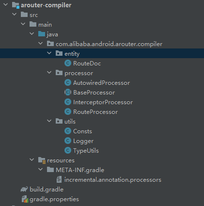

# 前言
ARouter是一个很老的组件化框架。其实很多编译时技术。比如通过注解动态去生成class。比如plugin里面动态的把class组合调用起来。
但是组件化里面的路由处理值得我们去学习。当然这里主要是去学习他的编译时技术。

## 资料
* [gitHub ARouter](https://github.com/alibaba/ARouter)
# 正文
## 使用
因为这个调调功能点特别多。大致在编译时分为两种：
* APT 主要是去生成class。
* plugin 这个主要是将生成的class找出来，然后合并到一个一个注册文件中。要不然启动的时候遍历所有class去注册，比较耗时。

## 源码分析


整个项目。和编译时相关的的大概就这么几个了。

* arouter-annotion  这个里面包含了所有的注解及其类型等。
* arouter-api Arouter 里面的相关调用实现类。
* arouter-compiler APT编译时技术。
* arouter-gradle-plugin  Plugin 插件。

### compiler 

还是先上目录结构图



通过目录结构图我们可以看到，这个调调和之前写到只有一个Processor的不一样，他有了一个resources 文件夹。

> Gradle增量注解处理器分为两种isolating,aggregating.你可以在resources/META-INF/gradle/incremental.annotation.processors下进行声明你属于那种增量处理器.
>
> 当然有时候我们只能在运行时确定自己是哪种增量处理器,或者动态开启增量,这种类别的我们称为dynamic.它同样需要resources/META-INF/gradle/incremental.annotation.processors下进行声明.
>
> [gradle编译时注解增量编译](https://blog.csdn.net/qfanmingyiq/article/details/116300913)

所以他这个是支持增量编译的。而且支持多个注解修饰去生成同一个class。

````
com.alibaba.android.arouter.compiler.processor.RouteProcessor,aggregating
com.alibaba.android.arouter.compiler.processor.AutowiredProcessor,aggregating
com.alibaba.android.arouter.compiler.processor.InterceptorProcessor,aggregating
````

为啥添加这个功能，这个和业务诉求有关。比如一个activity 标记了path和自动注册参数。那么就存在多个注解去修饰一个class。因为他实现的特性，如果说不通过Arouter打开activity，那么那个参数也不会生效，所以直接在这里焊死了这种操作。至于为啥要先理解这个，因为这个和文件生成有关。基于这个内容便可以理解几个问题：

* 增量编译的接入，减少了编译耗时
* 为啥有的时候，需要清除build缓存再编译就可以了。

#### BaseProcessor 

这是几个processor的父类。主要是提取一些功能信息。

```
@Override
public synchronized void init(ProcessingEnvironment processingEnv) {
    super.init(processingEnv);
    // Attempt to get user configuration [moduleName]
    Map<String, String> options = processingEnv.getOptions();
    if (MapUtils.isNotEmpty(options)) {
        moduleName = options.get(KEY_MODULE_NAME);
        generateDoc = VALUE_ENABLE.equals(options.get(KEY_GENERATE_DOC_NAME));
    }

    if (StringUtils.isNotEmpty(moduleName)) {
        moduleName = moduleName.replaceAll("[^0-9a-zA-Z_]+", "");

        logger.info("The user has configuration the module name, it was [" + moduleName + "]");
    } else {
        logger.error(NO_MODULE_NAME_TIPS);
        throw new RuntimeException("ARouter::Compiler >>> No module name, for more information, look at gradle log.");
    }
}
```

在init函数里面。我们获取了 ProcessingEnvironment 对象中的options。这和使用的使用build.gradle 中的：

````
 javaCompileOptions {
            annotationProcessorOptions {
                arguments = [AROUTER_MODULE_NAME: project.getName()]
            }
        }
````

````
kapt {
    arguments {
        arg("AROUTER_MODULE_NAME", project.getName())
    }
}

````

这两个配置相对应。

然后是配置相关的：

```
@Override
public Set<String> getSupportedOptions() {
    return new HashSet<String>() {{
        this.add(KEY_MODULE_NAME);
        this.add(KEY_GENERATE_DOC_NAME);
    }};
}
```

这个函数的重写。主要是为了配合 @SupportedAnnotationTypes。使用这个注解去标记了class。就不用重写SupportedAnnotationTypes函数了。这个需要返回需要处理注解的全类名。好像getSupportedOptions和SupportedAnnotationTypes没有啥强制关联，可能是特性上的关联吧。

 #### AutowiredProcessor 

这个是自动注入参数的。整体是创建一个类实现ISyringe 。通过@SupportedAnnotationTypes标记了这个处理的注解。因为这个注解里面没有导入Api包，所以导出都是反射。

### gradle-plugin

