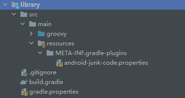
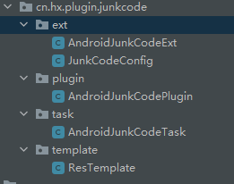

# 前言
最近有业务诉求是将APP 做成马甲包，而且需要上线。但是马甲配置只有一些基础配置。这就导致了一个问题，上线代码上一模一样的，而应用市场的审核中需要将其
差异代码拉到一定的阈值才行。这才有了马甲包的项目。但是人家应用市场也会对于这种调调进行审核啊，单纯的丢一个jar 或者什么aar 不知道行不行。从Android的整体项目上而言。
拉高差异化的方式就那么几种：

* activity的差异化
* class 的差异化
* 资源文件的差异化
如果说，activity不注册到清单文件中，那么就是class的差异化了。而这就涉及到了很多内容。
* 明确是JAVA到class这个阶段加入差异文件 还是 class到dex 前插入文件
* 在什么时候把class添加到清单文件
* 什么时候把生成的资源，比如string，颜色，xml 等放到资源文件中，因为资源文件也会被编译打包。
* 为了防止class冲突，资源冲突，我们需要指定包名范围，资源名称前缀等等，这种配置项如何配置及其如何获取。
## 资料
* [github 地址](https://github.com/qq549631030/AndroidJunkCode)
# 正文
基于这些内容，才有了学习这个调调的前提。
## 使用
要想了解这个调调，那么先要学会使用。
```aidl
 classpath "com.github.qq549631030:android-junk-code:x.x.x"
```
通过这个就可以看出来，这个调调采用的是编译时生成class 和资源文件。
````aidl
apply plugin: 'com.android.application'
apply plugin: 'android-junk-code'
````
说明他强制判断了是主工程，那么估计是transform或者task.而且强制对执行顺序进行了排列。比如这个执行在那个后面，在那个前面等等。
````aidl
androidJunkCode {
    variantConfig {
        release {//变体名称，如果没有设置productFlavors就是buildType名称，如果有设置productFlavors就是flavor+buildType，例如（freeRelease、proRelease）
            packageBase = "cn.hx.plugin.ui"  //生成java类根包名
            packageCount = 30 //生成包数量
            activityCountPerPackage = 3 //每个包下生成Activity类数量
            excludeActivityJavaFile = false //是否排除生成Activity的Java文件,默认false(layout和写入AndroidManifest.xml还会执行)，主要用于处理类似神策全埋点编译过慢问题
            otherCountPerPackage = 50  //每个包下生成其它类的数量
            methodCountPerClass = 20  //每个类下生成方法数量
            resPrefix = "junk_"  //生成的layout、drawable、string等资源名前缀
            drawableCount = 300  //生成drawable资源数量
            stringCount = 300  //生成string数量
        }
    }
}
````
说明Plugin 实现提供了androidJunkCode。同时也包含了传参的接收等等。而且这个怎么有release。还可以debug 不设置。
`````aidl
androidJunkCode {
    def config = {
        packageBase = "cn.hx.plugin.ui"
        packageCount = 30
        activityCountPerPackage = 3
        excludeActivityJavaFile = false
        otherCountPerPackage = 50
        methodCountPerClass = 20
        resPrefix = "junk_"
        drawableCount = 300
        stringCount = 300
    }
    variantConfig {
        debug config
        release config
    }
}
`````
这个有点迷糊。暂时看不出来东西。
## 源码分解

我们将源码下载下来，他结构很简单。

 这是plugin的源码。我们使用：

```
apply plugin: 'android-junk-code' // 这个其实是android-junk-code.properties 这个文件，这个好像叫SPI机制。
```

在这个文件中：

```
implementation-class=cn.hx.plugin.junkcode.plugin.AndroidJunkCodePlugin
```

这个便是plugin的实现类。我们代码的主要入口就是这个。同时可以看到这个工程采用Groovy编写。整个项目的源码也很简单。ext应该是参数配置。plugin 为入口类。task 表示了这个文件创建和排序相关任务是通过task操作的，template 估计是和资源相关。

那么我们直接查看 AndroidJunkCodePlugin相关源码。

### AndroidJunkCodePlugin 

````
class AndroidJunkCodePlugin implements Plugin<Project> {}
````

表述这个是一个gradle plugin。目前笔者已知的plugin基本上都是基于这个。然后是实现了apply 函数。

这个apply 函数执行较早。编译的时候最开始执行。

````
def android = project.extensions.findByName("android")
        if (!android || !android.hasProperty("applicationVariants")) {
            throw IllegalArgumentException("must apply this plugin after 'com.android.application'")
        }
````

这个代码就是获取Android  AppExtension，也就是apply plugin: 'com.android.application' 才会存在这个对象，Android编译时技术也是基于打包的，所以的有这个才能可以，而且一些信息需要通过这个调调获取。android.hasProperty("applicationVariants") 这个函数JAVA里面没有，Groovy自己的。applicationVariants编译变体，他判断了没有就跑错了，虽然没有懂，估计和实现方案有关。为啥没有待定。

````
def generateJunkCodeExt = project.extensions.create("androidJunkCode", AndroidJunkCodeExt, project.container(JunkCodeConfig))
````

这个和build.gradle 中自定义androidJunkCode 遥相对应。这串代码没有懂，但是目的是很清晰的就是获取配置的参数与值。

````
android.applicationVariants.all { variant ->{}} //后面的所有的逻辑代码全在这个闭包里面了。
````

````
def variantName = variant.name
            def junkCodeConfig = generateJunkCodeExt.variantConfig.findByName(variantName)
            if (junkCodeConfig) {
            	// todo 
            }
````

这个代码和build.gradle 配置的 遥相呼应release。同时判断了只有配置了的才会继续执行。

````
 def junkCodeNamespace = ""
                if (android.hasProperty("namespace") && android.namespace) {//AGP 4.2.0+
                    junkCodeNamespace = android.namespace
                } else {
                    //从AndroidManifest.xml找到package name
                    def parser = new XmlParser()
                    for (int i = 0; i < sourceSets.size(); i++) {
                        def sourceSet = sourceSets[i]
                        if (sourceSet.manifestFile.exists()) {
                            def node = parser.parse(sourceSet.manifestFile)
                            if (node.attribute("package")) {
                                junkCodeNamespace = node.attribute("package")
                                break
                            }
                        }
                    }
                }
````

这个代码是获取整个APP的包名。因为一些Activity中使用资源文件，需要使用这个。代码还是没有懂为啥要这么写。

````
 def junkCodeOutDir = new File(project.buildDir, "generated/source/junk/$variantName")
                def generateJunkCodeTaskName = "generate${variantName.capitalize()}JunkCode"
                def generateJunkCodeTask = project.tasks.create(generateJunkCodeTaskName, AndroidJunkCodeTask) {
                    config = junkCodeConfig
                    namespace = junkCodeNamespace
                    outDir = junkCodeOutDir
                }
````

这个代码主要是确定代码的输出文件位置，因为task 需要一个输出作为下一个task的输入。然后组合了一个task的名称，创建了一个task对象，把task 对象的入参传递了进行。而这个task的实现就是AndroidJunkCodeTask 。

````
def manifestFile = new File(junkCodeOutDir, "AndroidManifest.xml")
                //将自动生成的AndroidManifest.xml加入到一个未被占用的manifest位置(如果都占用了就不合并了，通常较少出现全被占用情况)
                for (int i = variant.sourceSets.size() - 1; i >= 0; i--) {
                    def sourceSet = variant.sourceSets[i]
                    if (!sourceSet.manifestFile.exists()) {
                        sourceSet.manifest.srcFile(manifestFile)
                        break
                    }
                }
````

这个代码说的是，从task的输出目录中获取到清单文件，然后将其设置到variant 的资源中，虽然没有懂为啥这么写。这个没有懂。

```
def javaDir = new File(junkCodeOutDir, "java")
variant.registerJavaGeneratingTask(generateJunkCodeTask, javaDir)
```

这个感觉是variant 去注册一个一个task。

```
def resDir = new File(junkCodeOutDir, "res")
if (variant.respondsTo("registerGeneratedResFolders")) {//AGP 3.0.0+
    variant.registerGeneratedResFolders(project
            .files(resDir)
            .builtBy(generateJunkCodeTask))
    if (variant.hasProperty("mergeResourcesProvider")) {//AGP 3.3.0+
        variant.mergeResourcesProvider.configure { dependsOn(generateJunkCodeTask) }
    } else {
        variant.mergeResources.dependsOn(generateJunkCodeTask)
    }
} else {
    variant.registerResGeneratingTask(generateJunkCodeTask, resDir)//AGP 1.1.0+
}
```

这个可能和APG版本有关，注册task并且指明他执行在那个task 之后。

### JunkCodeConfig 

至于为啥先看这个，因为这个相对简单，而且大多数都是注解。

````
class JunkCodeConfig {
    @Input
    String packageBase = ""
    @Input
    int packageCount = 0
    @Input
    int activityCountPerPackage = 0
    @Input
    boolean excludeActivityJavaFile = false
    @Input
    int otherCountPerPackage = 0
    @Input
    int methodCountPerClass = 0
    @Input
    String resPrefix = "junk_"
    @Input
    int drawableCount = 0
    @Input
    int stringCount = 0

    @Internal
    String name = ""

    JunkCodeConfig(String name) {
        this.name = name
    }
}
````

这是一个和JAVA对象类似的文件。和数据模型几乎一模一样。

*  @Input 说的是用于这个标记这是输入。
* @Internal 说的是可忽略这个属性 

### AndroidJunkCodeExt

````
class AndroidJunkCodeExt {

    NamedDomainObjectContainer<JunkCodeConfig> variantConfig

    AndroidJunkCodeExt(NamedDomainObjectContainer<JunkCodeConfig> variantConfig) {
        this.variantConfig = variantConfig
    }

    void variantConfig(Action<? super NamedDomainObjectContainer<JunkCodeConfig>> action) {
        action.execute(variantConfig)
    }
}
````

要想理解这个，就需要了解并知道 NamedDomainObjectContainer 这个是用来干嘛的。

#### NamedDomainObjectContainer

参考资料：https://blog.csdn.net/chennai1101/article/details/103279477

通过这篇资料就可以很好的理解了上面的如何获取到入参的问题了。

