## 资料
> 当前主要是《FFMPEG从入门到精通》 书籍的笔记
* [本书代码相关的举例均可以在FFmpeg的源代码目录的doc/examples中获得](https://ffmpeg.org/doxygen/trunk/examples.html) 
* [FFmpeg官方文档](http://ffmpeg.org/documentation.html) 
* [FFmpeg官方wiki](https://trac.ffmpeg.org) 
* [雷霄骅博士总结的资料](http://blog.csdn.net/leixiaohua1020) 
* [罗索实验室](http://www.rosoo.net) 
* [ChinaFFmpeg](http://bbs.chinaffmpeg.com) 
# 正文 

ffmpeg 中常用的工具主要是ffmpeg,ffprobe,ffplay,他们分别用作多媒体的编解码工具，内容分析工具和播放器。

## FFmpeg 的基本组成


FFmpeg 框架的基本组成 包含：AvFormat,Acodec,Avfilter,AVDevice,AVutil 等模块库。

###  AvFormat 

AvFormat 中实现了目前多媒体领域中的绝大多数媒体封装格式，包括封装与解封装。包含视频封装格式和网络协议封装格式（RTMP,RTSP,MMS,HLS）,FFmepg 是否支持某种封装格式取决于编译时是否包含该格式的封装库。根据实际需求，可进行媒体封装格式的扩展，增加自己定制的封装格式，即在AVFormat 中增加自己的封装处理模块。

### AVCodec

AVCodec 中实现了目前多媒体领域绝大多数常用的编解码格式，即支持编码也支持解码，除了支持MPEG4、AAC\MJPEG等自带的媒体编解码格式之外，还支持第3方编解码器，如H264(AVC)需要使用X264的编码器，如果需要增加相应编解码格式，或者硬件编解码，则需要在AVCodec 中增加相应的编解码模块。

### AVFilter 

提供了一个通用的音视频字幕等滤镜处理框架，在AVFilter 中，可以有多个输入和多个输出。

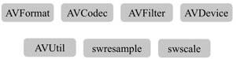

* 相同的Filter 线性链之间用逗号分隔
* 不同的filter线性链之间用分号分隔。

### 视频图像转换计算模块swscae

提供了搞级别的图像转换API，允许进入图像缩放和像素格式转换，如1920到1080，如yuv420P到yuyv,或者转换为RGB等

### 音频转换计算模块swresample

音频采样，音频通道布局转换与布局调整。

## FFmpeg 的编解码工具 ffmpeg

ffmpeg 是FFmpeg源代码编译后生成的一个可执行程序。其可以作为命令行工具使用。

### 简单转码示例

````
./ffmpeg -i input.mp4 output.avi
````

#### 解析 

ffmpeg 通过-i 参数将input.mp4 作为输入源输入，然后转码封装操作，出去到output.avi 中。

### 简单转码指定输出格式

````
./ffmpeg -i input.mp4 -f avi output.dat
````

#### 解析

-f 定制了输出文件的容器格式。

#### 经历的步骤

* 读取输入
* 解封装
* 解码
* 编码
* 封装
* 输出

## FFmpeg 的播放器ffplay

使用ffmpeg的acformat和avcodec 可以播放各种媒体文件或者流。如果想要使用ffplay ,那么系统首先需要有SDL 来进行ffplay 进行基础支撑。ffplay是另外一个可执行程序，提供音视频显示和播放相关图像信息，音频的波形信息等。

## FFmpeg 的多媒体分析器ffprobe

多媒体分析工具，可以从媒体文件或媒体流中获得你想要了解的媒体信息，如音频参数，视频的参数，媒体容器的参数等。

## FFmpeg 的编译支持与定制

ffmpeg 所做的 只是提供一套基础框架，所有的编码格式，文件封装格式流媒体协议等均可以作为ffmpeg 的一个模块挂载在ffmpeg 框架中，这些模块以第三方的外部库的方式提供支持。可以通过ffmpeg源码的configure 命令查看支持的音视频格式，文件封装格式与流媒体传输协议，对于暂时不支持的格式，可以通过configure --help 查看所需要的第三方外部库，然后通增加对应的编译参数选项进行支持。

可以通过--enable- 命令配置需要添加到编码格式。

可以通过--disable- 命令关闭不需要的编码封装协议等模块。

### ffmpeg 编码器支持

````
./configure --list-encoders 
````

通过上述命令查看编码器。

### ffmpeg 解码器支持

````
./configure -list-decoders 
````

### ffmpeg 的封装支持

````
./configure --list-muxers
````

### 解封装支持

````
./configure--list-demuxers
````

### 协议支持

````
./configure --list-protocols
````

## FFmpeg 常用命令

通过ffmpeg --help 可以查看到ffmpeg 常见的命令。大概可以分为6个部分。通过ffmpeg --help long 参数来查看更多信息。ffmpeg -help full 获取全部的帮助信息。

* 信息查询
* 公共操作参数部分
* 文件主要操作参数部分
* 视频操作参数部分
* 音频操作参数部分
* 字幕操作参数部分

### 封装转换

封装转换功能包含在AvFormat 模块中，通过libavformat 库进行mux 和demux 操作，多媒体文件格式有很多种，这些格式中很多参数在mux 与demux 的操作参数中是公用的。 可以通过ffmpeg --help full 信息中AvformatContext 参数部分，该参数下单所有参数君威封装转换可使用的参数。以下是主要参数及其说明：

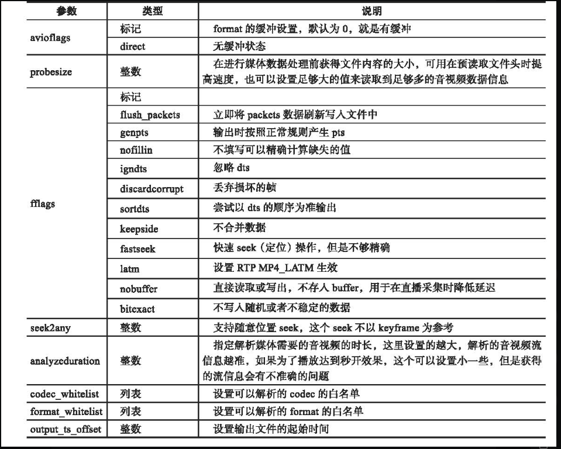

这些都是通用的封装，解封装操作时候使用的参数。

###　转码参数

ffmpeg 编解码部分的功能主要是通过AVCodec 来完成的，通过libacvodec 库进行encode 与decode 操作。可以在AVCodecContext 参数中查询。下列是AVCodecContext 主要参数：

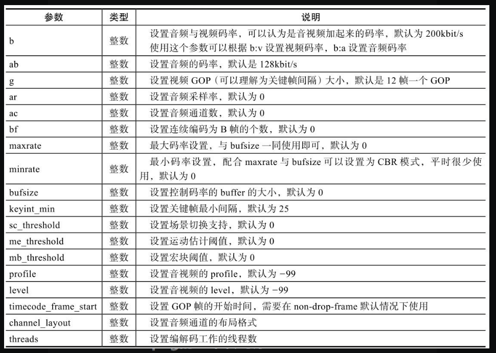

### 基本转码原理

ffmpeg 工具的主要用途为编码，解码，转码以及媒体格式转换，ffmpeg 常用语进行转码操作。ffmpeg 转码原理图：

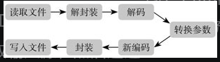

#### 简单转码示例

````
./ffmpeg -i /input.rmvb -vcodec mpeg4 -b:v 200k -r 15 -an output.mp4
````

* 转封装格式 从RMVB 转换为 mp4
* 视频编码为RV40 转换为mpeg4
* 视频码率转为 200kbit/s
* 视频帧率修改为15fps
* 转码后不包含音频 -an 参数

## ffprobe 常用命令

ffprobe 主要是查看多媒体文件信息。ffprobe --help 查看详细帮助。

packet 字段说明：

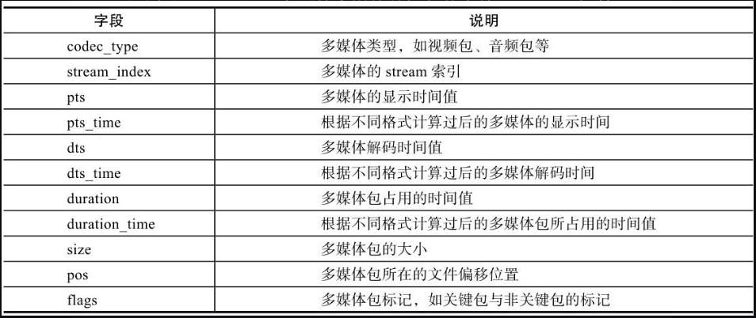

format 字段说明

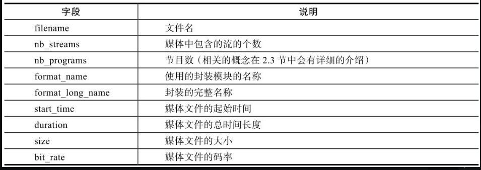

frame 字段说明 

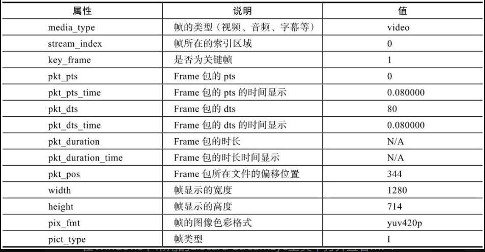

stream 字段说明

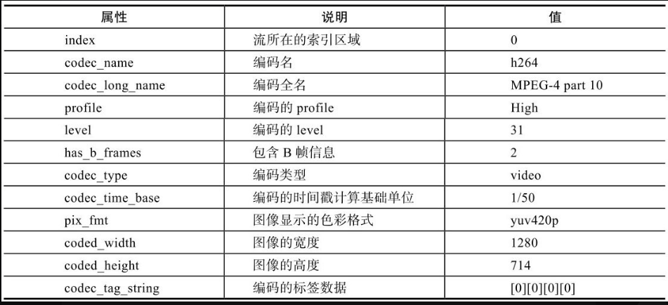

stream 字段信息

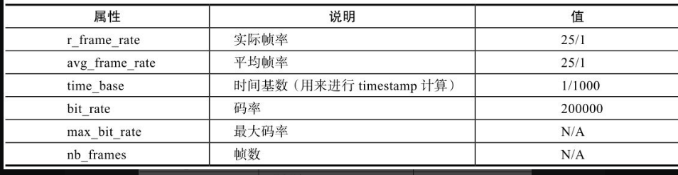

### 简单查看多媒体数据包信息

````
ffprobe -show_packets input.flv
````

## ffplay 常用命令

ffplay 通常作为播放器，同样也可以作为音视频数据点图形化分析工具，可以通过ffplay 看到视频图像的运动估计方向，音视频数据点波形等。

同时也是测试ffmpeg 的codec 引擎、format引擎，以及filter引擎的工具。

ffplay --help 查看支持功能

ffplay 基础帮助信息

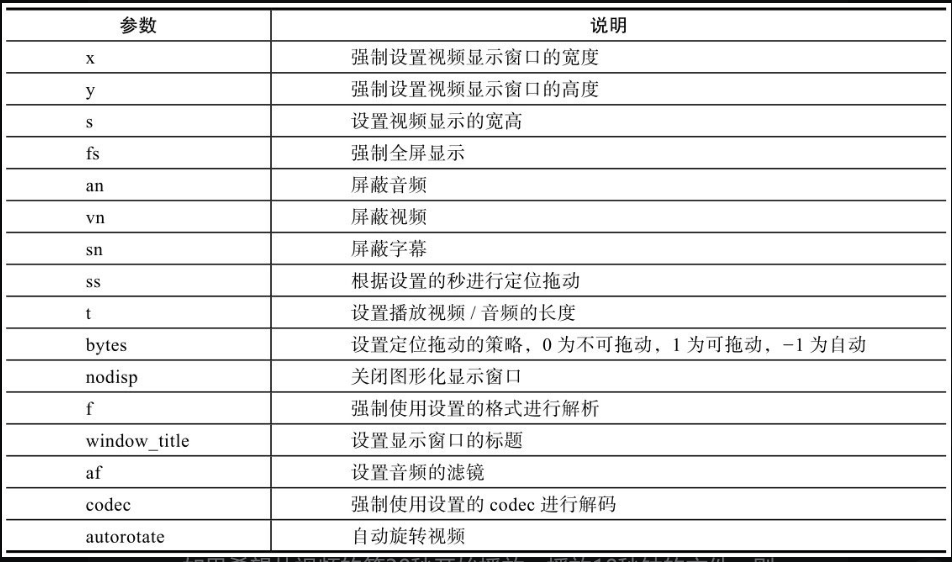

### 简单播放

````
ffplay -ss 30 -t 10 input.mp4
````

视频从第30秒开始播放，播放10秒的视频文件。

> 设置title,可能在Android上莫得效果。

### 网络直播流

````
ffplay rtmp://up.v.test.com/live
````

### ffplay 高级参数

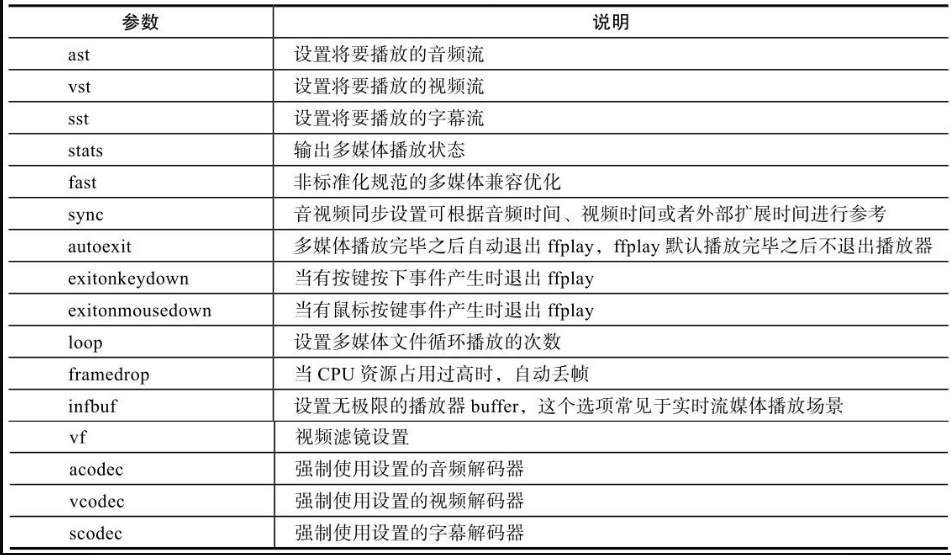

## 音视频文件转Mp4


## 视频文件转FLV
## 视频文件转M3U8
## 视频文件切片
## 音频文件音视频流抽取
## FFmpeg 转封装 系统资源使用情况
## FFmpeg 软编码与H264
## ffmpeg 硬编码
## ffmpeg 输出Mp3
## ffmpeg 输出AAC
## FFmpeg转码系统资源使用情况  
## ffmpeg 发布与录制RTMP 流
## FFmpeg 录制RTSP 流
## FFmpeg 录制Http 流
## ffmpeg 录制与发布UDP/TCP 流
## ffmpeg 推出多路流
## ffmpeg 生成HDS流
## ffmpeg 生成DASH流
## ffmpeg 滤镜Filter
## ffmpeg 水印
## ffmpeg 画中画
## ffmpeg 多宫格处理
## ffmpeg 音频流滤镜操作
## ffmpeg 音频音量探测
## ffmpeg 视频添加字幕
## ffmpeg 视频抠图合并
## ffmpeg 3D 视频处理
## ffmpeg 定时视频截图
## ffmpeg 生成测试元数据
## ffmpeg 对音视频倍数处理
## ffmpeg linux 设备操作
## ffmpeg os x 设备操作
## ffmpeg windows 设备操作
## ffmpeg 旧接口使用
## ffmpeg 新接口使用
## ffmpeg filtergraph和filter
## ffmpeg 预留的滤镜
## ffmpeg avfilter流程图
## ffmpeg 使用滤镜+Logo 操作
