## 资料
> 当前主要是《FFMPEG从入门到精通》 书籍的笔记
* [本书代码相关的举例均可以在FFmpeg的源代码目录的doc/examples中获得](https://ffmpeg.org/doxygen/trunk/examples.html) 
* [FFmpeg官方文档](http://ffmpeg.org/documentation.html) 
* [FFmpeg官方wiki](https://trac.ffmpeg.org) 
* [雷霄骅博士总结的资料](http://blog.csdn.net/leixiaohua1020) 
* [罗索实验室](http://www.rosoo.net) 
* [ChinaFFmpeg](http://bbs.chinaffmpeg.com) 
# 正文 

ffmpeg 中常用的工具主要是ffmpeg,ffprobe,ffplay,他们分别用作多媒体的编解码工具，内容分析工具和播放器。

## FFmpeg 的基本组成


FFmpeg 框架的基本组成 包含：AvFormat,Acodec,Avfilter,AVDevice,AVutil 等模块库。

###  AvFormat 

AvFormat 中实现了目前多媒体领域中的绝大多数媒体封装格式，包括封装与解封装。包含视频封装格式和网络协议封装格式（RTMP,RTSP,MMS,HLS）,FFmepg 是否支持某种封装格式取决于编译时是否包含该格式的封装库。根据实际需求，可进行媒体封装格式的扩展，增加自己定制的封装格式，即在AVFormat 中增加自己的封装处理模块。

### AVCodec

AVCodec 中实现了目前多媒体领域绝大多数常用的编解码格式，即支持编码也支持解码，除了支持MPEG4、AAC\MJPEG等自带的媒体编解码格式之外，还支持第3方编解码器，如H264(AVC)需要使用X264的编码器，如果需要增加相应编解码格式，或者硬件编解码，则需要在AVCodec 中增加相应的编解码模块。

### AVFilter 

提供了一个通用的音视频字幕等滤镜处理框架，在AVFilter 中，可以有多个输入和多个输出。

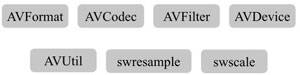

* 相同的Filter 线性链之间用逗号分隔
* 不同的filter线性链之间用分号分隔。

### 视频图像转换计算模块swscae

提供了搞级别的图像转换API，允许进入图像缩放和像素格式转换，如1920到1080，如yuv420P到yuyv,或者转换为RGB等

### 音频转换计算模块swresample

音频采样，音频通道布局转换与布局调整。

## FFmpeg 的编解码工具 ffmpeg

ffmpeg 是FFmpeg源代码编译后生成的一个可执行程序。其可以作为命令行工具使用。

### 简单转码示例

````
./ffmpeg -i input.mp4 output.avi
````

#### 解析 

ffmpeg 通过-i 参数将input.mp4 作为输入源输入，然后转码封装操作，出去到output.avi 中。

### 简单转码指定输出格式

````
./ffmpeg -i input.mp4 -f avi output.dat
````

#### 解析

-f 定制了输出文件的容器格式。

#### 经历的步骤

* 读取输入
* 解封装
* 解码
* 编码
* 封装
* 输出

## FFmpeg 的播放器ffplay

使用ffmpeg的acformat和avcodec 可以播放各种媒体文件或者流。如果想要使用ffplay ,那么系统首先需要有SDL 来进行ffplay 进行基础支撑。ffplay是另外一个可执行程序，提供音视频显示和播放相关图像信息，音频的波形信息等。

## FFmpeg 的多媒体分析器ffprobe

多媒体分析工具，可以从媒体文件或媒体流中获得你想要了解的媒体信息，如音频参数，视频的参数，媒体容器的参数等。

## FFmpeg 的编译支持与定制

ffmpeg 所做的 只是提供一套基础框架，所有的编码格式，文件封装格式流媒体协议等均可以作为ffmpeg 的一个模块挂载在ffmpeg 框架中，这些模块以第三方的外部库的方式提供支持。可以通过ffmpeg源码的configure 命令查看支持的音视频格式，文件封装格式与流媒体传输协议，对于暂时不支持的格式，可以通过configure --help 查看所需要的第三方外部库，然后通增加对应的编译参数选项进行支持。

可以通过--enable- 命令配置需要添加到编码格式。

可以通过--disable- 命令关闭不需要的编码封装协议等模块。

### ffmpeg 编码器支持

````
./configure --list-encoders 
````

通过上述命令查看编码器。

### ffmpeg 解码器支持

````
./configure -list-decoders 
````

### ffmpeg 的封装支持

````
./configure --list-muxers
````

### 解封装支持

````
./configure--list-demuxers
````

### 协议支持

````
./configure --list-protocols
````

## FFmpeg 常用命令

通过ffmpeg --help 可以查看到ffmpeg 常见的命令。大概可以分为6个部分。通过ffmpeg --help long 参数来查看更多信息。ffmpeg -help full 获取全部的帮助信息。

* 信息查询
* 公共操作参数部分
* 文件主要操作参数部分
* 视频操作参数部分
* 音频操作参数部分
* 字幕操作参数部分

### 封装转换

封装转换功能包含在AvFormat 模块中，通过libavformat 库进行mux 和demux 操作，多媒体文件格式有很多种，这些格式中很多参数在mux 与demux 的操作参数中是公用的。 可以通过ffmpeg --help full 信息中AvformatContext 参数部分，该参数下单所有参数君威封装转换可使用的参数。以下是主要参数及其说明：

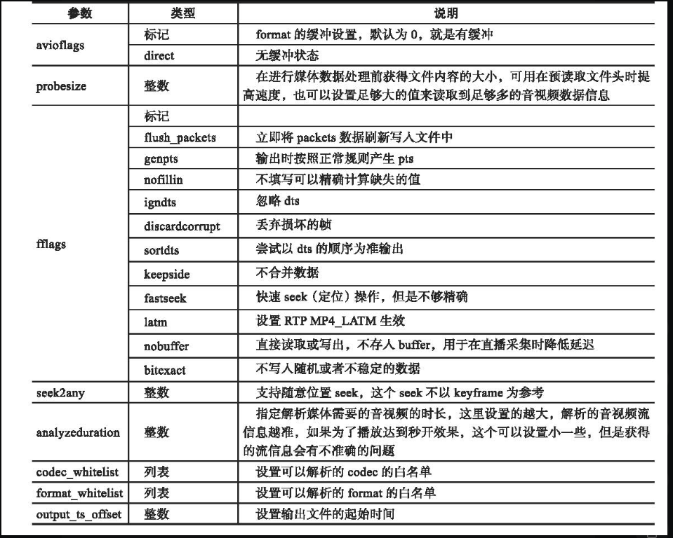

这些都是通用的封装，解封装操作时候使用的参数。

###　转码参数

ffmpeg 编解码部分的功能主要是通过AVCodec 来完成的，通过libacvodec 库进行encode 与decode 操作。可以在AVCodecContext 参数中查询。下列是AVCodecContext 主要参数：


### 基本转码原理

ffmpeg 工具的主要用途为编码，解码，转码以及媒体格式转换，ffmpeg 常用语进行转码操作。ffmpeg 转码原理图：

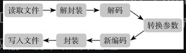

#### 简单转码示例

````
./ffmpeg -i /input.rmvb -vcodec mpeg4 -b:v 200k -r 15 -an output.mp4
````

* 转封装格式 从RMVB 转换为 mp4
* 视频编码为RV40 转换为mpeg4
* 视频码率转为 200kbit/s
* 视频帧率修改为15fps
* 转码后不包含音频 -an 参数

## ffprobe 常用命令

ffprobe 主要是查看多媒体文件信息。ffprobe --help 查看详细帮助。

packet 字段说明：


format 字段说明


frame 字段说明 


stream 字段说明


stream 字段信息


### 简单查看多媒体数据包信息

````
ffprobe -show_packets input.flv
````

## ffplay 常用命令

ffplay 通常作为播放器，同样也可以作为音视频数据点图形化分析工具，可以通过ffplay 看到视频图像的运动估计方向，音视频数据点波形等。

同时也是测试ffmpeg 的codec 引擎、format引擎，以及filter引擎的工具。

ffplay --help 查看支持功能

ffplay 基础帮助信息


### 简单播放

````
ffplay -ss 30 -t 10 input.mp4
````

视频从第30秒开始播放，播放10秒的视频文件。

> 设置title,可能在Android上莫得效果。

### 网络直播流

````
ffplay rtmp://up.v.test.com/live
````

### ffplay 高级参数


## 音视频文件转Mp4

在互联网常见的格式中，跨平台最好的应该是mp4,很多系统默认都默认支持mp4.

mp4格式标准为ISO-14496 Part 12、ISO-1449 Part 14。首先描述几个概念：

* mp4 文件由许多个box 与FullBox 组成
* 每个Box 右Header和Data 两部分
  * fullBox 是box 的扩展，在box 结构的基础上，在Header 中增加8位version 标识和24位flags标识。
  * Header 包含了整个box 的长度的大小和类型，当size 等于0时，代表这个box 是一个文件的最后一个box,当size 等于1的时候，说明box 长度需要更多的位来描述，在后面会定义一个64位Largesize 用来描述box 长度，当type为UUID时，说明这个box中的数据是用户自定义的扩展类型。
  * data 为box 的实际数据，可以是纯数据，也可以是更多的子box
  * 当一个box 中的data是一系列的子box 时，这个box 又可以称为Container(容器)box

mp4 常用参考标准。标记V的box 为必要box,否则为可选box:

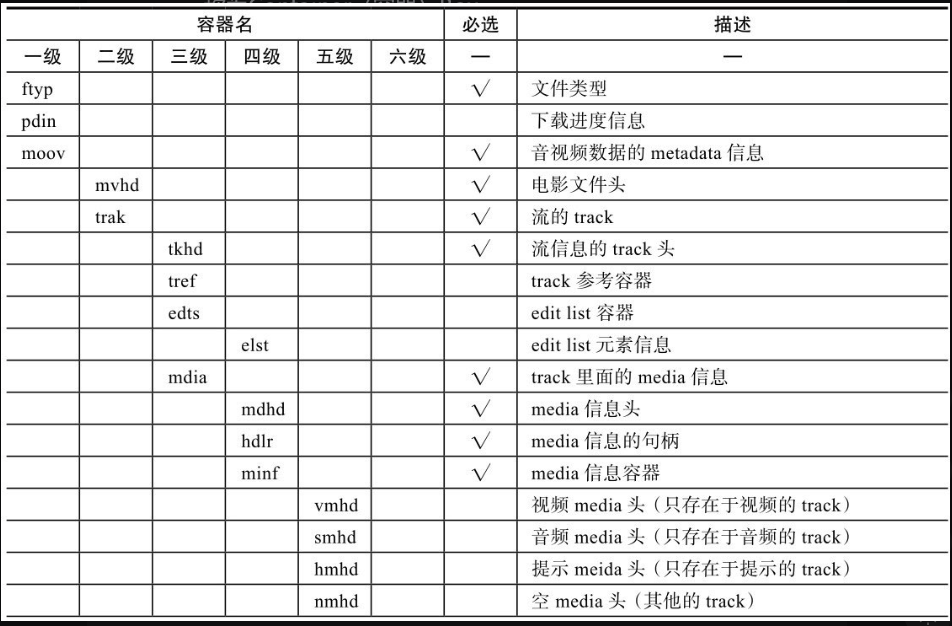

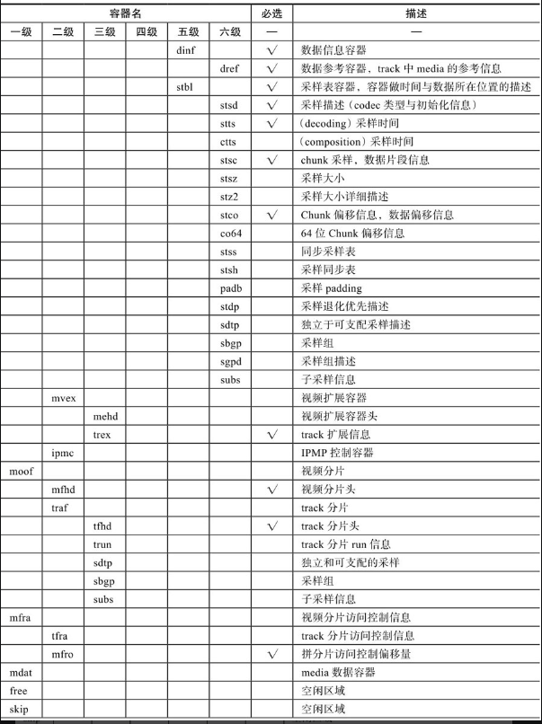

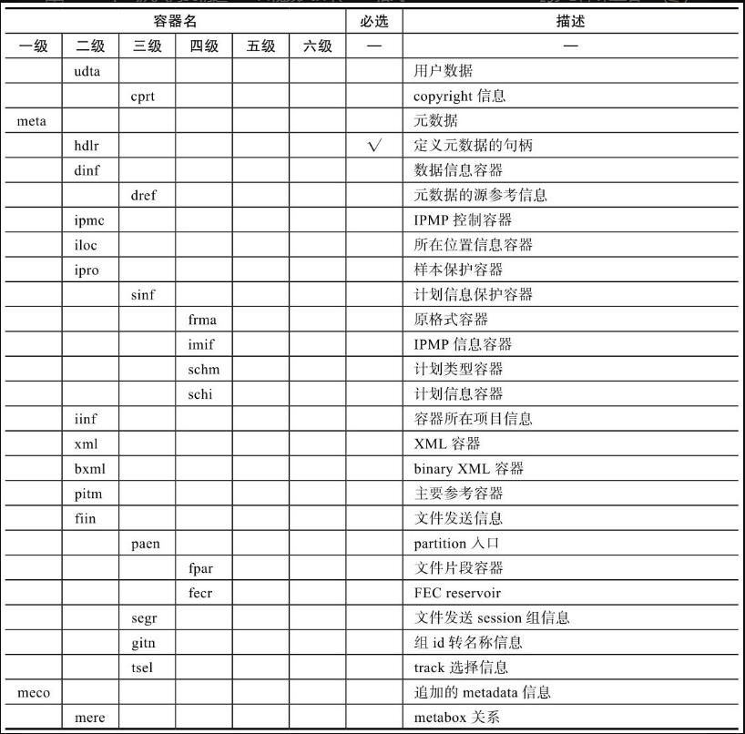

通常而言，在mp4 文件中，box 的结构与上述描述一版没有太大的差别，因为Mp4的标准中描述的moov和mdat 的存放位置前后没有进行强制要求。如果需要mp4文件被快速打开，则需要将moov存放在mdat的前面，如果放在后面，则需要将mp4 文件下载完成后才可以进行播放。

### moov 容器

moov 容器定义了一个Mp4 文件中的数据信息，类型是moov，是一个容器atom，其至少必须包含以下3种atom 中的一种。

*  mvhd 标签，movie header atom 存放未压缩过的影片信息的头容器。
* cmov 标签 compressed movie atom 压缩过的电影信息容器，此容器不常用
* rmra 标签 reference movieatom 参考电影信息容器，此容器也不常用

当然也可以包含其他容器信息，如果影片的剪辑信息 clipping atom(clip),一个或几个 tackAtom(trak),一个color table atom (ctab),user data Atom (udta)等。

其中 mvhd 定义了多媒体问题的time scale,duration 以及display characteristics,track 是多媒体文件中可以独立操作的媒体单位，例如一个音频流或者一个视频流就是一个track.

moov 参数：


#### 解析mvhd 子容器

mvhd 参数：

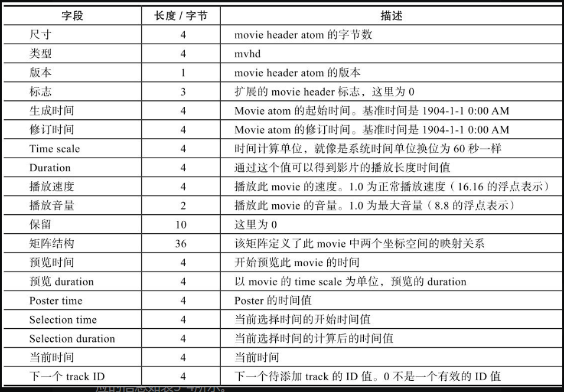

mvhd 参考值：

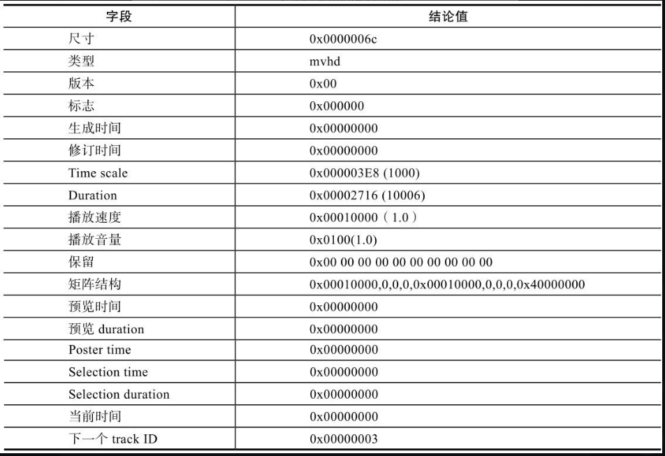

#### 解析trak 子容器

trak 容器中定义了媒体文件中的track 的信息，一个媒体文件中可以包含多个trak,每个trak 都是独立的。具有自己的时间和空间占用信息，每个trak 容器都有与他关联的media 容器描述信息。

*  包含媒体数据点引用和描述（media track）

* 包含modifier track 信息

  *  流媒体协议等打包信息（hint track）,hint track 可以引用或者复制对应的媒体采用数据

hint track 和modiffier track 必须保证完整性，同时要至少一个media track 一起存在。
> 一个trak 容器中要求必须要有一个track header atom(tkhd),一个 media atom (mdia) 其他atom 都是可选的。例如以下：
>
> * track 剪辑容器 track clipping atom (clip)
> * track 画板容器 track matte atom (matt)
> * edit 容器 edit atom (edts)
> * track 参考容器 track reference atom (tref)
> * track 配置加载容器 track load settings atom (load)
> * track 输出映射容器 track input map atom (imap)
> * 用户数据容器 user data atom (udta)

track 数据通用参考表

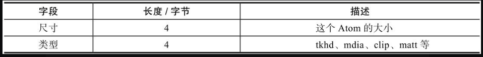

#### 解析tkhd 容器

tkhd 参数

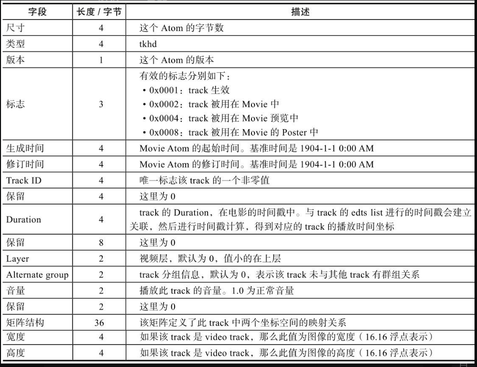

视频的tkhd 参数值

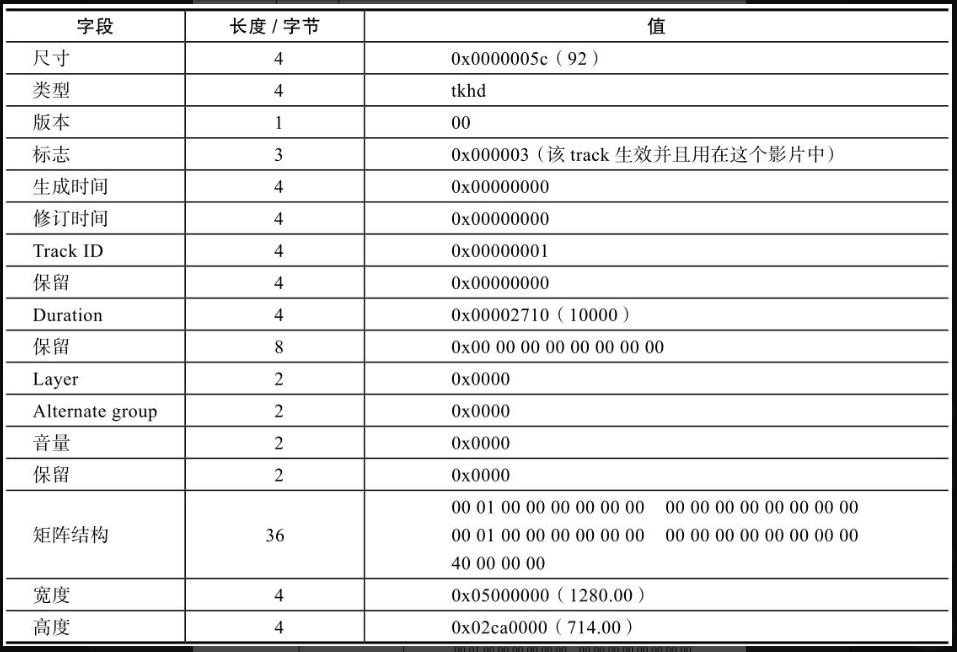

音频的tkhd 参数值

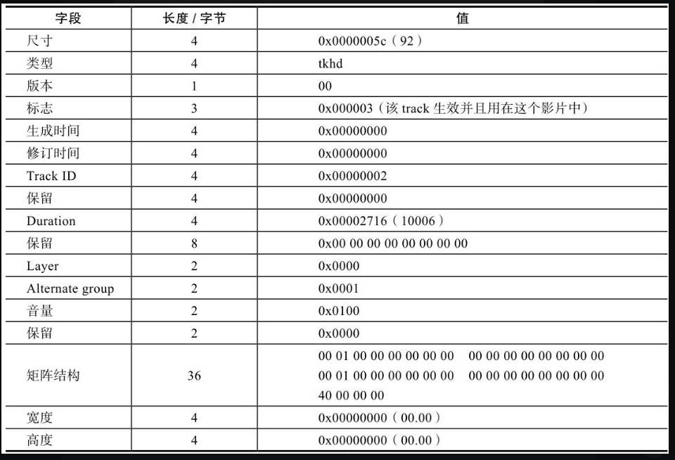

音频与视频的trak 的tkhd 的大小相同，里面的内容会随着音频的trak 类型的不同而有所不同。

#### 解析mdia 容器

media atom 的类型是mdia.其必须包含如下容器。

* 一个媒体头：media header atom (mdhd)
* 一个句柄参考 handler reference (hdlr)
* 一个媒体信息  media infomation (minf) 和用户数据 user data atom (udta)

mdia 容器参数：

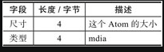

#### 解析mdhd 容器

mdhd 容器被被包含在各个track 总，描述了mieda 的header.其中包含以下 信息：

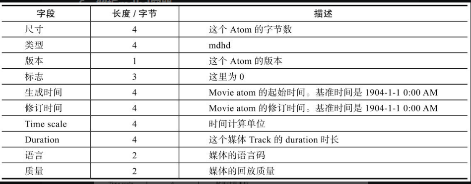

根据iso 14496-part 12 标准中的描述可以知道，当版本字段为0时候，解析与当前版本字段为1的时候稍微不同。mdhd 参数值：

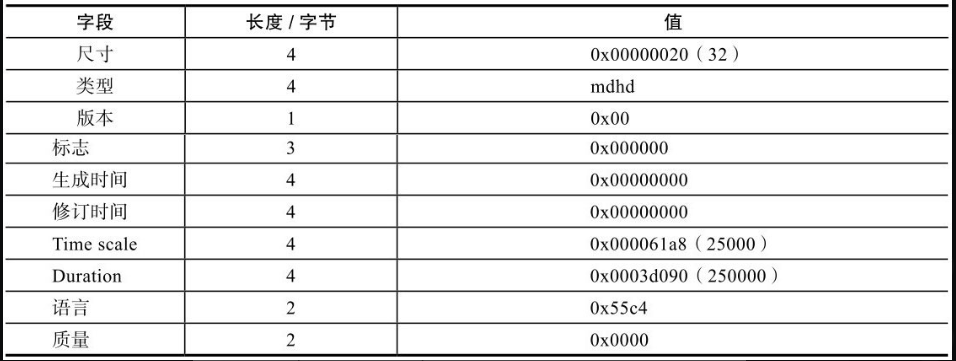

音频时长可以根据duration/timeScale 的方式来计算。

#### 解析Hdlr 容器

Hdlr 容器描述了媒体流的播放过程，该容器中包含以下内容：

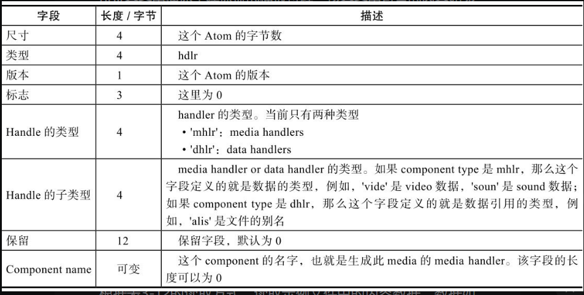

hdlr 参数值：

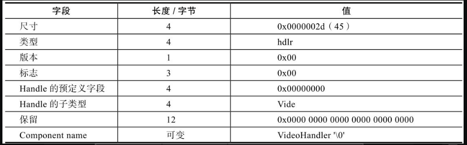


#### 解析minf 容器

minf 容器中包含了很多重要的子容器，例如音视频采样等信息相关的容器，minf 容器中的信息作为音视频的映射存在。

*  视频信息头 video media information header (wmhd 子容器)
* 音频信息头 sound media information header (smhd 子容器)
* 数据信息 data information (dinf  子容器)
* 采样表 sample tab （stbl 子容器）

#### 解析 vmhd 容器

wmhd 容器内容格式如下：

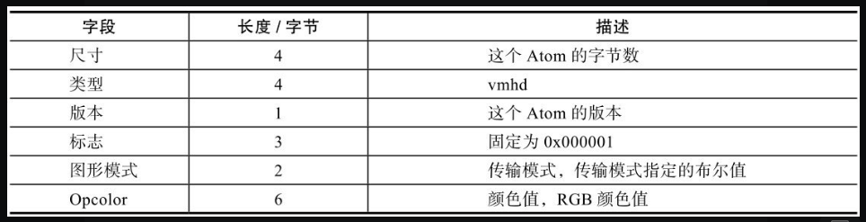

vmhd 参数值：

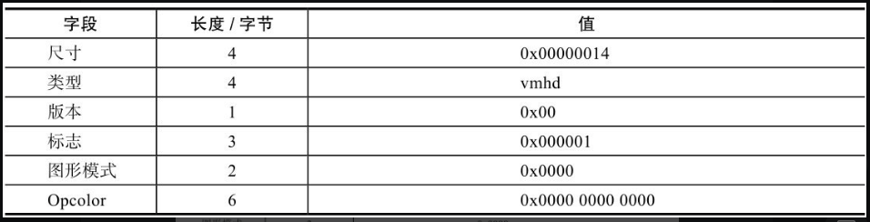

#### 解析 smhd 容器

参数：

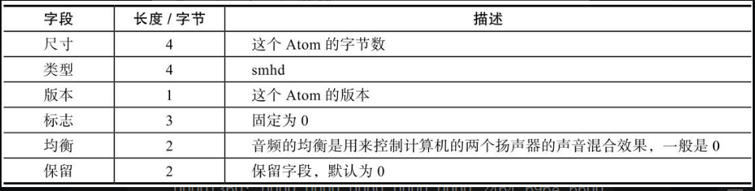

参数值：

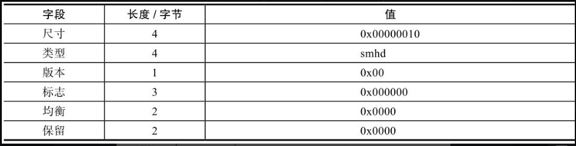

#### 解析dinf容器

dinf 容器是一个用于描述数据信息的容器，其定义的是音视频数据信息，这是一个容器，他包含子容器 dref.dinf 参数：

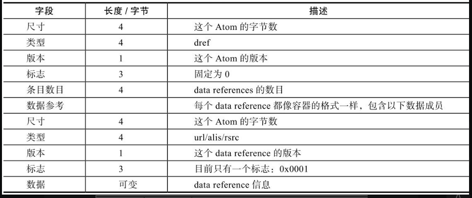

#### 解析stbl 容器

stbl 容器又称为采样参数列表容器，sample tab atom ,改容器包含转换媒体时间到实际的sample 信息，也说明就解释sample 的信息，例如视频数据是否需要解压缩，解压缩算法是什么等等。其所包含的子容器具体如下：

* 采用描述容器sample description atom  (stsd)
* 采样时间容器 time to sample atom (stts)
* 采样同步容器  sync sample atom (stss)
* chunk 采样容器 sample to chunk atom (stsc)
* 采样大小容器 sample size atom (stsz)
* chunk 偏移容器 chunk offset atom (stco)
* shadow 同步容器 shadow sync atom (stsh)

stbl 包含track 中的media sample 的所有时间和数据索引，利用这个容器中的sample信息，就可以定位sample的媒体时间，决定其类型，大小，以及如何在其他容器中找到临近的sample,如果 sample table atom 所在的track 没有引用任何数据，那么他就不是一个有用的media track,不需要包含任何子atom 

如果sample table atom 所在的track 引用了数据，那么其必须包含以下atom.

* 采样描述容器
* 采样大小容器
* chunk 采用容器
* chunk 偏移容器。

所有的子表都有相同的sample 数目。stbl 是必不可少的一个atom ,而且必须包含字少一个条目，因为他包含了数据引用 atom 检索 media sample 的目录信息，没有sample description 就不可能计算出media sample 存储到我这，sync sample atom是可选的，如果没有，则表明所有sample 都是 sync sample。

#### 解析edts 容器

edts 容器定义了创建 movie 媒体文件中一个tarck 的一部分媒体，所有的edts 数据都在一个表里，包含没一部分的时间偏移量和长度，没有该表，那么这个track 就会立即开始播放，一个空的edts 数据用来定位到track 的起始时间偏移位置。如下图所示：

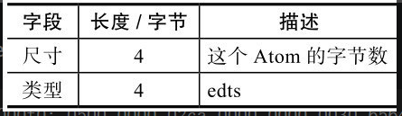

### mp4 分析工具

可以用来分析mp4 封装格式的工具比较多，除了ffmpeg 之外，还有一些常用的工具，如Elecard streamEye,mp4box,mp4info 等。

#### elecard streamEye 

这个调调是一个非常强大的视频信息查看工具，能够查看帧的排列信息，将I 帧，P帧，B帧以不同的颜色的柱状展示出来，而柱的长短将根据帧的大小展示，包含流信息，宏快信息，文件头信息，图像的信息，以及文件信息等。

#### mp4 box

mp4box 是一个gpac 项目中的一个组件，可以通过mp4box 针对媒体文件进行合成，拆解等操心。

#### mp4info

可视化分析工具，可以将mp4 文件中的box 解析出来，并且将数据展示出来。

### mp4 在ffmpeg 中的demuxer

ffmpeg 解封装 mp4 常用参数

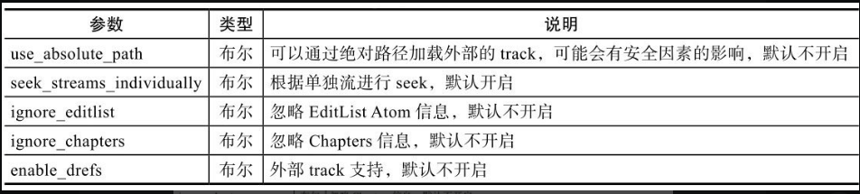

在解析mp4 文件的时候，通过ffmpeg 解析时，也可以通过参数 ignore_editlist 忽略 editlist atom 对mp4 进行解析，关于mp4 的demuxer 操作通常使用默认配置即可。

通过查看ffmpeg 的helpe 信息

````
ffmpeg-h demuxer=mp4
````

mp4 的demuxer 与moc,3gp,m4a,3g2,mj2的demuxer 相同。

### mp4 在ffmpeg 中的muxer

ffmpeg 封装mp4 常用参数：

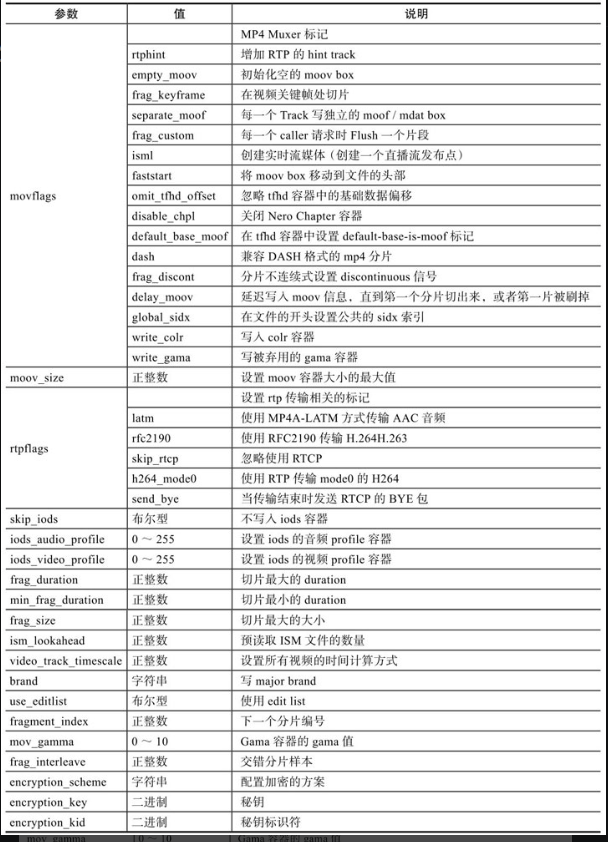

通过上图可以看出，mp4的muxer 支持的参数比较复杂，例如支持在制品关键帧处切片，支持设置moov 容器大小的最大值，支持设置encrypt 加密等。

#### faststart 参数的使用案例

正常情况下，ffmpeg 生成moov 是在mdat 写完之后再写入，可以通过 参数fastatart 将moov 容器移动到mdat的前面。

````
./ffmpeg -i input.flv -c copy -f mp4 output.mp4
````

``````
./ffmpeg -i input.flv 0c copy -f mp4 -movflags faststart output.mp4 
``````

至于顺序为啥这么重要：

> 通常而言，在mp4 文件中，box 的结构与上述描述一版没有太大的差别，因为Mp4的标准中描述的moov和mdat 的存放位置前后没有进行强制要求。如果需要mp4文件被快速打开，则需要将moov存放在mdat的前面，如果放在后面，则需要将mp4 文件下载完成后才可以进行播放。

#### dash参数的使用案例“没懂”

当使用生成的dash格式的时候，里面使用了一种特殊的mp4 格式，可以通过dash 参数来生成。"没懂"

````
./ffmpeg -i input.flv -c copy -f mp4 -movflags dash output.mp4
````

#### isml 参数的使用

ismv 作为微软发布的一个流媒体格式，通过参数 isml 可以发布isml 直播流，将ismv 推流至IIS 服务器，可以通过 isml 进行发布：

````
./ffmpeg -re -i input.mp4 -c copy -movflags isml frag_keyframe -f ismv stream  
````

生成的文件格式的原理类似于 HLS,使用xml 格式化进行索引。索引内容中主要包含音视频流的关键信息，例如视频的宽高以及码率等关键信息。

## 视频文件转FLV

在网络的直播与点播场景中，flv 也是一种常见的格式，flv 是adobe 发布的一种可以作为直播也可以作为点播的封装格式。其封装格式非常简单，均以flvtag 的形式存在。每一个tag都是独立存在的。

### flv 格式标准介绍

FLV 文件格式分为两部分，一部分为FLV文件头，另外一部分为FLV 文件内容。

#### FLV 文件头格式：

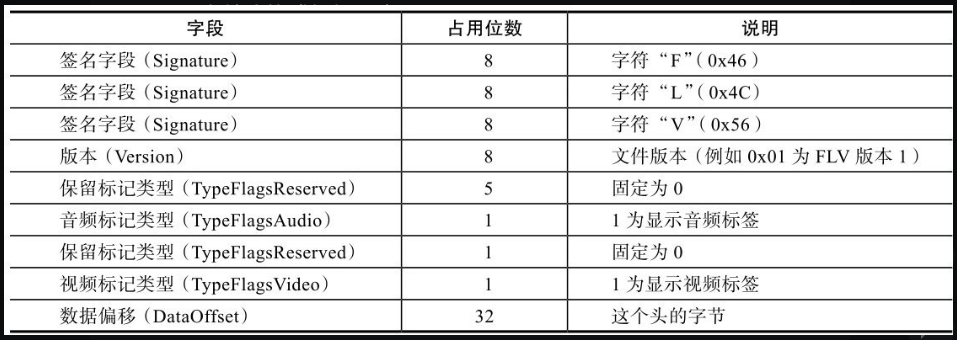

通过上图 可以看出 FLV文件头格式中签名字段占用3个字节，最终组成的3个字符分别为“FLV”,然后是文件的版本，常见的为1，接下来的一个字节前5位为0，接着音频展示设置为1，然后下一位是0 ，再下一位为视频展示为1，如果说一个音视频都展示的FLV 文件，那么这个字节会设置为00000101,然后是4字节的数据为FLV文件头数据点偏移位置。

#### FLV 文件内容格式

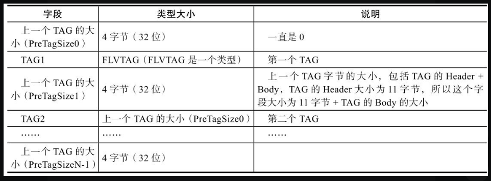

通过上图 可以看到FLV 文件的内容的格式主要为FLVTAG,FLVTAG 分为两个部分，分别是TAGHeader部分和TAGBody 部分。

#### FLVTAG 格式解析

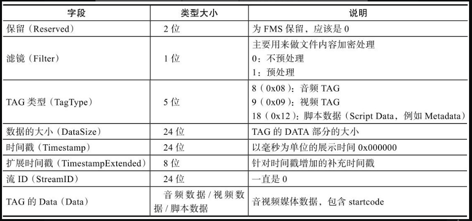

从上图 可以看到FLVTAG 的header 部分信息如下。

* 保留占位用2位，最大11b
* 滤镜位占位用1位，最大为1b
* TAG 类型占用5位，与保留位，滤镜位共用一个字节。一版默认将保留位与滤镜位设置0.
* 数据大小占用24位 3字节。最大为16777215字节
* 时间戳大小占用24位，3字节，最大为16777315毫秒，约等于16777秒，279分钟，4.66小时。
* 扩展时间戳大小占用8位，1字节，最大为255，使得时间戳最大为1193个小时，以天为单位大约为49.7天。
* 流id 占用24位，3字节。最大为0xffffff,不过默认一直存储为0

紧接着在FLVTAG header 之后存储为TAG 的data,大小为FLVTAG 的head而中的DataSize 中存储的大小，存储数据分为 视频数据、音频数据、脚本数据。

#### videoTAG 数据解析

如果从FLVTAG 的header 中读取到的tagType 为0x09,则为视频数据的TAG,FLV 支持多种视频格式。

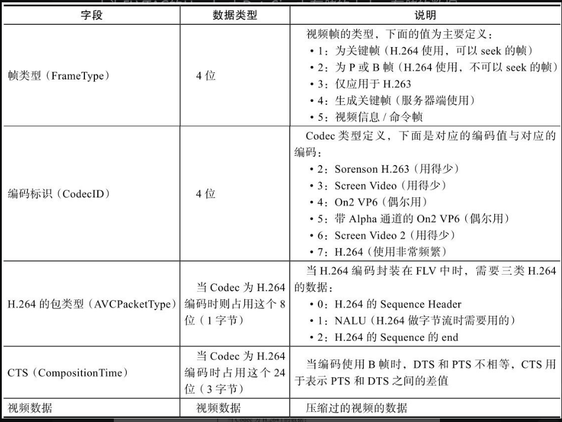

#### AudioTag 数据格式解析

从FLVTAG 的header 中解析到TagType 为0x08,这个TAG 为音频。与视频TAG 类似，音频TAG 里面课余i封装的音频编码也可以有很多种。

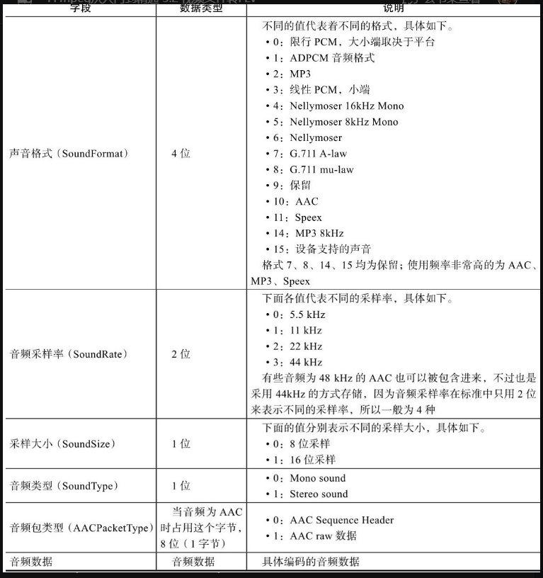

#### ScriptData 格式解析

当FLVTAG 读取到TagType 类型为0x12 时，这个数据为ScriptData 类型。Script-Data 常见的展示方式是FLV的metadata。里面存储的数据格式一版为AMF 数据。

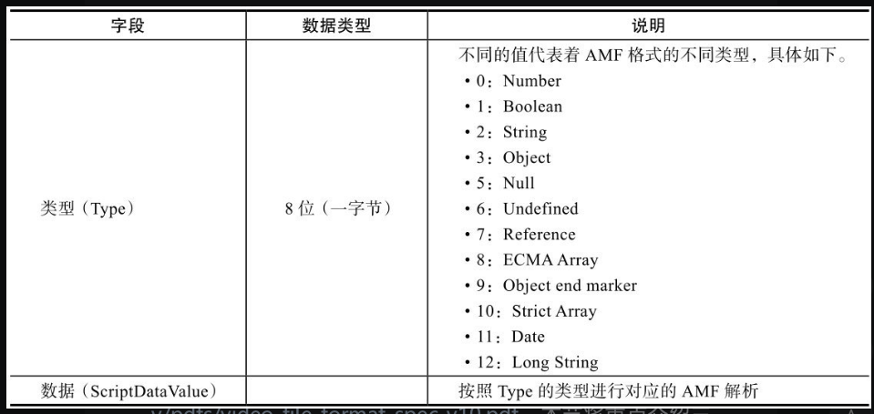

### ffmpeg 转FLV 参数

ffmpeg 的FLV 封装格式参数：

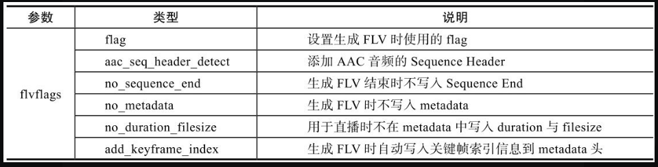

通过上图可以看出，在生成FLV 文件时候，写入视频，音频数据等均需要写入Sequence header 数据，如果FLV视频流中没有Sequence Header 那么视频很可能就不会显示出来，如果音频中没有就可能不会播放出来。所以需要将ffmpeg 中的参数fivflags 值设置为aac_seq_header_detect,其将写入音频aac的Sequence Header.

### ffmpeg 文件转为FLV 简单示例

FLV 封装中可以支持的视频编码主要包含如下内容

* Sorenson H.263
* screen video
* On2 VP6
* 带Alpha 通道的 On2 VP6
* screen video 2
* H.264 (AVC)

FLV 中封装支持的音频主要包含如下内容。

* 限行PCM 
* ADPCM 音频格式
* MP3
* 线性PCM 
* Nellymoser 16KHz mono
* nellymoser 8kHz mono 
* nellymoser
* G.711 A-law
* G.711 mu-law
* 保留
* AAC
* speex
* mp3 8kHz

如果 封装FLV 时，内部的音频或者视频不符合标准时候，那么他们肯定是封装不进FLV 的，还会报错

为了解决这类问题，可以进行转码，转换为支持的格式。

### Ffmpeg 生成带有关键索引的FLV 


## 视频文件转M3U8
## 视频文件切片
## 音频文件音视频流抽取
## FFmpeg 转封装 系统资源使用情况
## FFmpeg 软编码与H264
## ffmpeg 硬编码
## ffmpeg 输出Mp3
## ffmpeg 输出AAC
## FFmpeg转码系统资源使用情况  
## ffmpeg 发布与录制RTMP 流
## FFmpeg 录制RTSP 流
## FFmpeg 录制Http 流
## ffmpeg 录制与发布UDP/TCP 流
## ffmpeg 推出多路流
## ffmpeg 生成HDS流
## ffmpeg 生成DASH流
## ffmpeg 滤镜Filter
## ffmpeg 水印
## ffmpeg 画中画
## ffmpeg 多宫格处理
## ffmpeg 音频流滤镜操作
## ffmpeg 音频音量探测
## ffmpeg 视频添加字幕
## ffmpeg 视频抠图合并
## ffmpeg 3D 视频处理
## ffmpeg 定时视频截图
## ffmpeg 生成测试元数据
## ffmpeg 对音视频倍数处理
## ffmpeg linux 设备操作
## ffmpeg os x 设备操作
## ffmpeg windows 设备操作
## ffmpeg 旧接口使用
## ffmpeg 新接口使用
## ffmpeg filtergraph和filter
## ffmpeg 预留的滤镜
## ffmpeg avfilter流程图
## ffmpeg 使用滤镜+Logo 操作
