> 个人感觉这本书。很系统，很适合入门。
# 正文 
## 前言
音视频技术天生就和日常生活很近，拍照，音乐，小视频，瘦脸，混音等。从各种人脸识别算法到越来越强大的摄像头或是专用的
dps 芯片。
# 正文
## 音视频基础概念
### 声音是波
**声音是由物体振动产生** <br>
声波的3要素：

* 频率
* 振幅
* 波形

以上3要素共同决定了声波，因为是波，所以音频的合成也是波的合成。人体耳朵听力大约是**20Hz~20KHz**。<br>
人耳对于3~4KHz 频率的声音比较敏感，而对于较低或较高频率的声音，敏感度会有所减弱，在声压级别较低时，听觉的频率特性会很不均匀。
而在声压级别较高时候，听觉的频率特性会变得较为均匀，频率范围较宽的音乐 其声压以80~90dB(分贝)为最佳。超过90会损害人耳，105为人耳基线。

### 数字音频
为了通过数字信号存储音频。转换过程分别为：采样、量化、编码。<br>
通常所说的音频的裸数据格式就是脉冲编码调试(Pulse code Modulation, PCM)数据。描述一段PCM数据一般需要以下几个概念：
* 量化格式 sampleFormat
* 采样率 sampleRate
* 声道数 channel
### 音频编码
音频压缩分为有损压缩和无损压缩，常用的都是有损压缩。常用的压缩算法：PCM,WAV,AAC,MP3,Ogg等。<br>
压缩编码的原理实际上是压缩调冗余的信号，冗余的信号是指不能被人耳感知到的信号。
#### wav编码
pcm 是pulse code modulation的缩写，而wav编码的一种实现就是在pcm 数据格式前加44字符，分别用来描述pcm的采样率，声道数，数据格式等等。<br>
特点：音质非常好，大量软件都支持。<br>
适用场合：多媒体开发的中间文件，保存音乐盒音效素材。
#### mp3编码
mp3具有不错的压缩比，使用LAME编码(mp3编码格式的一种实现)的中高码率的mp3,听觉上非常接近源wav文件。在不同的应用常
场景下，应该调整合适的参数。<br>
特点：音质在128kbit/s以上表现还不错，压缩比较高，大量软件都支持，兼容性能好。<br>
适用场合：高比特率下对兼容性有要求的音乐。

#### aac 编码
aac 是新一代有损压缩技术，通过附加一些编码技术(ps,sbr等) 衍生出来LC-aac,he-aac,he-aac v2 3种主要的编码格式。
lc-aac 是比较传统的aac,相对而言，主要应用与高码率的场景编码（>=80kbit/s）,he-aac(相当于aac+sbr)主要应用与中低码率场景
的编码（<=80kbit/s），而新退出来的he-aac v2(相当于aac+sbr+ps)主要应用与低码率的编码(<=48kbit/s),大部分都编码器设置小于等于48kbit/s 自动启用ps技术。<br>

特点：小于128kbit/s 的码率下表现优异。并且多用于视频中的音频编码。

#### Ogg 编码

一种非常有潜力的编码，在各种码率下都有优秀的表现，尤其是在中低码率场景下。主要是免费。

特点：可以比mp3 更小的码率实现比mp3更好的音质，兼容性不够好，流媒体特性不支持。

适用场合：语音聊天的音频消息场景。

### 图像的物理现象

RGB 三原色。假设一步手机屏幕为1280   *  720，所有就有1280*     720个像素点。

#### RGB 表示方式

* 浮点表示：取值范围为0.0~1.0，比如在 openGl ES 中对于每一个子像素点的表示使用就是这种表达方式。
* 整数表示：0到255或者00~FF个比特表示一个子像素。32个比特表示一个像素，这就类型与RGBA_8888数据格式。而Android上的RGB_565 则是16位比特模式表示一个像素。

对于一幅画而言，一般使用整数进行描述，比如1个RGBA_8888 的图像可采取如下方式：

````
1920*720*4=3.516MB
````

这也是位图在内存中所占的大小。所以需要图像压缩。比如JPEG压缩，JPEG是静态图像压缩标准，由ISO定制。但是不能压缩视频，这个和视频文件的颜色编码定义有关。

#### YUV 表示方式

视频通常采用这种表示方式，他最大的优点在于相对ＲＧＢ而言，带宽较小。

其中Ｙ表示亮度，也称灰阶，Ｕ和Ｖ表达色度，他们的作用是描述影像的色彩及饱和度，用于指定像素点颜色。

之所以采用ＹＵＶ色彩空间，因为他的亮度信号Ｙ和色度信息ＵＶ是分离的。如果只有Ｙ信号而没有ＵＶ，那么图像就是黑白灰图像。彩色电视采用ＹＵＶ空间正是为了用亮度信号Ｙ解决彩色电视与黑白电视的兼容问题，使得黑白电视机也可以接收彩色电视信号，最常用的表示形式是ＹＵＶ都使用８个字节表示，所取值范围是０到２５５.为了防止信号变动造成的过载，不论是rec.601还是bt.709的广播电视标准中，y的取值范围是16到235.UV的取值范围是16到240.

yuv最常用的采样格式是4:2:0,也就是说，如果某一行是4:2:0，那么其下一行就是4:0:2.再下一行就是 4:2:0。以此类推。相较于RGB而言：

````
1280*720*1+1280+720*0.5=1.318MB
````

#### YUV和RGB互相转换

> 这个是可以互相转换的，RGB 转换为YUV 会降低质量。

### 视频的编码

和音频编码类似，都是去除冗余的信息。但是视频编码却是帧内编码。

* 运动补偿，是通过之前的局部图像来预测，补偿当前的局部图像，他说减少帧序列冗余信息的有效方法。
* 运动表示。不同区域的图像需要使用不同的运动矢量来描述运动信息。
* 运动估计：运动估计是从视频序列中抽取运动信息的一整套技术。

ios 制定了MPEG标准，他除了对单幅图像进行编码外，来利用图像序列中的相关原则去除冗余，这样可以大大提高视频压缩比。Mpeg1(VCD)，mpeg2(dvd),mpeg4 AVC（现在流媒体使用最多的）

相较于ios 制定的mpeg的视频压缩标准，ITU-T 定制了H261,h262，h263,h264一系列视频编码标准。H264集中了以往的标准的所有优点。H264创造了多参考帧，多块类型，整数变化，帧内预测等新的压缩技术，使用了更精细的分像素运动矢量（1/4,1/8）和新一代的环路滤波器，使得压缩性能得到了大大提高。

#### 编码概念

视频压缩中，每一帧都代表着一幅禁止的图像，而进行压缩的时候，会采取各种算法以减少数据点容量，其中IPB帧就是最常见的一种。

#### IPB 帧

在H264的概念中有一个帧为IDR帧，因为H264采用了多帧预测，所以I帧之后的P帧可能会参考I帧之前的帧，这就使得在随机访问得时候不能以找到I帧作为参考条件，即使是找到了I帧，I帧以后的某一帧可能也解析不出来，而IDR 则是一个特是I帧，即这一帧之后的所有参考帧只会参考到这个IDR帧，而不会再参考前面的帧，在解码器中一旦收到了一个IDR帧，就会立即清理参考帧缓冲去，并将IDR帧作为被参考的帧。

###### i 帧

帧内编码帧，I帧通常是每个GOP的第一帧。经过适度的压缩，作为随机访问得参考点，可以当成静态图像。I帧可以看作一个图像经过压缩的产物，I帧压缩可以得到6：1的压缩比，而不产生任何可察觉到模糊现象。所以说I帧是完整的图像。

###### P帧

前向预测编码帧，通过将图像序列中前面已经编码帧的时间冗余信息充分去除来压缩传输数据量的编码图像，也称为预测帧。他需要参考前面一个I帧或者P帧完成解码成一个图像。

###### B帧

双向预测内插编码帧，即考虑图像序列前面的已编码的帧，又顾及源图像序列后面的已编码帧直接的时间冗余信息，来压缩传输数据量的编码图像，也称为双向预测帧。（Android 好像默认不开启B帧，待定），他需要参考前面或者后面的I帧或者P帧解码成图像。

##### PTS与DTS

DTS主要用于视频的解码，PTS主要用于在解码阶段进行适配的同步和输出。在没有B帧的情况下，DTS和PTS的输出顺序是一样的，因为B帧打乱的解码和显示顺序，所以一旦存在B帧，PTS和DTS就势必就会不同。FFmpeg中使用AVPacket 结构体来描述解码前或者编码前的原始数据。对于视频而言，Avframe 就是他的一帧图像，他什么时显示给用户，取决于PTS,DTS 是acPacket 的一个成员，表示改压缩包应该在什么时候被破解，如果视频里面个帧的编码是按输入顺序依次进行的。那么解码和显示时间是一致的。事实上。大多数编码标准中，编码顺序和输入顺序并不一致，于是才需要PTS 和DTS 这两种不同的时间戳。

##### GOP 概念

 两个I帧之间形成的一组图片就是GOP的概念，通常在为编码器设置参数的时候，必须要设置gop_size 的值。其代表的是两个I帧之间的帧数目。gop_size 设置越大，整个画面的画质就会越好，但是在解码端必须从接收到的第一个I帧开始才可以正确解码出原始图像，否则会无法正确解码。在提高视频质量中，多使用Ｂ帧，一般来说，Ｉ整的压缩率是７，Ｐ是２０，Ｂ帧最多可以达到５０，节约出来的空间可以保存更多的Ｉ帧。

## 移动环境搭建

在Android 平台上开发音视频相关项目必懂涉及JNI.他是一种编程框架，允许运行于JVM的JAVA程序去调用本地（C/C++ 以及汇编语言的代码）（听说，so 文件就是一个可执行程序），本地代码通常会与硬件或操作系统相关联。比如Android 系统的framework 层面 就采用了大量的JNI手段 去调用 native层的实现库。会涉及JNI的大致包含以下几种情景：

* 应用程序需要一些平台特性的支持，而JAVA 层没有，如openSL ES的使用
* 调用成熟或者已经存在的C/C++语言编写的代码。如openGl Es的视频特效处理库，或者FFmpeg，LAME等第三方开源库。
* 应用程序的某些关键操作对于运行速度有较高的要求。
* 做数据安全和数据校验。

### 交叉编译

交叉编译就是在一个平台上生成另外一个平台上可执行的代码。相对于正常编译，首先，最终程序运行的设备就是Android 或者iOS设备，编译及其就是我们的PC。而编译器也必须安装到PC上。所以大部分都嵌入式开发平台都提供了本身平台交叉编译所需要的交叉工具编译链。

* CC 编译器，对于C文件进行编译处理，生成汇编文件。
* AS 将汇编文件生成目标文件。汇编文件使用的是指令助记符，AS将他翻译成机器码。
* AR 打包器，用于库的操作，可以通过该工具从一个库中删除或者增加目标代码模块。
* LD 连接器，为前面生成的目标代码分配地址空间，将多个目标文件链接成一个库或者可执行文件。
* GDG:调试工具，可以对运行过程中的程序进行代码调试工作。
* STRIP，以最终生成的可执行文件或者库文件作为输入。然后消除掉其中的源码。
* NM：查看静态库文件中的符号表。
* Objdump:查看静态库或者动态库的方法签名。

#### 正常编译一个程序过程

````
//编译
gcc -c main.cpp ./libmad/mad_decoder.cpp -l./libmad/include
// 打包
ar cr ../prebuilt/libmedia.a mad_decoder.o
// 链接
g++ -0 main main.o -L ../prebulit -l mdedia
````

整个过程中，使用了gcc.ar,g++ 3个编译工具。

在Android提供的NDK 中，其交叉工具编译链中的prebuilt/darwin-x86_64/bin 中就包含了 gcc.ar,g++,gdb,strip.nm,ranlib 等工具。

### Android 交叉编译

> Android 原生开发包NDK  可用于Android 平台上的C++开发，NDK不仅仅是一个单一功能的工具，还是一个包含API,交叉编译器，链接程序，调试器，构建工具等综合工具集。

下面列举经常会用到的组件：

* ARM.x86交叉编译器
* 构建系统
* JAVA 原生接口头文件
* C库
* math 库
* 最小的C++ 库
* Zlib压缩库
* POSIX线程
* Android日志库
* Android原生应用API
* openGL ES 包括EGL 库
* OpenSL ES 库

下面描述下NDK 跟目录下的结构：

* ndk-build ：该shell 脚本是Android ndk 构建系统的起始点，一版在项目中仅仅执行这一个命令就可以编译出对应的动态链接库。
* ndk-gdb:该shell 脚本运行使用GUN调试器调试Native 代码。可以做到像调试JAVA 代码一样调试native 的代码。
* ndk-stack:该shell脚本可以帮助分析native 代码崩溃时的堆栈信息。
* build 包含NDK 构建系统的所有模块。
* platforms:该目录包含支持不同Android 目标版本的头文件和库文件。NDK构建系统会根据具体的配置来引用指定平台下的头文件合库文件。
* toolchains:该目录包含目前NDK所支持的不同平台下的交叉编译器。ARM,x86，MIPS等。

android.mk 是Android平台上构建一个C或者C++语言编写的程序系统的Makefile 文件。不同的是Android 提供了一系列的内置变量来提供更加方便的构建语法规则。application.mk 文件实际上是对应应用程序本身进行描述的文件，他描述了应用程序要针对那些CPU架构打包动态SO包，要构建的是release包还是debug包以及一些编译和链接参数等。

#### android.mk 文件

Android.mk 文件 可以分为以下几个部分。

* LOCAL_PATH:=$(call my-dir) 返回当前文件在系统中的路径，Android,mk 文件开始时，必须要定义该变量。
* include $(clear_vars) 表示清除上一次构建过程的所有全局变量。因为在一个 makefile 编辑脚本中，会使用大量的全局变量。使得这行脚本表明需要清除掉所有的全局变量。
* local_sec_files 要编译的C或者Cpp的文件，这里不需要列举头文件，构建系统会自动帮助开发者依赖这些文件。
* local_static_librarise 所依赖的静态库文件
* local_ldibs:=-l$(sysroot)/usr/lib -llog -lopenSles -lglesv2-legl -lz 指定编译过长所依赖的ＮＤＫ提供的动态与静态库，sysroot变量代表的是ndk_root 下面的目录$ndk_root/platforms/android-18/arch-arm,而在这个目录的usr/lib/ 目录下有很多对应的so的动态库以及.a 的静态库
* local_cflags 编译C或者Cpp的编译标志。在实际编译的时候会发送给编译器，比如常用的实例是加上-dauto_test,然后再代码中就可以利用条件判断#ifdef auto_test 来做一些与自动化测试相关的事情。
* local_ldflags 链接标志的可选列表，。当对目标文件进行链接以生成输出文件的时候，将这些标识带给连接器，该指令和local_lelibs 有些类似，一般情况下，改选项会用于指定第3方编译的静态库，local_ldlibs 经常用于指定系统的库，如log,openGL es,EGL 等。
* local_module 该模块的编译的目标名，用于区分各个模块，名字必须是唯一并且不包含空格。如果编译的目标是so 库，那么该so库的名字就是lib项目名.so
* include $(build_shared_library) 其实类似是include 还有很多，都是构建系统提供的内置变量。该变量的意义是构建动态库。其他内置变量还包括如下几种：
  * build_static_library：构建静态库
  * prebuilt_static_library:对已有的静态库进行包装，使得其成为一个模块
  * prebuilt_shared-library: 对已有的动态库进行包装，使其成为一个模块。
  * build_executable 构建可执行文件。

构建系统提供的内置变量 在$ndk_root/build/core/目录下，这里会有所有预先定义好的makefile,开发者include 一个变量，实际上就是把对应的makeile 包含到android.mk 中。

````
include $(call all-makef iles-under
````

$(cocal_path)) 也是构建系统提供的变量，该命令会返回该目录下所有子目录的Android.mk 列表。

那么在输入命令 ndk-build 之后，系统到底会使用那些编译器以及打包器和连接器来编译我们的程序呢？

> 会使用 $ndk_root/toolchains/arm-linux-androideabi-4.8/prebuilt/darwin-x86_64/bin/目录 下面的gcc,g++,ar，ld等工具。同样在该目录下的strip 工具将会用于清除so 包里面的源码，nm工具可以供开发者查看静态库下的符号表。

那么gcc 编译的时候，头文件将方在哪里？

> $ndk_root/platforms/android-18/arch-arm/usr/include/目录 下回存放编译过程所依赖的头文件。

那么在链接过程中，经常使用的log或者openSL ES 以及OpenGL ES 等库又将放在哪里呢？

> $ndk_root/platforms/android-18.arch-arm/usr/lib/目录下回存放链接过程中所依赖的库文件。

#### application.mk

###### app_abi:=xxx。

上面的xxx是指不同的平台，可以填的有：x86,mips,armeabi,armeabi-v7a,all等。若选择all 会构建出所有平台的so,如果不填该项，默认会构建为armeabi 平台下的库。构建armeabi-v7a平台的so 库之所以可以运行在 intel x86架构的cpu平台，因为intel针对armeabi 做了兼容，但是如果想要应用以最小的能耗、最高的运行效率运行在intel x86 的平台上，则好要指定构建的so 为x86平台。编译arm6-v8a的时候使用的交叉工具编译链与之前的v7a所在目录有较大的差异，其目录存放于：

> $ndk_root/toolchains/aarch64-linux-android-4.9/prebuilt/darwin-x86_64/bin

编译过程中使用的编译工具都存放于上述的目录中。

###### app_stl:gnustl_static

ndk 构建系统提供了由于Android系统给出来最小的C++运行时库（/system/lib/libstdc++.so）的C++头文件。然而ndk 带有另一个C++实现。开发者可以在自己的应用程序中使用或链接它，定义app_stl 可选择它们中的一个，可选项包括，stlport_static,stlport_shared,gnustl_static.等

###### app_cppflags:=-std=gnu++11-fexceptions 

指定编译过长的flag,可以在该选项中开启 exception rtti等特性，但是未了效率考虑，最好关闭rtti。

###### ndk_toolchanin_version=4.8

指定交叉工具编译链里面的版本号

###### app_platform：=android-9 

指定创建的动态库的平台

###### app_optim:=release 

该变量是可选的，用来定义 release 或debug,release 模式是默认的，并且会生成高度优化的二进制代码，debug 模式生成的是未优化的二进制代码，但是可以检测出很多bug,经常用于调试阶段，也相当于 ndk-build 指令后面直接加上参数 ndk_debug=1

#### 如何交叉编译

主要是对接lame,fdk_aac,x264这3个库进行交叉编译。

// TODO 这个调调 要实操。

## ffmpeg介绍与使用

ffmpeg 是一套可以用来记录，处理数字音频，视频，并且讲起转换为流的开源框架。提供了录制，转换，以及流化音视频的完整解决方案。名称中mpeg来着视频编码标准mpeg,而FF来着Fast forward 的首字母。

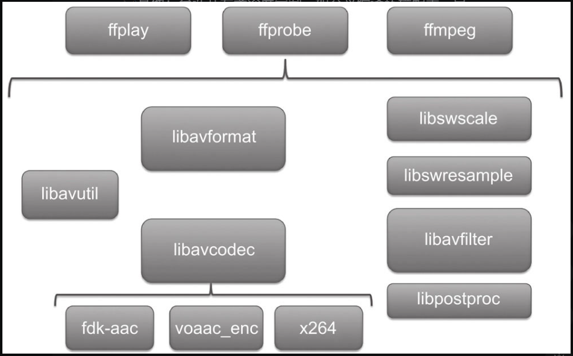

### ffmpeg 的编译与命令工具的使用

编译过程需要实战。

默认的编译会生成4个可执行文件合8个静态库，可执行文件包括用于转码，推流，dump媒体文件的ffmpeg,用于播放媒体文件的ffplay,用于获取媒体文件信息的ffprobe,以及作为简单流媒体服务器的ffserver。8个静态库其实就是FFmpeg 的8个模块:

* avutil ：核心工具库，该模块是最基础的模块之一。下面的许多其他模块都会依赖该库做一些基本都音视频处理。
* avformat:文件格式和协议库。该模块是最重要的模块之一，封装了protocol 层和demuxer,muxer层，使得协议和格式对于开发者来说是透明度。
* avCodec ：编解码库，该模块也是最重要的模块之一。封装了codec 层，但是又一些codec是俱备自己的licence的，ffmpeg是不会默认添加 libx264，fdk-aac,lame等库。
* avFilter：音视频滤镜库，该模块提供了包括音频特效和视频特效的处理，在使用ffmpeg 的api 进行编解码的过程中，直接使用该模块为音视频数据做特效处理是十分高效的。
* avDevice:输入输出设备库，比如，需要编译出播放声音或者视频的工具ffplay,就需要确保该模块是打开的。同时也需要libSDL的预先编译，因为改设备模块播放声音与播放视频使用的都是libSDL库。
* swrRessample：该模块可用于音频重采样，可以对数字音频进行声道数，数据格式，采样率等多种基本信息的转换。
* SWScale:该模块是将图像进行格式转换比如YUV转为为RGB
* PostProc：该模块可用于进行后期处理，当我们使用avFilter的时候，需要代开该模块的开关，因为filter 中灰使用到该模块的一些函数。

在ffmpeg 中，有一个类似的f ilter 称为 bit stream f ilter，要想在开发过程中使用 f ilter,则需要在编译的过程中打开它，该f ilter 存在的意义主要是应对某些格式的封装转换行为。

### ffmpeg api的介绍与使用(android)

术语介绍：

* 容器/文件（conainer/file）即特定格式的多媒体文件。比如mp4
* 媒体流  stream,表示时间轴上的一段连续数据，如一段声音。可以说压缩的，也可以说非压缩的
* 数据帧/数据包（frame/packet）通常，一个媒体流由大量的数据帧组成。
* 编解码器：编解码器是以帧为单位实现压缩数据和原始数据之间的转换。

####  Android 中引用头文件

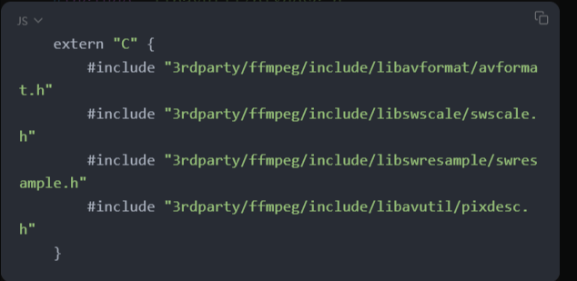

作为一种面相对象的语言，C++ 支持函数的重载，而面相过程的C语言是不支持函数的重载的，通一个函数在C++ 中编译后与其在C中编译后，在符号表中的签名是不同的。假如对于同一个函数：

`````
void decode(float position,floast duration)
`````

在C语言中便于出来的签名是_decode，而在c++中，编译出来是类似于

````
_decode_float_float 
````

虽然在编译阶段没有问题，但是在链接阶段，如果不加extern "C" 那么会链接到_decoder_float_float 这个方法签名，如果添加 extern "C" 则会链接到 _decode，而ffmpeg 是C语言编写的，所以FFmpeg 必须添加extern "C" 关键字。

#### 注册协议，格式与编解码器

使用FFmpeg的api，首先要调用ffmpeg 的注册协议，格式与编解码器的方法，确保所有的格式与编解码器都被注册到了ffmpeg 框架中。当然如果需要用到网络操作，那么也应该将网络协议部分注册到ffmpeg 框架中。以便于后续再去查找对应的格式。

````
avformat_network_init();
av_register_all();
````

文档中 还有一个方法是accodec_register_all(),其用于将所有编解码器注册到FFmpeg 框架中，但是av_register_all() 内部已经调用了avcodec_register_all()。

#### 打开流媒体文件源，并设置超时回调

````
    AVFormatContext ＊formatCtx = avformat_alloc_context(); 
    AVIOInterruptCB int_cb = {interrupt_callback, (__bridge void ＊)(self)};    			formatCtx->interrupt_callback = int_cb; 
    avformat_open_input(formatCtx, path, NULL, NULL);    			avformat_find_stream_info(formatCtx, NULL);
````

#### 寻找各个流，并且打开对应的解码器

##### 寻找音频解码器

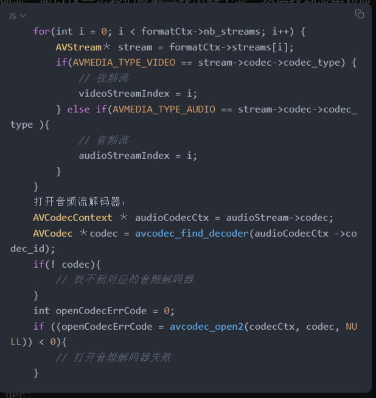

##### 寻找视频解码器

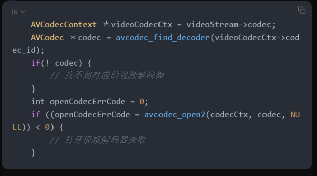

#### 初始化解码后数据的结构体

需要分配出解码后的数据所存放的内存空间，以及格式转换需要用的对象。

##### 音频格式转换存储对象

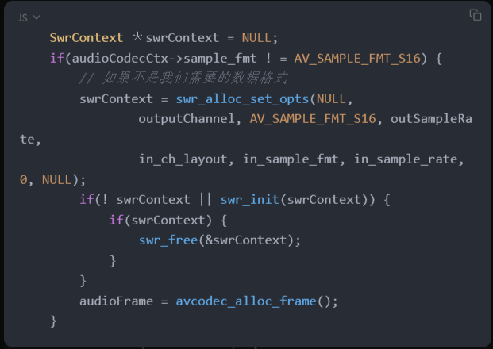

##### 视频格式转换存储对象

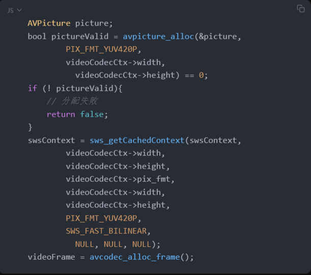

#### 读取流内容并且解码

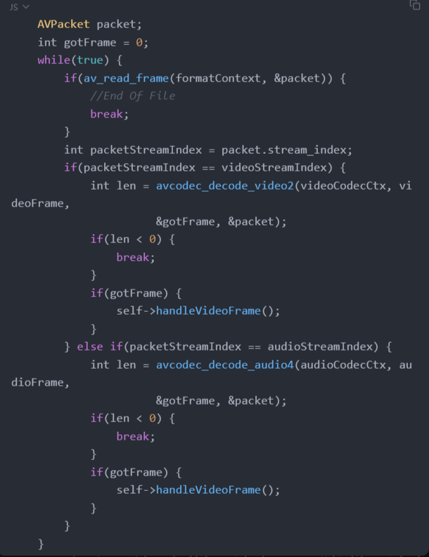

#### 处理解码后的裸数据

解码后就会得到裸数据，音频是PCM，视频就是YUV数据。

##### 音频裸数据

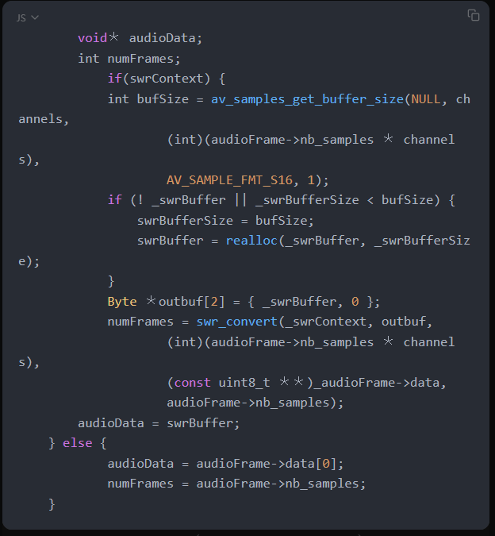

##### 视频裸数据

````
    uint8_t＊ luma;    uint8_t＊ chromaB;    uint8_t＊ chromaR;    if(videoCodecCtx->pix_fmt == AV_PIX_FMT_YUV420P ||            videoCodecCtx->pix_fmt == AV_PIX_FMT_YUVJ420P){        luma = copyFrameData(videoFrame->data[0],                videoFrame->linesize[0],                videoCodecCtx->width,                videoCodecCtx->height);        chromaB = copyFrameData(videoFrame->data[1],                videoFrame->linesize[1],                videoCodecCtx->width / 2,                videoCodecCtx->height / 2);        chromaR = copyFrameData(videoFrame->data[2],                videoFrame->linesize[2],                videoCodecCtx->width / 2,                videoCodecCtx->height / 2);    } else{        sws_scale(_swsContext,                  (const uint8_t ＊＊)videoFrame->data,                videoFrame->linesize,                0,                videoCodecCtx->height,                picture.data,                picture.linesize);        luma = copyFrameData(picture.data[0],                picture.linesize[0],                videoCodecCtx->width,                videoCodecCtx->height);        chromaB = copyFrameData(picture.data[1],            picture.linesize[1],            videoCodecCtx->width / 2,            videoCodecCtx->height / 2);        chromaR = copyFrameData(picture.data[2],            picture.linesize[2],            videoCodecCtx->width / 2,            videoCodecCtx->height / 2);    }
````

#### 关闭所有资源

解码完成后，或者在解码过程中不像继续解码了，可以退出程序，当然也需要释放资源。

##### 关闭音频资源

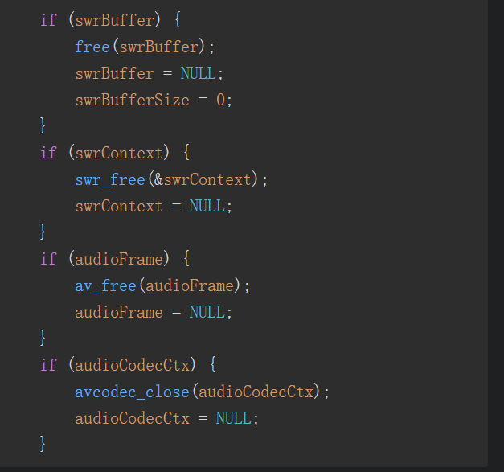

##### 关闭视频资源

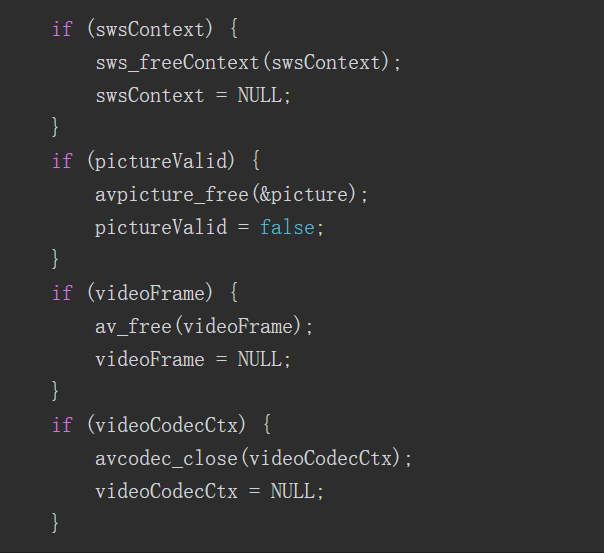

##### 关闭连接资源

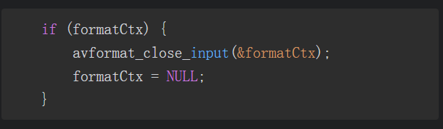

### ffmpeg 源码结构

### libavformat与libavcodec 介绍

#### libavformat 

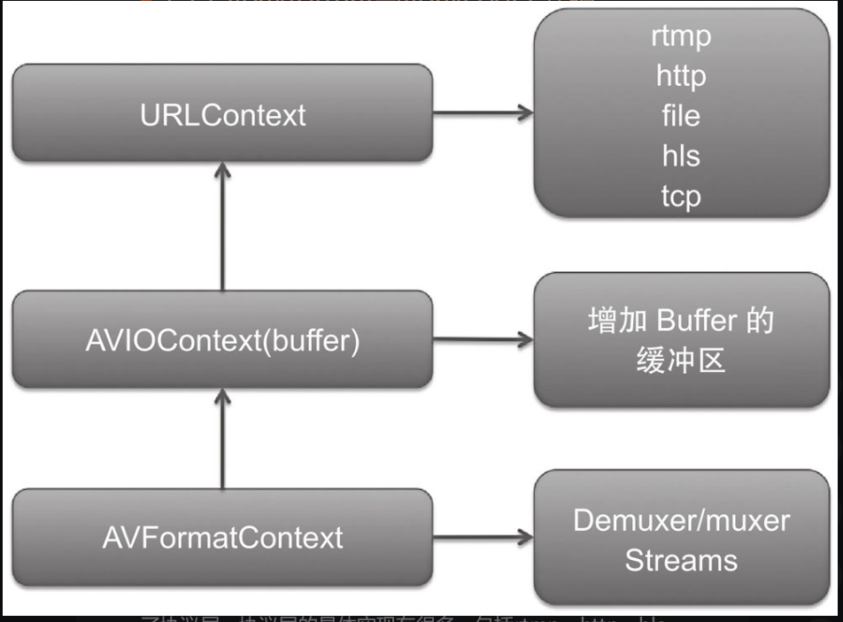

avformatContext 是api层直接接触到的结构体，它会进行格式的封装与解封装。他的数据部分由底层提供。底层使用了AvioContext,这个实际上是普通的io 增加了一层buffer 缓冲区。再往底层就是URLcontext,也就是到达了协议层，协议层的具体实现有很多，包括rtmp,http,hls,f ile 等。

#### libavcodec 

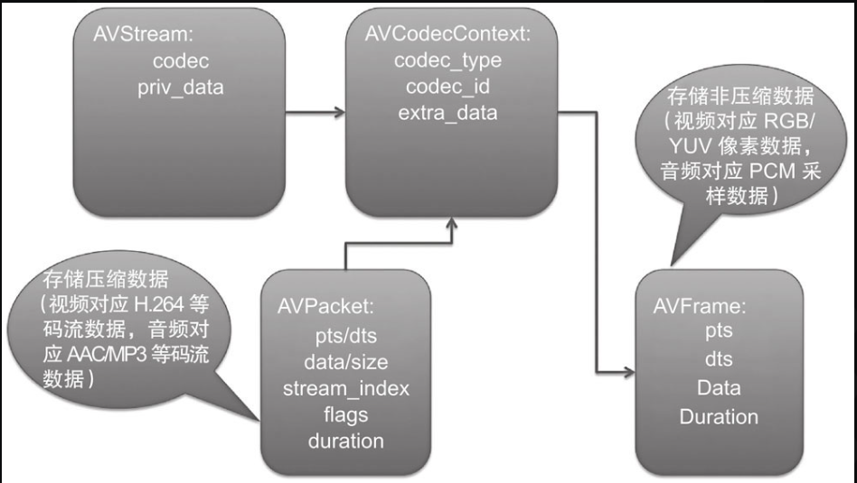

对于开发者而言，这一层是我们能接触到的最顶层的结构体。该结构体包含的就是与实际的编解码有关的部分。首页avcodecContext 是包含在一个AVStream 里面的，即描述了这路流的编码格式是什么，其中存放了具体的编码格式信息。根据codec 的信息可以打开编码器或者解码器。然后利用改编码器或者解码器进行 avPacket与Avframe 之间的转换（解码或者编码过程）

### 通用API 

#### av_register_all()

#### av_find_codec()

#### accodec_open2()

#### acvodec_close()

### 解码函数 

#### acformat_open_input()

#### avformat_find_stream_info()

#### av_read_frame()

#### avcodec_decode()

#### avformat_clase_input()

### 编码函数

#### avformat_alloc_out_context2()

#### avio_open2()

### 面相对象的C语言

## android平台下的音视频渲染

Android sdk 提供了3套音频播放api,MediaPlayer,soundpool和audioTrack.

* mediaPlayer 适合在后台长时间播放音视频文件。
* SoundPool：适合播放比较短的音频片段。如游戏声音，按键声音，他可以同时播放多个音频。
* audioTrack:适合低延迟播放，是更加底层的API，提供了非常强大的控制能力，适合流媒体等场景，需要结合解码器使用。

Android NDK 提供了OpenSE ES 的C语言接口，可以提供非常强大的音效处理，低延时播放等功能。

### audioTrack 的使用

它只允许输入裸数据（PCM），所以需要自行实现解码操作和缓冲区控制。audioTrack的工作流程：

* 根据音频参数信息，配置出一个audioTrack的实例。
* 调用play 方法，将audioTrack切换到播放状态。
* 启动播放线程，循环想audioTrack的缓冲区中写入音频数据。
* 当数据写完或者停止，停止播放线程，并且释放所有资源。

### OpenSL ES 的使用

openSL EST为嵌入式音频加速标准。硬件音频加速API。他为嵌入式移动多媒体提供了标准化，高性能，低响应时间的音频功能的实现方法，同时还实现了软/硬解音频新能的直接跨平台部署。

在Android 中 High level audio libs 是音频java 层API的输入输出，属于高级API，相对而言，openSL ES 则是比较低层级的api ,薯片C语言API。比如语音实时聊天，3D audio,某些Effects等等。

#### 导入使用系统提供的OpenSL  es 的so 库

在 Android.mk 中增加链接选项。

````
local_ldlibs+=-1OpenSLES
````

#### 导入OpenSL ES 头文件

````
# include <SLES/OpenSLES.h>
# include <SLES/OpenSLES_Android.h>
````

#### 创建引擎对象接口

#### 实例化引擎对象

#### 获取引擎对象的方法接口

#### 创建需要的接口对象

#### 实例化新对象

#### 维护对象状态

#### 销毁对象 

### 视频渲染 OpenGL ES 

OpenGl 定义了一个跨编程语言，跨平台编程的专业图形程序接口。可用于二维或者3维图像的处理与渲染,它是一个功能强大，调用方便的底层图形库。对应嵌入式设备，提供了OpenGL  ES 版本。

由于OpenGL 是基于跨平台设计，所以每个平台都有他的实现。即要提供上下文环境以及窗口的管理。在openGL 设计中，OpenGL不负责管理窗口的。窗口的管理交给设备自己完成。在Android上使用EGL提供本地平台对openGL ES 的实现。

libSDL  他可以为开发者提供面相libSDL的API编程，libSDL 内部会解决多个平台都OpenGL 上下文环境以及窗口管理问题，开发者只需要交叉编译这个库到各自的平台上就可以做大一份代码运行到多个环境。

若要使用OpenGl ES 2.0 ，就需要GLSL,这个是OpenGl 的着色器语言，开发人员利用这种语言编写程序运行在GPU上进行图像的处理或渲染。

#### OpenGL 渲染管线

渲染管线是指OpenGL 引擎渲染绘制图像的流程。

##### 阶段1，指定几何对象

所谓几何对象，就是点，线，面等。这里将根据具体执行的指令绘制几何图元。比如OpenGL 提供给开发者的绘制方法 glDrawArrays,这个方法里面的第一个参数是mode.就是制定绘制方式，可选值有以下几种方式：

* GL_POINTS:以点的形式绘制，通常用在绘制粒子效果的场景。
* GL_LINES:以线的形式进行绘制。通常用在绘制直线的场景中。
* GL_TRINGLE_STRIP:以三角形进行绘制，所有的二维图像的渲染都是这种方式。

具体选用哪一种绘制方式决定了OpenGL 渲染管线的第一阶段应如何去绘制几何图元。

##### 阶段2，顶点处理

根据模型视图和投影矩阵进行变换来改变顶点的位置。根据纹理坐标与纹理矩阵来改变纹理坐标的位置，如果设计三维 渲染，这里还要处理光照计算和法线变换。这里输出是以gl_position来表示具体的顶点位置，如果以点绘制几何图元，那么还应该输出 gl_PointSize

###### 阶段3 图元组装

顶点将会根据应用程序送往图元的规则(如：GL_POSITIONS,GL_REIANGLES) 将纹理组装成图元。

##### 阶段4 栅格化操作

在这里图元将会被分解成更小的单元并对应与帧缓冲区的各个像素，这些单元称为片元。一个片元可能包含窗口颜色，纹理坐标等属性，片元的属性是根据顶点坐标利用插值来确定的，这其实就是栅格化操作。

##### 阶段5 片元处理

通过纹理坐标取得纹理中对应的片元像素值，根据自己的业务（比如提亮，饱和度调节，对比度调节，高斯模糊等）来变换片元的颜色。这里的输出是gl_FragColor。

###### 阶段6：帧缓冲操作

这是渲染管线的最后一步。负责将最终的像素值写入到帧缓冲区中。

OpenGL 2.0 相对于之前版本，更出色的功能就是提供了可编程的着色器来替代OpenGl ES 中渲染管线的某一个阶段。

* vertex shader（顶点着色器）用来替换顶点处理阶段
* Fragment shader (片元着色器，又称像素着色器)用来替换片元处理阶段。

##### glFinsh 和glFlush

提交给OpenGl 的绘制指令并不会马上发送给图形硬件执行。而是放到一个缓冲区中，等缓冲区满了后再将这些指令发送给图形硬件执行。为了马上完成效果。需要开发者在后面的代码中添加 glFinsh 或flFunsh.

* glFinsh 将缓冲区的指令立即发送给图形硬件执行，发送完成立即返回。
* glFinish 的作用也是将缓冲区指令立即发送给图形执行硬件，但要等待图形硬件执行完成之后才返回这些指令。

####  GLSL 语法与内建函数

具体来说.GLSL 语法和C语言非常类似。

##### 修饰符

* const: 用于申明非可写的编译时常量变量。
* attribute:用于经常更改的信息。只能在顶点着色器中使用
* uniform:用于不经常改的信息。可用于顶点着色器和片元着色器。
* varying:用于修饰从顶点着色器向片元着色器传递的变量。

##### 数据类型

* int
* float
* bool

这里面的float是有一个修饰符的，即可以指定精度，3种修饰符的范围(范围一版视显卡而定)和应用情况如下。

* highp:32bit 一般用于顶点坐标 (vertex coordinate)
* medium:16bit 一般用于纹理坐标(texture coordinate)
* lowp:8bit，一般用于颜色表示 color 

##### 向量类型

向量类似是shader 中非常重要的一个数据类型。因为在左数据传递的时候，经常需要传递过个参数，相较于写多个基本数据类型。使用向量类型是非常好的选择。

````
attribute vec4 position
````

##### 矩阵类型

````
uniform lowp mat4 colorMatrix
````

##### 纹理类型

````
uniform sampler2D texSampler
````

##### 传递类型

在GLSL 中有一个特殊的修饰符就是varying,这个修饰符符修饰的变量均用在于VertexShader和fragment Shader 之间传递参数。

##### 内置变量

最常见的是两个shader的输出变量：

* vec4 gl_position :顶点转换到屏幕坐标的位置。vertex shader 一定要去更新这个数值
* floast gl_pointSize: 在粒子效果的场景下，需要为粒子设置大小，改变该内置变量的值就是为了设置每一个粒子矩形的大小。

其次是fragment shader的内置变量：

* vec4 gl_FragColor ：用于指定当前纹理坐标所代表的像素点的最终颜色值。

##### 内置函数

* abs 绝对值
* floor 向下取整
* ceil 向上取整 
* mod 取模函数
* min 最小值
* max 最大值
* clamp 取中间值
* step 如果 x<edge 则返回0.0 否则返回1.0
* smoothstep
* mix 

#### 创建显卡执行程序

下图描述了如何创建一个显卡可执行程序

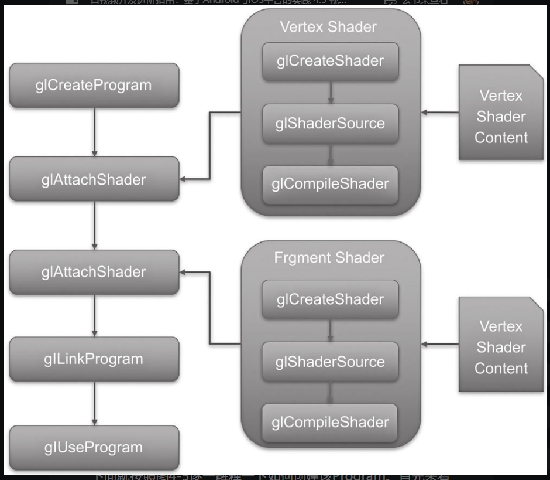

### Android环境搭建

在Android 上要使用OpenGl ES ，第一种方式就是直接使用GLSurfaceView.这种方式不需要搭建OpenGl ES 的上下文环境，以及创建OpenGL ES 的显示设备。可以通过EGL的api来搭建OpenGl ES 的上下文。如果仅仅在JAVA 层编写，那么对于普通的应用也许可行，但是对于要进行解码或者使用第三方库的场景（如人脸识别）则需要C++ 层来实施。

### OpenGL ES 中的纹理

OpenGL 中的纹理可以用来表示图像，照片，视频画面等数据。在视频渲染中，只需要处理二维纹理。每个二维纹理都是由许多小的纹理元素注册，他们都是小块数据。类似于像素点。要使用纹理，最常用的方式是直接从一个图像文件加载数据.android 中的坐标有点不一样。

## 实现一款视频播放器

整体架构：

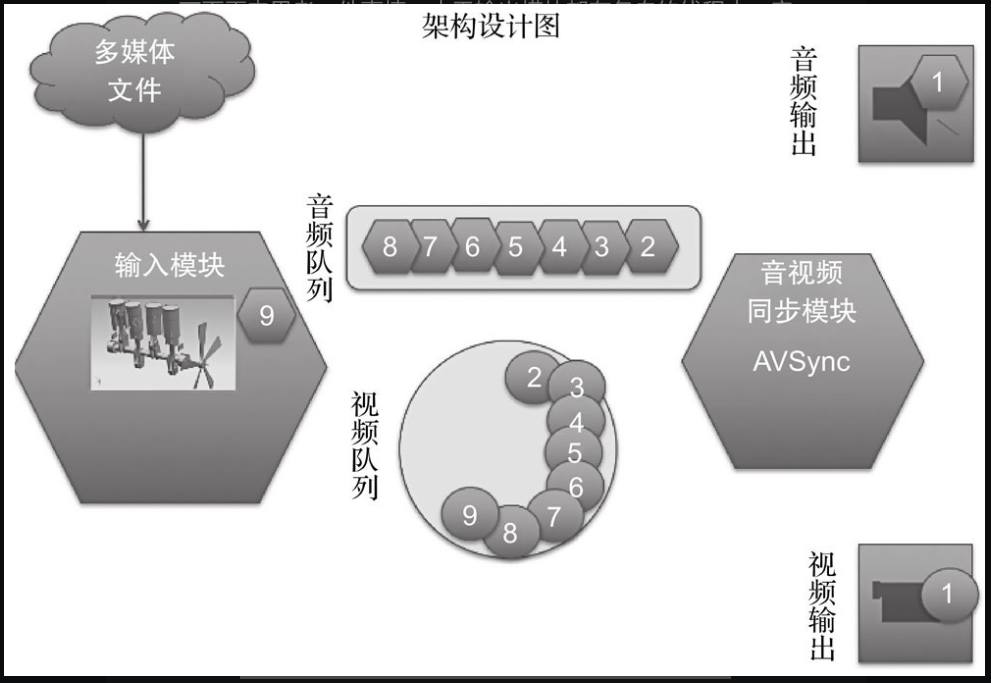

### 解码模块

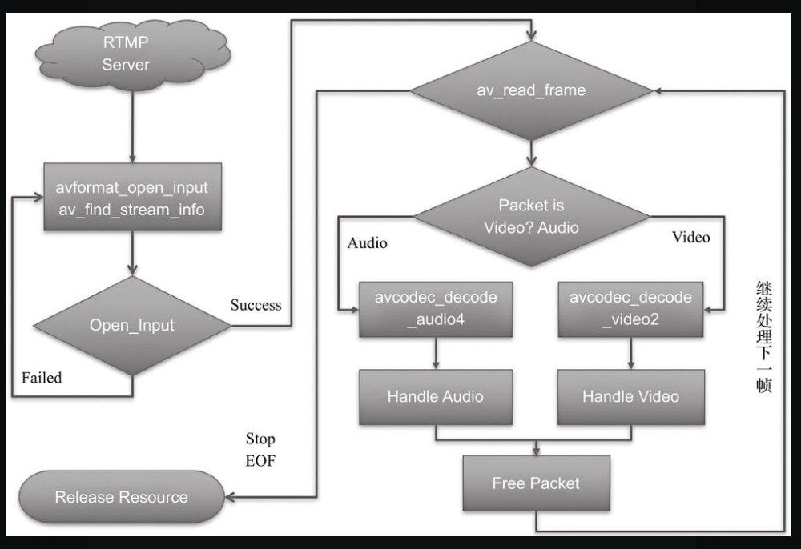

### 音频播放模块

### 视频渲染模块

### 音视频同步

#### 音频向视频同步

#### 视频向音频同步

#### 音视频统一向外部时钟同步

### 中控系统串联起各个模块

## 音视频的采集与编码

### 音频采集

Android SDK 提供了两套 音频采集的API ,分别是MediaRecorder 和AudioRecord，前者是一个更加上层的API,他可以直接对手机麦克风录入音频数据进行编码压缩，如AMR和MP3等，并且存储为文件。后者更加接近底层，能够更加自由灵活的控制，其可以让开发者得到内存中的PCM 音频流数据，如果需要对音频做进一步处理，或者需要采用第三方编码库进行压缩，或者网络传输场景那么只能用AudioRecord或者OpenSl ES。

### 视频采集

视频画面的采集主要是摄像和屏幕。

### 音频的编码

Mp3格式是兼容性最好的格式，而AAC在低码率场景下，其音频品质大大超过Mp3.

#### lib_fdk_aac 编码AAC 

软件编码AAC,基于ffmpeg  libfdk_aac 进行编码，这么写的好处是字需要编写一份音频编码的代码即可。

#### 硬件编码 MEdiaCodec

硬件编码的效率高于软件编码，还可以降低电量的使用，但是兼容性不如软件好。一个aac原始数据块的长度是可变的，对原始帧上加上ADTS头进行封装，就形成了ADTS帧。ADTS是AAC音频的传输流格式。而mediaCodec 编码出来的AAC都是裸AAC。需要对于该文件进行封装，在封装之前，需要了解相关参数，如采样率，声道数，原始数据块长度等。

#### libx264编码H264

在iOS平台上，由于硬件编码器的兼容性比较好，基本上用不到libx264这些软件编码器。

## 实现一款视频录制应用

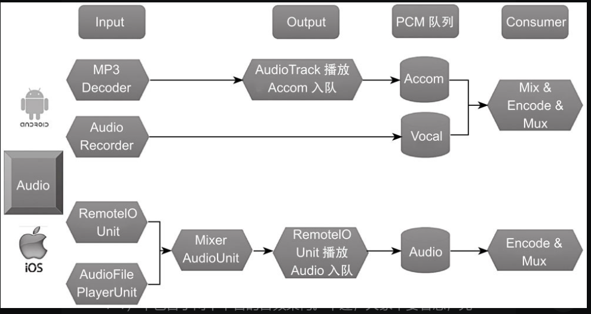

## 音频效果器介绍与实战

常用的音频编辑工具如：audacity,audition,cubase等。

声音在数字信号中的表现形式就是时域和频域，而音频处理就是针对声音分别在时域和频域上的处理，对于时域方面处理比较简单，不需要额外进行转换，因为一版拿到的音频数据就是时域表示的音频数据，若要对音频的频域做处理，那么需要将拿到的音频数据先转换为频域上的信号，再进行处理。如何转换为频域上的信号呢？答案就是使用FFT(傅里叶变换)。

离散傅立叶变换简称为DFT,由于计算速度太慢，所以就演变出来快速傅里叶变换（FFT）,在处理音频过程中使用MayerFFT来实现。

FFT的物理意义：

> 有些信号在时域上很难看出特征，这就是很多信号分析采用FFT变换的原因。声音的时域信号可以直接用FFT变换，加入N个采样点经过FFT之后，就可以得到N个点的FFT结果，为了方便进行FFT运算，通常N的取值为2的整数次幂。

MIDI 乐器数字接口，MIDI是编码界最广泛的音乐标准格式。

### 混音效果器

#### 均衡效果器

均衡效果器最大的作用就是决定声音的远近层次。不同歌曲的风格区别在于声音在不同频段的提升或衰减。均衡效果器具有美化声音的作用，即调整音色，每个人由于自身声道、颅腔、口腔的形状不同，导致音色不同。

均衡器最早是用来补偿频率缺陷的。

#### 压缩效果器

是指在时域上对声音强度所进行的一个处理。压缩器也可以简单的理解，当音频音量剧增的时候，自动将音量调小一点。

#### 混响效果器

* 采样IR混响。是最真实也是效果最好的一种，当然这种IRl的制作极为昂贵。
* 算法混响，也是最常见的混响效果器。

#### 实现技术 SOX

sox是声音处理开源库。

## 视频效果器的介绍与实战

视频使用YUV格式。

### 基本原理

#### 亮度调节

亮度调节的实现方式有两种，一种是非线性亮度调节，一种是线性亮度调节。

#### 对比度调节

对比度调节要针对RGB3个通道同时调整。

#### 饱和度调节

图像饱和度调节有很多方法，最简单的方法就是判断每个像素点RGB值是否大于或者小于128，也可以将RGB转换为HSV,然后调整其S部分。

#### 图像的卷积过程

线性滤波可以说是图像处理的一种常用方法，他运行我们对图像进行处理。产生多种不同的效果。做法很简单，假设有一个二维的滤波器矩阵（卷积核）和一个要处理的二维图像，那么对于图像的每个像素点，先计算它的领域像素和滤波器矩阵的对应元素的乘积，然后加起来，以此作为该像素位置的值，即完成整个滤波过程。

对于图像和滤波矩阵进行逐个元素相乘再求和的操作，相当于将一个二维的函数移动到另一个二维函函数的所有位置，这个操作叫做卷积。这个操作有两个基本特点：

* 操作是线性的，也就是我们用每个像素与其领域的线性祝贺来代替这个像素。
* 具有平移不变性。是指我们在图像的每个位置都执行相同的操作，正是因为具有这两特性，后期才可以将图像处理的算法迁移到GPU中去执行。

对于平面图像的卷积，一版称为2D卷积，因为需要嵌套多个循环，所以执行速度比较慢，除非我们使用比较小的卷积核。所谓的卷积核即选择这个像素点周围领域的多少，3x3,5x5的卷积核。

#### 锐化效果器

图像的锐化就是补偿图像的轮廓，增强图像的边缘及灰度跳变的部分，使得图像变得更加清晰，一般的磨破效果器或者视频解码后图像往往会变得比较平滑。从频域的角度考虑，图像模糊的实质是因为其高频部分的能量被衰减，而用户直接看到的现象就是图像中边界、轮廓变得模糊。为了降低这种效果，通常要使用扩展对比效果器、去块滤波器，此外还会使用到锐化效果器。

#### 高斯模糊算法

其实模糊滤波器就是对周围像素进行加权平均处理。对于均值模糊算法来讲，周围所有领域像素点的权值都相同，所以不是很平滑。高斯模糊就是用来解决这个问题的，他会把图像的模糊处理得很平滑。

#### 双边滤波算法

双边滤波算法是一种可以降噪保边的滤波器。之所以可以达到此效果，因为滤波器是由两个因素共同影响的：

* 几何空间距离决定滤波器系数
* 像素差值决定滤波器系数。

几何空间距离类似于高斯模糊算法，由距离中心像素点的远近来确定权重值。

#### 图层混合介绍

图层混合是指两个图层需要混合在一起，可通过多种模式来实现这种混合。所有的图层混合都可以看成是两个图层的混合。常见的混合模式：

* 正片叠底混合模式。将两个颜色的像素值相乘，得到的结果就是最终的色的像素值。
* 滤色混合模式，是将两个颜色的互补色的像素值相乘。
* 叠加混合模式，在保留底色的明暗变化的基础上，使用正片叠底或滤色混合模式。
* 柔光混合模式，根据绘图色的明暗程度来决定最终色是变亮还是变暗。
* 强光混合模式，根据图色来决定是执行“正片叠底”还是“滤色”混合模式。

### ffmpeg 内部滤镜

视频录制时：

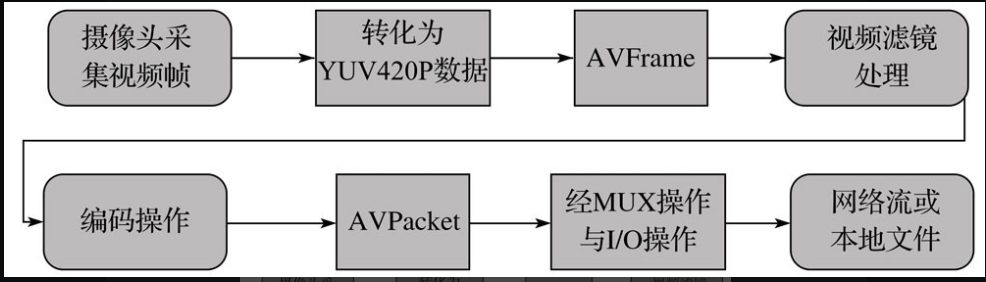

播放时：

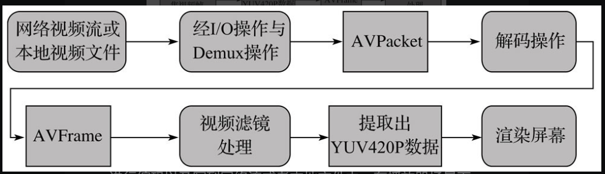

视频的播放过程恰好是录制的一个逆过程。

#### 常用滤镜

* 翻转
* 旋转
* 裁切
* 消除水印
* 增加水印
* 对比度
* 饱和度
* 调节亮度
* 分辨率转换

### OpenGL ES 实现视频滤镜

在移动平台上，大家关心的是性能，特别在图像或者视频处理方面。性能问题是一个更突出的问题，如何提高性能呢？答案就是使用OpenGL  ES。在openGL ES 上实现水印 建议使用 libpeng 库。

OpenGL ES 内部不可以直接进行文字绘制。并且可能还有字体，阴影等要求，所以文字可以是一个bitmap。

#### 美颜效果器

美颜算法的实现有很多种，一般是先通过磨破算法将皮肤的一些纹理磨掉，然后通过色相、提亮等效果器美化肤色。双边滤波算法是较为常用且效果比较好的磨皮算法。

#### 动画贴纸效果器

这种效果器也有很多实现方式，其中一种实现方式就是使用gif格式的图片来做动图。优点是图片压缩比打，缺点是由白边。也可以说png 图片数组。

说到优化体验，无非是提升整体性能，在当前场景下，提升性能最好的方法就是缓存，将解码后的纹理对象缓存起来。

#### 主题效果器

对于主题效果器来讲，一般会分为以下处理流程：片头的布置，作者作品名的渲染，片中主题效果，对视频源的处理，以及片尾的修饰预处理。对于这个过程的描述一般会通过配置文件实现，这样APP就可以通过热更新来随意的增加主题了。这其中最主要的一个效果器就是整个主题背景的展示。

背景效果器的实现分为两种。一种是粒子效果器，一种是视频实现。

## 专业的视频录制应用实战

## 直播应用的构建
## 直播应用中的关键处理
## 平台工具
## 通过 Ne10的交叉编译输入理解ndk-build
## 编码器的使用细节
## 视频的表示与编码
