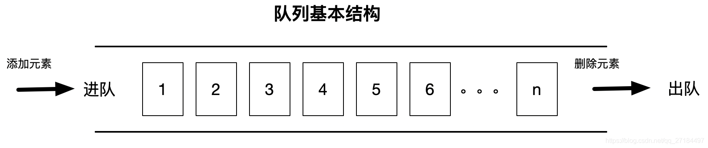
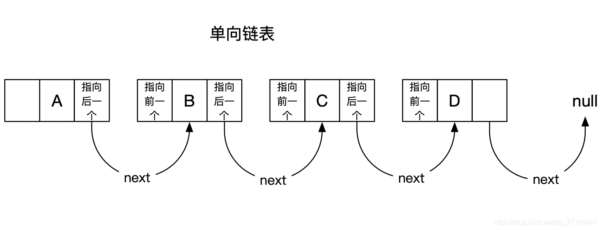
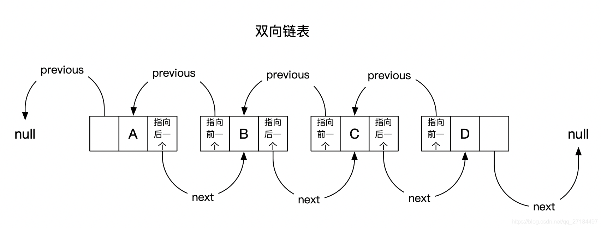
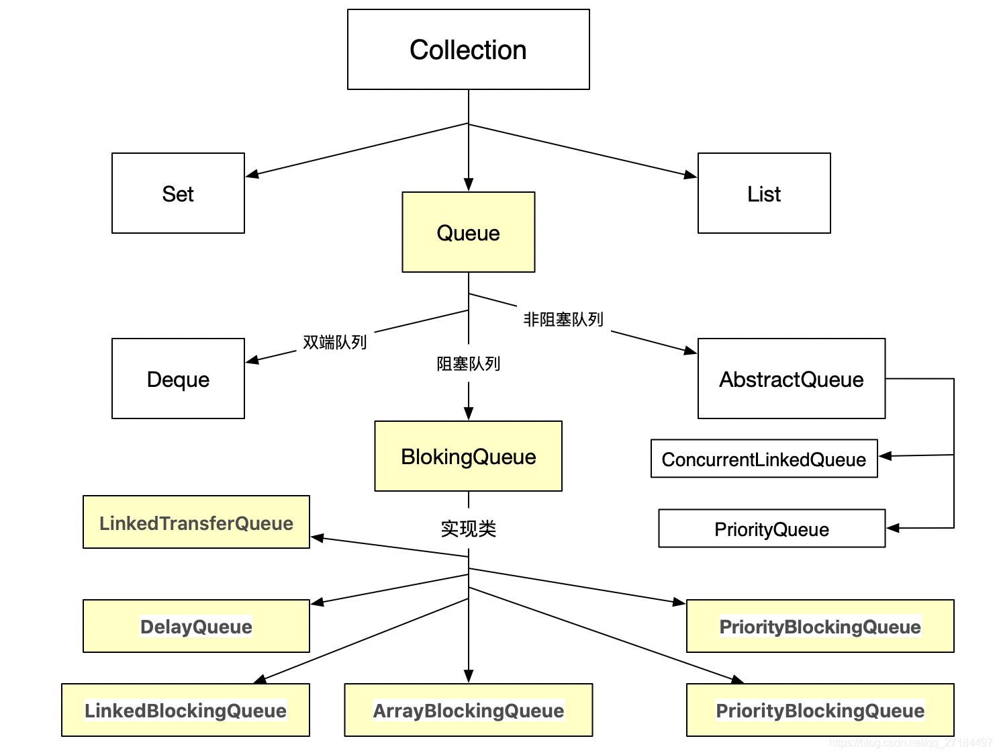

## 什么是队列？
      队列是一种特殊的线性表，遵循先入先出、后入后出的基本原则，一般来说，它只允许在表的前端进行删除操作，而在表的后端进行插入操作，但是java的某些队列运行在任何地方插入删除；比如我们常用的 LinkedList 集合，它实现了Queue 接口，因此，我们可以理解为 LinkedList 就是一个队列；

###  java队列特性
队列主要分为阻塞和非阻塞，有界和无界、单向链表和双向链表之分；

### 阻塞和非阻塞
#### 阻塞队列
          入列(添加元素)时，如果元素数量超过队列总数，会进行等待（阻塞），待队列的中的元素出列后，元素数量未超过队列总数时，就会解除阻塞状态，进而可#### 以继续入列；
          出列(删除元素)时，如果队列为空的情况下，也会进行等待（阻塞），待队列有值的时候即会解除阻塞状态，进而继续出列；
          阻塞队列的好处是可以防止队列容器溢出；只要满了就会进行阻塞等待；也就不存在溢出的情况；
          只要是阻塞队列，都是线程安全的；
          

#### 非阻塞队列
          不管出列还是入列，都不会进行阻塞，
          入列时，如果元素数量超过队列总数，则会抛出异常，
          出列时，如果队列为空，则取出空值；

一般情况下，非阻塞式队列使用的比较少，一般都用阻塞式的对象比较多；阻塞和非阻塞队列在使用上的最大区别就是阻塞队列提供了以下2个方法：

    出队阻塞方法 ： take()
    入队阻塞方法 ： put()
###  有界和无界
    有界：有界限，大小长度受限制
    无界：无限大小，其实说是无限大小，其实是有界限的，只不过超过界限时就会进行扩容，就行ArrayList 一样，在内部动态扩容

单向链表和双向链表
单向链表 ： 每个元素中除了元素本身之外，还存储一个指针，这个指针指向下一个元素；

双向链表 ：除了元素本身之外，还有两个指针，一个指针指向前一个元素的地址，另一个指针指向后一个元素的地址；

### java 队列接口继承图

### 队列常用方法
　　add        增加一个元索                     如果队列已满，则抛出一个IIIegaISlabEepeplian异常
　　remove   移除并返回队列头部的元素    如果队列为空，则抛出一个NoSuchElementException异常
　　element  返回队列头部的元素             如果队列为空，则抛出一个NoSuchElementException异常
　　offer       添加一个元素并返回true       如果队列已满，则返回false
　　poll         移除并返问队列头部的元素    如果队列为空，则返回null
　　peek       返回队列头部的元素             如果队列为空，则返回null
　　put         添加一个元素                      如果队列满，则阻塞
　　take        移除并返回队列头部的元素     如果队列为空，则阻塞
       drainTo(list)   一次性取出队列所有元素

知识点： remove、element、offer 、poll、peek 其实是属于Queue接口。 

#### 非阻塞队列
1、ConcurrentLinkedQueue
  单向链表结构的无界并发队列, 非阻塞队列，由CAS实现线程安全，内部基于节点实现

2、ConcurrentLinkedDeque  
双向链表结构的无界并发队列, 非阻塞队列，由CAS实现线程安全    

3、PriorityQueue
内部基于数组实现，线程不安全的队列

#### 阻塞队列
1、DelayQueue
一个支持延时获取元素的无界阻塞队列

2、LinkedTransferQueue
一个由链表结构组成的无界阻塞队列。

3、ArrayBlockingQueue
有界队列，阻塞式,初始化时必须指定队列大小，且不可改变；，底层由数组实现；

4、SynchronousQueue
最多只能存储一个元素，每一个put操作必须等待一个take操作，否则不能继续添加元素

5、PriorityBlockingQueue
一个带优先级的队列，而不是先进先出队列。元素按优先级顺序被移除，而且它也是无界的，也就是没有容量上限，虽然此队列逻辑上是无界的，但是由于资源被耗尽，所以试图执行添加操作可能会导致 OutOfMemoryError 错误；