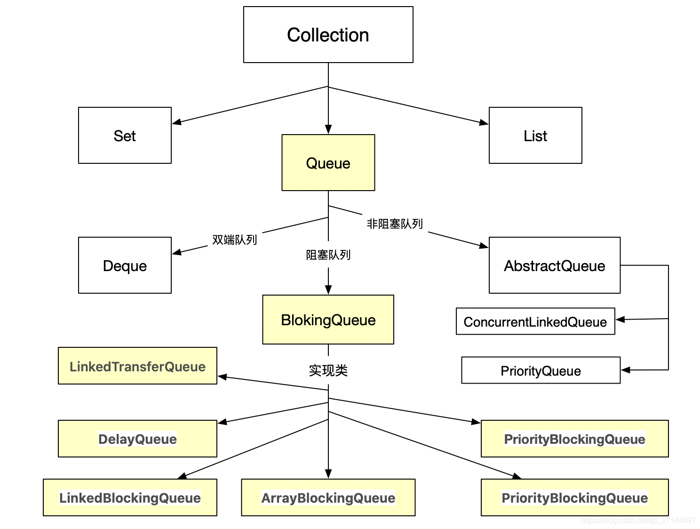

# 前言
单向链表结构的无界并发队列, 非阻塞队列，由CAS实现线程安全，内部基于节点实现
## 资料
单向链表 ： 每个元素中除了元素本身之外，还存储一个指针，这个指针指向下一个元素；

### java 队列接口继承图


### 队列常用方法
add        增加一个元索                     如果队列已满，则抛出一个IIIegaISlabEepeplian异常
remove   移除并返回队列头部的元素    如果队列为空，则抛出一个NoSuchElementException异常
element  返回队列头部的元素             如果队列为空，则抛出一个NoSuchElementException异常
offer       添加一个元素并返回true       如果队列已满，则返回false
poll         移除并返问队列头部的元素    如果队列为空，则返回null
peek       返回队列头部的元素             如果队列为空，则返回null
put         添加一个元素                      如果队列满，则阻塞
take        移除并返回队列头部的元素     如果队列为空，则阻塞
drainTo(list)   一次性取出队列所有元素

知识点： remove、element、offer 、poll、peek 其实是属于Queue接口。
# 正文 ConcurrentLinkedQueue
* 重要特性：链表结构，自旋非阻塞，容量无界。
* 入队列：入队列自旋直到成功，不允许插入null对象。
* 出入队列顺序：先进先出。
* 非原子、非安全：size方法，迭代器等方法不保证原子和安全。
* 节省CAS开销：头尾节点指针不一定指向真正的头尾节点。

````java
public class ConcurrentLinkedQueueDemo {
    public static void main(String[] args) {
        ConcurrentLinkedQueue<ChipsBean> queue = new ConcurrentLinkedQueue<ChipsBean>();
        // 添加一个元素
        queue.add(new ChipsBean("队列1"));
        //返回队列头部的元素             如果队列为空，则返回null
        System.out.println(queue.peek().toString());
        queue.add(new ChipsBean("队列2"));
        //poll         移除并返问队列头部的元素    如果队列为空，则返回null
        System.out.println(queue.poll().toString());
        queue.add(new ChipsBean("队列3"));
        // 队列2
        System.out.println(queue.poll().toString());
        // 队列3
        System.out.println(queue.poll().toString());
        // 这句话会报空指针。
        //System.out.println(queue.poll().toString());
        queue.add(new ChipsBean("1"));
        queue.add(new ChipsBean("12"));
        queue.add(new ChipsBean("123"));
        queue.add(new ChipsBean("1234"));
        //移除,也是从头部先移除的。先进先出。
        System.out.println(queue.remove());
        System.out.println(queue.remove());
        System.out.println(queue.remove());
        System.out.println(queue.remove());
    }
}
````