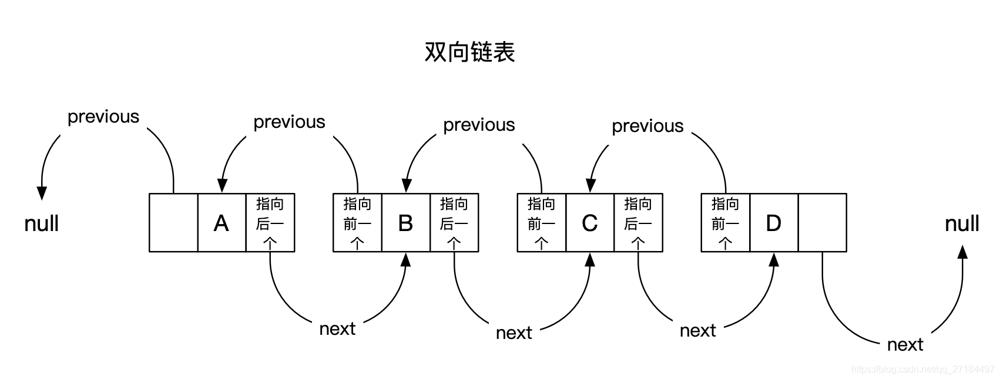

# 前言
双向链表结构的无界并发队列, 非阻塞队列，由CAS实现线程安全
## 资料
双向链表 ：除了元素本身之外，还有两个指针，一个指针指向前一个元素的地址，另一个指针指向后一个元素的地址。

# 正文 ConcurrentLinkedDeque
ConcurrentLinkedDeque使用了自旋+CAS的非阻塞算法来保证线程并发访问时的数据一致性。由于队列本身是一种双链表结构，所以虽然算法看起来很简单，但其实需要考虑各种并发的情况，实现复杂度较高，并且ConcurrentLinkedDeque不具备实时的数据一致性，实际运用中，如果需要一种线程安全的栈结构，可以使用ConcurrentLinkedDeque。
另外，关于ConcurrentLinkedDeque还有以下需要注意的几点：
ConcurrentLinkedDeque的迭代器是弱一致性的，这在并发容器中是比较普遍的现象，主要是指在一个线程在遍历队列结点而另一个线程尝试对某个队列结点进行修改的话不会抛出ConcurrentModificationException，这也就造成在遍历某个尚未被修改的结点时，在next方法返回时可以看到该结点的修改，但在遍历后再对该结点修改时就看不到这种变化。
size方法需要遍历链表，所以在并发情况下，其结果不一定是准确的，只能供参考。

* void addFirst(E e);//队首入列 会抛出异常
* void addLast(E e);//队尾入列 会抛出异常
* boolean offerFirst(E e);//队首入列
* boolean offerLast(E e);//队尾入列
* E removeFirst();//队首出列 会抛出异常
* E removeLast();//队尾出列 会抛出异常
* E pollFirst();//队首出列
* E pollLast();//队尾出列
* E getFirst();//队首读取 会抛出异常
* E getLast();//队尾读取 会抛出异常
* E peekFirst();//队首读取
* E peekLast();//队尾读取

````java
public class ConcurrentLinkedDequeDemo {
    public static void main(String[] args) {
        ConcurrentLinkedDeque<ChipsBean> deque = new ConcurrentLinkedDeque<ChipsBean>();
        deque.add(new ChipsBean("第一个"));
        deque.add(new ChipsBean("第2个"));
        deque.add(new ChipsBean("第3个"));
        deque.add(new ChipsBean("第4个"));
        // 获取头部，不出队列
        System.out.println(deque.peek());
         // deque.poll() 头部出列。
        //System.out.println(deque.poll());
        System.out.println(deque.removeFirst().toString());
        System.out.println(deque.removeFirst().toString());
        System.out.println(deque.removeFirst().toString());
        System.out.println(deque.removeFirst().toString());
    }
}
````