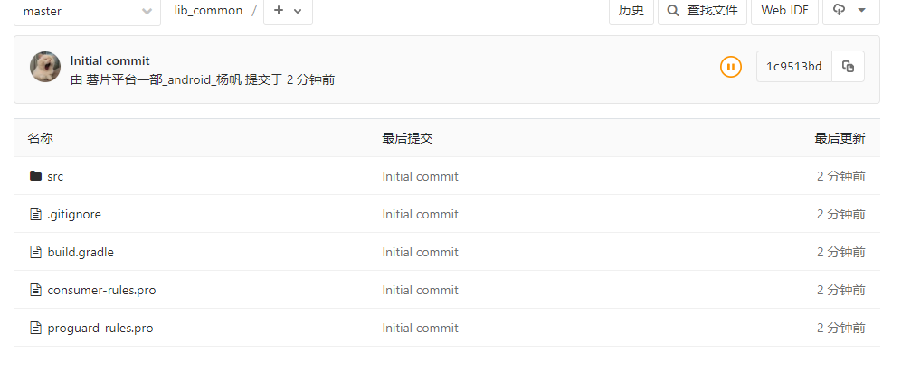
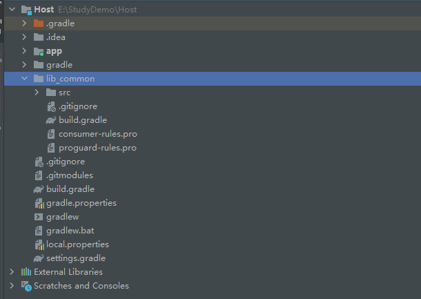
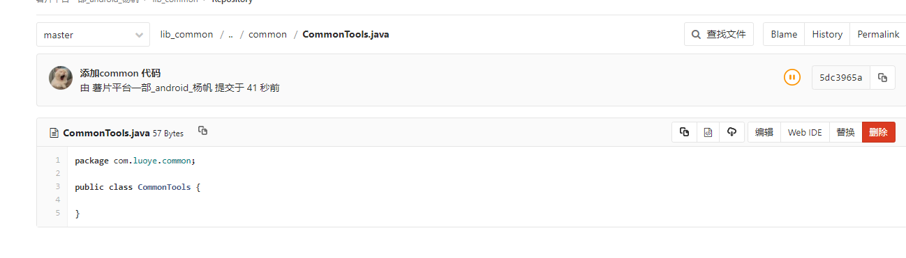
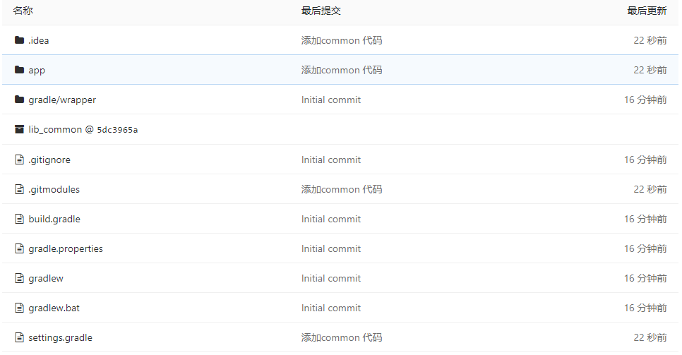
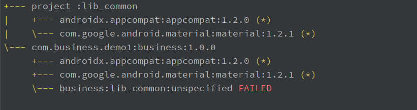
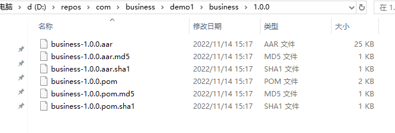

# 前言
2022年11月14日。我们APP的module和maven越来越多了。加上Kotlin和JAVA一起使用，导致APP编译打包速度越来越慢了。
为了减少编译和打包时的速度，我们打算将common 抽离成子模块，然后将module工程迁移出去，通过maven引用到APP中。
虽然common 在一开始就是子模块，被大佬干成module了，现在大佬跑路了，我们打算反清复明，走一波复辟的老路。
## 资料 
* [git子模块的使用](https://git-scm.com/book/zh/v2/Git-%E5%B7%A5%E5%85%B7-%E5%AD%90%E6%A8%A1%E5%9D%97)
# 正文 
我们一切的学习资料都是基于 [git子模块的使用](https://git-scm.com/book/zh/v2/Git-%E5%B7%A5%E5%85%B7-%E5%AD%90%E6%A8%A1%E5%9D%97)
。这篇笔记主要是对于上诉内容进行实战。

## 简单使用 

### 创建一个子模块工程
> 默认情况下，子模块会将子项目放到一个与仓库同名的目录中，本例中是 “DbConnector”。 如果你想要放到其他地方，那么可以在命令结尾添加一个不同的路径。

上面这句话的意思很简单，我们子模块的git目录名称和我们要放到目录是一个名称。
结合我们的实际诉求，我们需要将代码里面的lib_common 弄成子模块，但是我们lib_common是一个module，如果直接拉取子模块的代码下来好像是编译不了的，我们有两个选择。
要不不需要编译运行，子模块在引用的地方编译运行，要不就只能去配置gradle了。我们先不配置gradle，直接上传子模块。

#### 创建Android 工程
我们新建一个项目，叫SubmoduleProvider，在里面创建一个module，叫lib_common.
然后切换到 lib_common的目录，执行git 命令，将这个module 上传到git 上。
我将lib_common 上传到了：http://172.16.0.25/yangfan6/lib_common.git。上传成功后整个目录：



### 创建一个主工程并使用上面的子模块

我们同样创建一个Android 工程，名称叫 Host，然后添加到git。然后根据资料上的信息。添加子模块。

> 我们首先将一个已存在的 Git 仓库添加为正在工作的仓库的子模块。 你可以通过在 `git submodule add` 命令后面加上想要跟踪的项目的相对或绝对 URL 来添加新的子模块。 在本例中，我们将会添加一个名为 “DbConnector” 的库。
>
> ```console
> $ git submodule add https://github.com/chaconinc/DbConnector
> Cloning into 'DbConnector'...
> remote: Counting objects: 11, done.
> remote: Compressing objects: 100% (10/10), done.
> remote: Total 11 (delta 0), reused 11 (delta 0)
> Unpacking objects: 100% (11/11), done.
> Checking connectivity... done.
> ```
>
> 默认情况下，子模块会将子项目放到一个与仓库同名的目录中，本例中是 “DbConnector”。 如果你想要放到其他地方，那么可以在命令结尾添加一个不同的路径。

结合上面的子模块git地址，那么我们的添加子模块的命令就是：

````
git submodule add http://172.16.0.25/yangfan6/lib_common.git
````



通过上面的图，我们可以看到，我们的子模块被拉取下来了。然后我们需要再settings.gradle 中将lib_common 添加进去。

```
include ':lib_common'
```

最后将其导入到APP 中。添加子模块后，建议重启一下 android stuido。有点时候识别不了 git 添加。重启后就可以了

#### 修改子模块的代码并推送校验

我们在使用common的工程中对于lib_common 添加了一个类之后，是可以正确的推送到子模块的。



### 拉取包含子模块的工程

如果主工程添加成功后，然后推送上去，我们就可以看到，我们项目中是包含lib_common module的，点击他的时候，就会跳转到lib_common 的真正工程地址。



我们直接结合资料：

> 接下来我们将会克隆一个含有子模块的项目。 当你在克隆这样的项目时，默认会包含该子模块目录，但其中还没有任何文件：
>
> ```console
> $ git clone https://github.com/chaconinc/MainProject
> Cloning into 'MainProject'...
> remote: Counting objects: 14, done.
> remote: Compressing objects: 100% (13/13), done.
> remote: Total 14 (delta 1), reused 13 (delta 0)
> Unpacking objects: 100% (14/14), done.
> Checking connectivity... done.
> $ cd MainProject
> $ ls -la
> total 16
> drwxr-xr-x   9 schacon  staff  306 Sep 17 15:21 .
> drwxr-xr-x   7 schacon  staff  238 Sep 17 15:21 ..
> drwxr-xr-x  13 schacon  staff  442 Sep 17 15:21 .git
> -rw-r--r--   1 schacon  staff   92 Sep 17 15:21 .gitmodules
> drwxr-xr-x   2 schacon  staff   68 Sep 17 15:21 DbConnector
> -rw-r--r--   1 schacon  staff  756 Sep 17 15:21 Makefile
> drwxr-xr-x   3 schacon  staff  102 Sep 17 15:21 includes
> drwxr-xr-x   4 schacon  staff  136 Sep 17 15:21 scripts
> drwxr-xr-x   4 schacon  staff  136 Sep 17 15:21 src
> $ cd DbConnector/
> $ ls
> $
> ```
>
> 其中有 `DbConnector` 目录，不过是空的。 你必须运行两个命令：`git submodule init` 用来初始化本地配置文件，而 `git submodule update` 则从该项目中抓取所有数据并检出父项目中列出的合适的提交。
>
> ```console
> $ git submodule init
> Submodule 'DbConnector' (https://github.com/chaconinc/DbConnector) registered for path 'DbConnector'
> $ git submodule update
> Cloning into 'DbConnector'...
> remote: Counting objects: 11, done.
> remote: Compressing objects: 100% (10/10), done.
> remote: Total 11 (delta 0), reused 11 (delta 0)
> Unpacking objects: 100% (11/11), done.
> Checking connectivity... done.
> Submodule path 'DbConnector': checked out 'c3f01dc8862123d317dd46284b05b6892c7b29bc'
> ```
>
> 现在 `DbConnector` 子目录是处在和之前提交时相同的状态了。
>
> 不过还有更简单一点的方式。 如果给 `git clone` 命令传递 `--recurse-submodules` 选项，它就会自动初始化并更新仓库中的每一个子模块， 包括可能存在的嵌套子模块。
>
> ```console
> $ git clone --recurse-submodules https://github.com/chaconinc/MainProject
> Cloning into 'MainProject'...
> remote: Counting objects: 14, done.
> remote: Compressing objects: 100% (13/13), done.
> remote: Total 14 (delta 1), reused 13 (delta 0)
> Unpacking objects: 100% (14/14), done.
> Checking connectivity... done.
> Submodule 'DbConnector' (https://github.com/chaconinc/DbConnector) registered for path 'DbConnector'
> Cloning into 'DbConnector'...
> remote: Counting objects: 11, done.
> remote: Compressing objects: 100% (10/10), done.
> remote: Total 11 (delta 0), reused 11 (delta 0)
> Unpacking objects: 100% (11/11), done.
> Checking connectivity... done.
> Submodule path 'DbConnector': checked out 'c3f01dc8862123d317dd46284b05b6892c7b29bc'
> ```
>
> 如果你已经克隆了项目但忘记了 `--recurse-submodules`，那么可以运行 `git submodule update --init` 将 `git submodule init` 和 `git submodule update` 合并成一步。如果还要初始化、抓取并检出任何嵌套的子模块， 请使用简明的 `git submodule update --init --recursive`。

上面描述了几种方式，我要一步到位的好吧，要写两次，不可能，绝对不可能。

````
git clone --recurse-submodules http://172.16.0.25/yangfan6/host.git
````

但是这个命令没法在Android studio中的clone 工具中直接执行，只能通过git 命令行执行。

## 实践

结合前言中，我们提到的诉求，我们想把common独立成子模块，然后把业务模块抽离出主工程，然后将业务模块发布成maven。我们知道maven通常而言是没法发布他使用的module的，这就给了我们可乘之机，毕竟maven和module是没有指向同一份代码的，会报class 冲突。

###  业务工程

我们将业务工程中的一个module 使用lib_common. 然后将这个module 发布为maven。

我们执行：

````
gradlew app:dependencies --configuration releaseRuntimeClasspath
````




发现,lib_common 未找到，通过查看我们刚刚发布的maven 的pom文件发现：

    <dependency>
      <groupId>business</groupId>
      <artifactId>lib_common</artifactId>
      <version>unspecified</version>
      <scope>compile</scope>
    </dependency>

这个groupid 导致他无法获取到，即使是我们APP 工程中已经包含common。

### 如何解决这个问题

我们的common 作为子module 无法被加载到APP中，即使他存在，因为groupid 不一致的原因，无法被想象那样被识别。目前最简单的就是将common也发布成maven。那么是否还有其他的思路呢？

我们分析一下maven 的获取方式，1是groupId，artifactId，version 分别对应：



所以说，只要我们groupid 正确，因为我们是直接应用源码，所以没有version 所以我们在common 中添加一个：

```
group = "Host"
```

就可以指向我们的源码了，如果添加version 的话，就会再找一层目录，就会找不到，这种思路只能适合与这个maven 只在这个工程使用。换一个工程maven就得重新发了。

# 结束

最终，我们其实没有完整的解决这个问题，因为common 作为子模块，如果更改的多了，发布maven的话，需要发版的频率一定比业务module频繁。通常而言，只能使用快照。但是使用快照对于maven 文件服务器的压力是较大的。所以通过对于common 添加group 直接解决一个问题，就是这个maven 只能添加到group 定义的这个工程。
