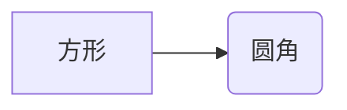

## 资料
* [Markdown 高级技巧](https://www.runoob.com/markdown/md-advance.html)
* [mermaid 文本图形标记](https://mermaid-js.github.io/mermaid/#/)
# 正文

## 流程图


#### 横向流程图

使用的语言是：mermaid



#### 标准流程图

语言是:flow

```flow
st=>start: 开始框
op=>operation: 处理框
cond=>condition: 判断框(是或否?)
sub1=>subroutine: 子流程
io=>inputoutput: 输入输出框
e=>end: 结束框
st->op->cond
cond(yes)->io->e
cond(no)->sub1(right)->op
```

### UML 时序图

使用的语言是：sequence

```sequence
对象A->对象B: 对象B你好吗?（请求）
Note right of 对象B: 对象B的描述
Note left of 对象A: 对象A的描述(提示)
对象B-->对象A: 我很好(响应)
对象A->对象B: 你真的好吗？
```

