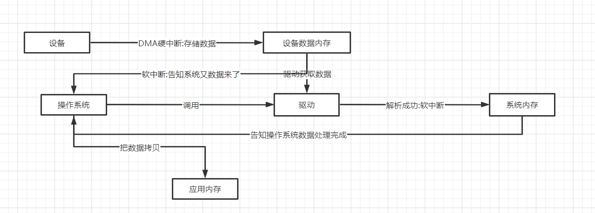
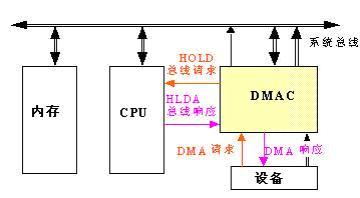

## 资料

* [课程文档](https://www.processon.com/view/link/6321819a07912955b2ea7c89)
* [百度百科 ：DMA](https://baike.baidu.com/item/DMA/2385376?fr=aladdin)
* [知乎：硬中断和软中断](https://zhuanlan.zhihu.com/p/482667961)
* [百度百科：MMU](https://baike.baidu.com/item/MMU/4542218?fr=aladdin) 

### 网络协议功能与所处位置

| TCP/IP概念层模型                         | 功能                                   | TCP/IP协议族                                         |
| ---------------------------------------- | -------------------------------------- | ---------------------------------------------------- |
| 应用层                                   | 文件传输、电子邮件、文件服务、虚拟终端 | TFTP \| HTTP \| SNMP \| FTP \| SMTP \| DNS \| TELNET |
| 数据格式化、代码转换、数据加密           | 自定义                                 |                                                      |
| 接触或简历与别的节点联系                 | 自定义                                 |                                                      |
| 传输层                                   | 提供端对端的接口                       | TCP\|UDP                                             |
| 网络层                                   | 为数据包选择路由                       | IP \| ICMP \| ROP \| OSPF \| BGP \| IGMP             |
| 链路层                                   | 传输有地址的帧、及错误检测             | SLIP \| CSIP \| PPP \| ARP \| RARP \| MTU            |
| 以二进制数据形式在物理介质上进行数据传输 | ISO02110 \| IEEE802 \| IEEE802.2       |                                                      |

# 正文

##  一次数据接收过程

> 当网络帧到达网卡后，网卡会通过DMA方式把这个网络包放到收包队列中。
>
> 通过硬中断，处理硬中断处理程序。（在处理硬中断时，先关闭CPU中断，等处理完成硬中断再开启CUP中断）一些耗时的处理交给软中断softirq处理。
>
> 网卡中断处理程序会为网络帧分配内核数据结构（sk_buffer）,并将其拷贝到sk_buffer缓冲区中，在通过软中断，通知内核收到了新的数据。
>
> 内核协议栈从缓冲区中取出网络帧，并通过网络协议栈从下到上逐层处理这个网络帧。
>
> 网络层取出ip头，判断网络包下一步走向，交给上层处理还是转发，当网络层确认这个包是要发送到本机后，就会取出上层协议的类型（如TCP还是UDP）再交给传输层处理。
>
> 传输层取出TCP或者UDP头，根据<源ip,源端口，目的ip,目的端口> 找出对应的socket,并把数据拷贝到socket的接受缓冲区中，应用层就可以使用socket 接口读取到最新的数据了。

通过上面信息，我们可以看到一些新的关键字

### DMA

DMA(Direct Memory Access，直接[存储器](https://baike.baidu.com/item/存储器/1583185?fromModule=lemma_inlink)访问) 是所有现代[电脑](https://baike.baidu.com/item/电脑/124859?fromModule=lemma_inlink)的重要特色，它允许不同速度的硬件装置来沟通，而不需要依赖于[ CPU ](https://baike.baidu.com/item/ CPU /120556?fromModule=lemma_inlink)的大量中断负载。否则，CPU 需要从来源把每一片段的资料复制到[暂存器](https://baike.baidu.com/item/暂存器/4308343?fromModule=lemma_inlink)，然后把它们再次写回到新的地方。在这个时间中，CPU 对于其他的工作来说就无法使用。

DMA 传输将数据从一个地址空间复制到另外一个地址空间。当CPU 初始化这个传输动作，传输动作本身是由 DMA 控制器来实行和完成。典型的例子就是移动一个外部内存的区块到芯片内部更快的内存区。像是这样的操作并没有让[处理器](https://baike.baidu.com/item/处理器?fromModule=lemma_inlink)工作拖延，反而可以被重新排程去处理其他的工作。DMA 传输对于高效能 嵌入式系统算法和网络是很重要的。

DMA

在实现DMA传输时，是由[DMA控制器](https://baike.baidu.com/item/DMA控制器/921346?fromModule=lemma_inlink)直接掌管总线，因此，存在着一个总线控制权转移问题。即DMA传输前，CPU要把总线控制权交给DMA控制器，而在结束DMA传输后，DMA控制器应立即把总线控制权再交回给CPU。一个完整的DMA传输过程必须经过DMA请求、DMA响应、DMA传输、DMA结束4个步骤。

>深层的逻辑在这里不需要理会，我们只需要理解一点，在系统总线的控制下，执行DMA 操作会暂停CPU的执行。

### 硬中断与软中断

**硬中断**

1. 硬中断是由**硬件产生**的，比如，像磁盘，网卡，键盘，时钟等。**每个设备或设备集都有它自己的IRQ（中断请求）**。基于IRQ，CPU可以将相应的请求分发到对应的硬件驱动上（注：硬件驱动通常是内核中的一个子程序，而不是一个独立的进程）。
2. 处理中断的驱动是需要运行在CPU上的，因此，当中断产生的时候，CPU会中断当前正在运行的任务，来处理中断。在有多核心的系统上，一个中断通常只能中断一颗CPU（也有一种特殊的情况，就是在大型主机上是有硬件通道的，它可以在没有主CPU的支持下，可以同时处理多个中断。）。
3. **硬中断可以直接中断CPU**。它会引起内核中相关的代码被触发。对于那些需要花费一些时间去处理的进程，中断代码本身也可以被其他的硬中断中断。
4. 对于时钟中断，内核调度代码会将当前正在运行的进程挂起，从而让其他的进程来运行。它的存在是为了让调度代码（或称为调度器）可以调度多任务。

**软中断**

1. 软中断的处理非常像硬中断。然而，它们仅仅是由**当前正在运行的进程**所产生的。
2. 通常，软中断是一些对I/O的请求。这些请求会调用内核中可以调度I/O发生的程序。**对于某些设备，I/O请求需要被立即处理，而磁盘I/O请求通常可以排队并且可以稍后处理**。根据I/O模型的不同，进程或许会被挂起直到I/O完成，此时内核调度器就会选择另一个进程去运行。I/O可以在进程之间产生。并且调度过程通常和磁盘I/O的方式是相同。
3. 软中断仅与内核相联系。而内核主要负责对需要运行的任何其他的进程进行调度。一些内核允许设备驱动的一些部分存在于用户空间，并且当需要的时候内核也会调度这个进程去运行。
4. **软中断并不会直接中断CPU**。也**只有当前正在运行的代码（或进程）才会产生软中断**。这种中断是一种需要内核为正在运行的进程去做一些事情（通常为I/O）的请求。有一个特殊的软中断是Yield调用，它的作用是请求内核调度器去查看是否有一些其他的进程可以运行。

**区别**

1. 软中断是执行中断指令产生的，而硬中断是由外设引发的。
2. 硬中断的中断号是由中断控制器提供的，软中断的中断号由指令直接指出，无需使用中断控制器。
3. 硬中断是可屏蔽的，软中断不可屏蔽。
4. 硬中断处理程序要确保它能快速地完成任务，这样程序执行时才不会等待较长时间，称为上半部。
5. 软中断处理硬中断未完成的工作，是一种推后执行的机制，属于下半部。

>比如说，上面的DMA 操作，需要暂停CPU和恢复CPU就是属于硬中断。上面内核读取DMA数据，然后调用驱动去解析数据就是软中断。同时我们JAVA 代码调用系统文件的读写也是属于软中断。
>
>而且软中断是系统内核去中断其他进程。

### MMU

