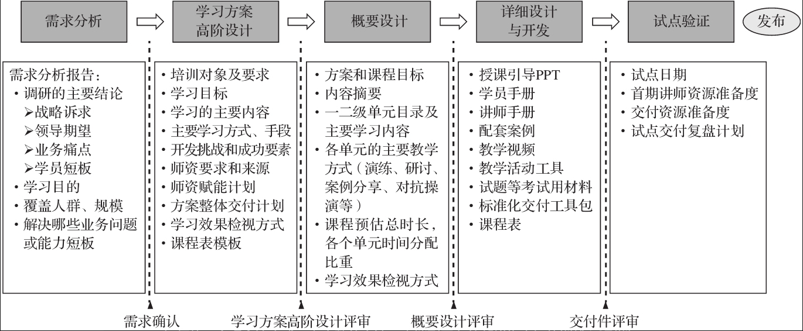
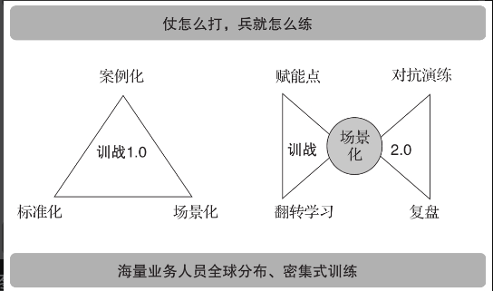
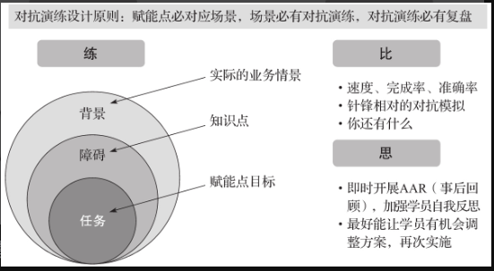
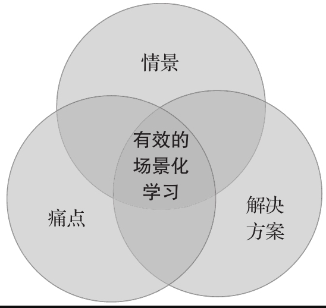
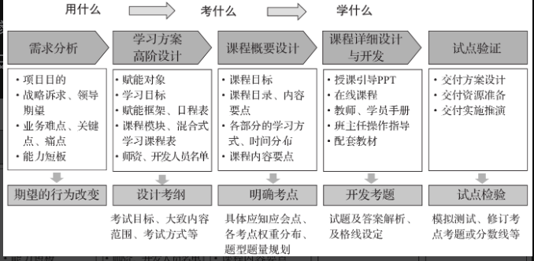

## 前言
* 让最优秀的人培养更优秀的人。
  > 商业模式下，发展的必要因素是教育。对内培训员工，对外培训用户习惯。然后将用户习惯和对内的培训相结合。
  
* 蓝海。来源于：管理才是真正的蓝海
  > 未知的市场空间。
  
* 大学所实施的教育，本来不只是供给传授现成的知识而是重在开辟基本的途径，提供获得知识的方法，并且培养学生研究、批判和反省的精神，以期学者有自动追求知识不断研究的能力。

* 华为管理哲学中的名词：
  * 混沌
  * 耗散结构
  * 场
  * 熵
  
* 没有正确的假设，就没有正确的方向，没有正确的方向，就没有正确的理论，没有正确的理论，就不会有正确的战略。

* 训战的意义和价值
  * 快速赋能。
  * 积累打法 
  * 助力变革 
  
* ADDIE
   
  * 需求分析A
  * 高阶和概要设计D
  * 详细设计开发D
  * 实施I
  * 评价E

# 正文

## 基础篇

### 理解训战才能驾驭训战
#### 训战提出的背景
* 放眼全球，军事思想与商业的交融是世界的通行做法。其原因很简单，战争是人类体能与智力竞争的终极形式，而军队是人类组织动员形式的极限。
  > 那么很多JFJ行动的动员，是不是基础民众素质水平未到达一定的阈值，需要采用这种军事化的行为，而不是采用通用社会行为。
* 战略预备队是指当战争进入关键阶段时，由最高统帅部直接调配使用的后备机动部队。
  > 逻辑上。战略预备队的素质应该高于常规成员，而且是某个领域的全面型人才，往往得具备领导力或决策力。

#### 搭建基本框架
* 挑战：
  * 人员多且密集
  * 业务诉求不一样
  * 业务赋能如何落地
* 要素
  * 标准化，主要是对于诉求和目标的标准化。(MD 一个标准化，调研和文档得干很久)
  * 场景化，对标业务诉求进行实战赋能，场景化主要谈对准业务场景的大的指导原则，以及教学内容如何经量贴近业务实战，所以场景化是理论基础
  * 案例化，案例化是将场景化的理论基础落地实战，然后提炼赋能内容，归纳总结。
#### 走向业务实战训练深水区
> 复盘成为关键提升因素。复盘需要双向反馈。
>
> 
* 场景化的理论知识需要不断提炼结合案例化进行提升，同时尽量保证理论包含场景训练。(还是吃最开始的标准化知识，你得理解深入才行)
* 需要反馈，反馈，反馈，案例化的讨论必须反馈。
* 还是标准化，但是标准化的大框架中讲师的理解得标准化。
* 案例化中需要包含团队协作。

赋能点源于依据公司业务战略和人才地图而提出的赋能诉求。在一个赋能点下可能有一个或者多个学习方案以支撑落实组织的赋能诉求。

学习方案则是对于赋能点的承接，将赋能点场景化，明确学习主题，课程是赋能点学习方案目标拆解为具体的知识和技能。

翻转学习：翻转学习是为了使课堂学习的效率最高和小高最大化，将基础内容制作成在线课程并前移到训前进行学习或者考试的一种方式，前置学习是课堂学习的重要组成部分，也是课堂集训更加实战高效的必要前提，因为前置学习如春笋般地涌现和覆盖，训战项目组开始强制贯彻实施集训课堂学习70%以上的时间用于实战演练或研讨的规定，在没高效的学习平台和充分的前置在线学习内容之前，提出这样的要求是无法想象的。

> 但是有一种模式，在学习初，让学员参与如何实现某种实战诉求，先提出思路，然后再上课，可能是一种优化学习的思路。但是讲师得有一定深度的知识水平和广度，毕竟不能自己在第3层，然后理所当然的认为别人也在第3层，这也是很多人就不厌其烦的讲述自己做什么的原因。
>
> 

#### 训战是颠覆更是回归

训战模式和人类活动是类似的。至于为什么读书的模式和训战模式有这么大的出入，主要还是目的诉求是不一样的，借用一句话：

> 大学所实施的教育，本来不只是供给传授现成的知识，而是重在开辟基本的途径，提供获取知识点方法，并且培养学生，研究、批判和反省精神，以期学者有自动追求知识不断研究的能力。

商业活动和文化传承还是有区别的。

### 理解场景才能把握关键
#### 什么是场景和场景化学习

* 场景是最真实的以人为中心的体验细节，是一种连接方式，是价值交互方式和新生活方式的表现形态，场景构成堪比新闻5要素，时间，地点，人物，事件，连接方式。
* 场景是一种对用户需求在时、空、情、境等参数上的细分方法，进而，也是产品创造、设计的依据和方法。
* 场景：学员在真实工作任务中所面临的情景挑战。
* 场景化：尽可能的还原和呈现真实工作任务中所面临的情景和挑战过程。
* 场景化学习：真实地呈现了学员在工作任务中面临的情况和挑战，并且提供了有效地应对这些情景和挑战的知识技能要点的学习项目。

#### 为什么场景化是训战落地的关键抓手
#### 场景化学习的场景方式及华为特色

## 实操篇
### 校准：对标业务需求
#### 对准顶层业务需求，摆脱评估纠结
#### 需求的三个层次和6种形式
#### 三张表把握需求调研分析的实操要点
#### 需求调研实战中的两大核心抓手
### 蓝图：还原任务场景
#### 上接战略，下接绩效的金钥匙
#### 如何拆解4类关键任务
#### 还原典型场景的4个要素
#### 区别两类任务场景的差异
### 收割：萃取组织经验
#### 华为对于经验的体会和认识
#### 组织经验萃取发挥业务价值的6大场景
#### 华为面相过去的经验萃取
#### 华为面相未来领域的项目登舰

### 取材：开发实战案例
#### 正本清源：华为这么理解案例
#### 案例在华为应用都5大场景
#### 大型复杂案例开发思路 
#### 中型案例开发方法
#### 案例取名和润色

### 转化：设计实战演练 
#### 没有演练，技能学习难以落地
#### 两类常规演练的开发要点
#### 复杂场景实战演练开发要点

### 检核：推进以考促训
#### 体验华为的考军长
#### 以考促训是对学习设计的颠覆式思考
#### 设计与落地以考促训

* 期望的行为改变。
* 设计考纲
* 明确考点
* 开发考题 
* 试点检验

#### 以考促训的延展：以赛促训和以战代训

### 出鞘：华为训战的精神锻造
#### 精神锻造不是走形式
#### 精神锻造的内核是3感营造
#### 华为训战中精神锻造的做法

## 升华篇
### 面向未来的训战
#### 面向未来的真实世界中的K12教育实践趋势
#### 假如记忆可以移植
#### 未来的训战样貌预测
## 附录：华为训战的精品培训
### 训战结合的业务赋能项目设计
### 华为训战利器：4C组织经验萃取
### 训战结合的场景化课程设计