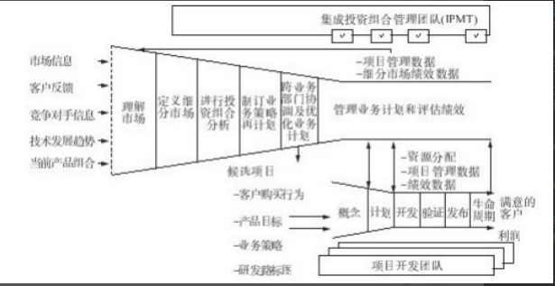
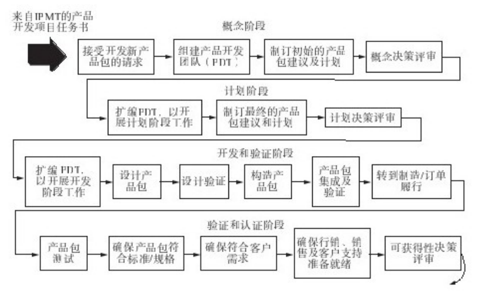
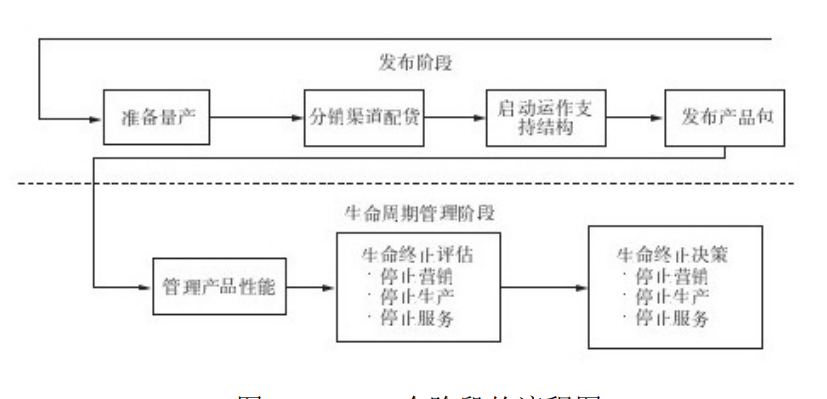

# 前言
目前呱呱呱引入了IPD 流程管理。现在产品需要结合经营诉求去做了。
## 资料
作者：郭富才
# 正文

## 1中国企业新产品开发存在的管理问题
单纯从章节命名而言，可以看出，作者是老手，同时描述了目前开发的现状。
> 一些中国企业：
>   没有时间把事情做正确，却总有时间一改再改。
>   相信结果，不相信过程管理决定产品质量和团队工作效率。----IBM咨询顾问
### 1.1重营销轻创新
企业经营需要两个轮子，一个是营销另外一个是研发创新。
### 1.2重产品实现，轻系统配合
新产品最终能否上市，不仅与产品的技术实现有关，起决定作用的是产品的市场分析是否充分，产品定位是否准确，营销是否有效等。新产品开发看起来是一个技术研发活动，
实质是产品经营活动。
### 1.3产品研发周期长，浪费大(时间和成本)，质量低（没有面对用户）
#### 1.3.1周期长，以销售为导向，浪费严重
研发浪费严重，研发项目立项评审后，再研发过程中缺少相应的业务决策评审机制，没有过滤，不能及时结束市场不成功的项目。
新产品磕磕绊绊地走向市场，最终死在力市场，达不到最初制定的销售目标。有限的研发资源由于管理不善，被大量的浪费在没有必要应对的项目上。
#### 1.3.2以牺牲质量赶进度
在APP上就是用户体验。
#### 1.3.3错误的研发管理理念 
没有好的研发管理观念和机制，就不会有持续创新机制。
* 没有产品规划，老板说什么就研发什么，没有面相市场。
* 相信市场机遇，不相信产品战略规划。研发是销售机会驱动型，而不是市场驱动型。抄袭在一定程度上可以解决诉求，但不是做大的因素。
* 研发人员工资高，具有优越感。产品和研发过分依赖研发人员而不是管理机制和团队。
* 进度优先，质量第二。
* 公司层面缺乏行之有效的绩效管理体系，没有人对新开发的产品市场成功负责。
### 1.4新产品项目管理中的困惑
* 如何指挥管理除研发部门之外的其他部门人员？
* 如何协调跨部门团队，如何与客户，高层，以及非研发部门沟通。
* 项目管理模式，项目成员要听从项目经理的安排，那么职能部门经理履行什么职责。
* PDT团队成员不愿意听项目经理指挥，而是听从部门经理指挥，如何解决。
* 项目奖分配机制，如何避免斤斤计较干的多，拿的少。
* 项目需求不明确，中途叠加功能导致延期怎么办.
* 项目成员不写文档，后期补足文档，是否正确，怎么解决。
* 为了保证质量，技术评审出工不出力，没有效果，如何解决。
* 管理体系和执行体系运行两层皮如何解决。
* 流程不少，文档化流程却被抛之脑后，如何保证研发流程得到执行的。
* 项目计划与实际情况不符，进度延期严重，为什么要提倡做项目计划。
* 计划做得不合理，导致执行和计划不符，如何使得计划合理。
## 2理性、平实的新产品开发管理观
单纯从章节上讲，这个是讲如何基于IPD去优化协作。
### 2.1新产品开发管理模式的变迁

#### 2.1.1 单打独斗的发明创造过程
这个是最初市场的创意阶段，市场小的时候，生产什么就消费什么。
#### 2.1.2 研发部门与其他部门串行协同作战
当市场扩大。该阶段新产品开发项目往往是由研发部门相关人员组成项目团队，团队试图负责新产品开发项目，企业大多数人认为，新产品项目的成败由研发部门决定。
以项目为基础并实行研发战略框架管理，将业务部门或公司作为研发专业人员的“外部客户”，力图增强业务部门与研发部门之间的沟通。这种
抛过墙式的研发管理模式，通过串行过程，采用从市场、研发、试产与生产、测试、销售再到服务的串行工作方式。项目
管理往往在研发体系内进行实践，把新产品开发仅仅当作是研发部门的事情，由于在新产品开发项目管理上各个部门目标不一致，导致各个部门沟通困难。

#### 2.1.3 跨部门团队工作机制阶段 
这一阶段研发管理的主要特征是，创建跨部门甚至跨公司的战略平衡研发组合。这种研发组合又产品开发经理以合作伙伴的方式确定。
从产品导向转变为客户导向，从质量，成本，交期管理模式转变为以质量，成本，交期与产品最终在市场闪成功为标志。

从管理的特点来看，市场战略，技术规划，产品开发，技术平台，跨部门团队为第三阶段研发管理的主要特征。
在产品开发团队中，业务部门和产品开发部门在产品开发中合作，提高了产品开发成功的概率，改阶段研发管理采用业务决策与技术评审分离的管理手段，让企业高层管理者产于研发管理，从项目的投资与公司整体决策进行控制。
高级管理者的作用很重要，只有高级管理者才有权调整资源，将不同部门的人员集合起来制作跨业务部门的产品和开发计划，也
只有高级管理者才能保证投入产品开发项目资金。

### 2.2 新产品开发是一项投资行为

要从投资的角度看待新产品开发，强调投资的理念（投资收益的角度）和方法来经营管理新产品开发。在新产品开发过程中，进行投资决策评审，做有价值的新产品，投资上市成功的新产品在进入开发团队之前就对市场机会进行过滤。

企业要建立新产品决策评审委员会，由高层组成的跨体系团队，他们关注市场管理团队提议的新产品机会，在新产品开发前期，通过决策评审活动及时过滤掉市场上不可能成功的产品。

企业的成长是靠投资保障的扩张策略，而不是靠压缩费用的收敛策略。

在新产品开发过程中，一把设置新产品开发任务决策评审点、概念决策评审点、计划决策评审点、新产品发布前决策评审点。子安这些决策点，公司高层管理团队可以及时过滤掉市场不成功的新产品开发项目，集中公司有限的研发资源，聚焦有潜力的新产品开发项目打歼灭战。

### 2.3 要开发的是新产品包，而不仅仅是新产品

企业的新产品开发，提倡的是新产品包开发，采用跨部门的团队方法，共同开发新的产品包。

一般已有上的新产品开发，往往关注新产品的功能和性能研发，站在客户的立场，客户关系的不仅仅是新产品功能和性能，还有价格、易用性、生命周期成本、可获得性等。

IPD 使用APPEALS 进行需求分析，确定客户购买准则并评估公司自生产品与竞争对手之间的差距，APPEALSE 8 大要素如下：

* 价格
* 可获得性
* 包装
* 性能
* 易用性
* 保用性
* 生命周期成本
* 社会影响 

新产品应该包含上述要素。

### 2.4 新产品要以市场为导向

> 注重客户体验，倾听客户的声音，认清客户的真正需求，以客户的需求为设立目标的依据，完全重客户的角度提升能力和素质，提升服务质量。这就是华为的核心价值观之一。

在充分的市场调研与分析的基础上，进行产品创新，在产品开发之前，需要实施市场环境分析，需求分析，竞争分析，市场定位等市场活动。在产品开发过程中，需要正确定义市场需求和产品概念，贯彻以客户为中心的设计理念。

开发的新产品要满足市场中一类客户的共性需求（细分市场需求），将这类细分市场中主要客户群的共性需求进行收集、分析，然后提炼共性需求，需要公司战略与市场部门做大量的市场调研与分析工作。

企业在过了生存期，需要研究客户群需求信息，包括短期需求和长期需求，明确需求和潜在的需求。

### 2.5 新产品需要多部门合作

新产品开发不仅是研发部门的工作，也是公司各个业务部门相互合作才能完成的工作，包括市场营销体系，研发体系，供应链体系，财务体系，质量管理体系，大家联合作战，在PDT经理带领下以团队形式共同工作。

### 2.6 基于矩阵管理模式进行新产品开发

如果新产品开发采用项目管理，就不可避免地采用矩阵式管理模式，在矩阵式管理模式下，PDT经理和智能部门经理共同考核项目核心成员。

矩阵式管理组织相对于职能式管理组织、项目式管理组织而言，具有不可多得的管理优势，他解决了职能式组织跨部门合作困难、对市场反应速度慢的问题，还解决了项目式管理组织资源不能重用、员工技能发展受到不利影响的问题。

但矩阵式管理组织给企业打来的最大的问题是管理复杂了，员工多个领导，要求企业管理人员提高管理技术水平，在矩阵模式下，员工的绩效管理是由职能经理和PDT经理共同评估的，不能由职能经理单方评估。

怎么保证矩阵式管理得到实施？

* 具有任职资格的项目经理，而不是项目协调员。
* 项目经理对来着不同部门的核心成员具有考核权利。
* 跨部门，全要素，端到端流程知道团队工作。

### 2.7 各业务部门并行作业进行新产品开发

并行工程避免了传统的串行研制模式带来的浪费问题，有效地缩减了研制周期，实现流程创新。并行工程强调新产品开发相关领域并行、协同设计。主张在新产品开发过程中，清除专业部门障碍及人为阻碍，从根本上摈弃串行模式的各种个缺陷。

并行工程，通过组建统一的集成化新产品开发团队，由集成化新产品开发团队负责整改产品的研发工作，团队的所有成员在统一的部署下，消除利益冲突，为共同的目标，一体化，协同、并行地开展新产品开发活动。

### 2.8 制定端到端的新产品开发项目书 

端到端的输入端是市场，输入端也是市场。端到端必须快捷、有效、流程顺畅。

由PDT经理带领跨部门的团队成员，从分析市场需求开始，为实现新产品开发的目标，把所有活动识别出来，做到滴水不漏，按照工作分解结构WBS 分层此制定出为实现新产品成功上市的全流程】全要素的完整计划。

### 2.9 新产品开发是PDT经理负责制

PDT 经理在业界经常被简称为LPDT，是新产品开发团队的领导。他将新产品开发业务计划提交给决策评审委员会，并争取获得项目所需的资源，对于新产品的业务成功负责，包括进度，质量，市场占有率，市场收益等。

## 3什么是 IPD
单纯从章节上讲，这个是讲IPD的工作流程。

### 3.1 IPD 管理模式

IPD作为一套企业产品经营管理体系包括以下核心思想：

* 新产品开发是投资行为，要从投资角度看待新产品开发，强调用投资的理念和方法管理新产品开发工作，主要是对新产品开发进行投资祝贺分析和管理。以及在新产品开发过程中进行投资决策评审，做有价值的产品、投资市场目标成功的新产品。
* 基于市场的创新，在充分的市场分析及规划的基础上，进行创新，在新产品进入开发流程前，需要实施市场管理流程，充分开展需求分析，竞争分析，市场定位等市场管理活动。在新产品开发过程中，需要正确定义市场需求和产品概念，贯彻以客户为中心的设计。
* 技术研发与新产品的开发相分离。技术研发与新产品开发分离，关键的数据和技术平台需要再新产品开发之前由专门的团队研发出来并实现技术转化，降低新产品开发的风险、缩短新产品开发周期，提高项目的可控性，有利于技术的突破和进展。
* 跨部门团队，实施大项目经理负责制，在公司层面跨部门团结负责新产品开发的决策、规划和新产品开发实施工作，依据跨部门流程，通过协同的方式开展工作，确保沟通、协调和决策点高效。
* 结构化的并行研发流程，建立结构合理、定义清楚、端到端跨部门研发流程。新产品开发的各项技术活动和职能活动并行作业，各方面的人员在一开始就参与进来，缩短研发周期，保证实现新产品质量和新产品业务目标。
* 基于矩阵模式建立公司绩效管理机制。由原来的职能模式下纵向单例绩效管理模式，转向基于纵横网络状绩效管理。在IPD模式下，团队工作模式是完成业务工作的主要方式，这个团队是由团队经理领导，各部门人员组建而成，团队经理具有绩效管理权利。

### 3.2 IPD 流程概述

IPD流程是一种增强业务投资效果的平衡方法，目的是让跨职能部门的投资委员会根据明确的市场需求，对有限的资源进行分配。IPD通过对产品开发中各种最佳实践进行集成，实现对产品开发工作的有效管理，其核心是跨职能部门团队和一套规范的、关注业务的流程。为了更顺利地运作，必须建流程归档‘实践并不断改进。另外，该流程应该是可以衡量的，以便判断IPD变革在公司的进展情况。

#### 3.2.1 IPD 概念阶段

概念阶段的目的是在市场、产品线战略和研发之间确定的产品包定义达成一致。下面是评估概念阶段的基本检查问题：

* 产品包的具体市场，客户需求是否明确
* 市场和研发部门是否同意对产品包的定义
* 产品包定义是否支持企业的产品线战略
* 产品包建议在技术上是否可行
* 是否明确了大致的技术路线
* 是否确定了成本目标
* 阶段退出和发布目标日期是否确定

#### 3.2.2 IPD 计划阶段

计划阶段的目的是对产品包做出明确的定义，包括对成本、销量、收入、发布日期的承诺。并由风险管理计划提供支持。下面是评估计划阶段的基本检查问题：

* 承诺是否满足具体市场、客户需求
* 项目的风险是否可以接收？市场数据是否以事实为基础
* 设计是否稳定、可实现
* 是否制定好了供应商选择计划，明确并就构建模块达成一致
* 所选构建模块的提前期能否支持项目进度
* 项目进度是否可行，一般可获得性日期能否达到
* 营销和销售部门是否同意销量和收入承诺
* 采购、制造和研发部门是否同意成本承诺
* 财务上能否实现利润目标 
* 研发是否对为直线可制造性和可服务性所需的设计更改做出承诺
* 制造、渠道和分销计划是否支持业务计划

#### 3.2.3 IPD 开发和验证阶段

开发阶段的目的是执行通过最终审批的最终产品包建议中所定义的产品设计，集成测试开发计划、制造计划和营销计划。下面是基本检查问题：

* 承诺计划是否支持具体的市场、客户需求
* 结束结果是否支持客户配置，是否实现类客制造性和可服务性需求
* 是否通过了初始产品技术评审
* 项目是否超出计划决策评审时承诺的范围
* 是否已经将初始市场发布方案分发下去并进行评审
* 制造计划是否支持一般可获得性试点和产品包生命周期销量

#### 3.2.3 IPD 验证和认证阶段

验证和认证阶段的目的是完成测试、验证产品、发布最终的规格和相关文档。以验证制造和市场的准备情况，下面是基本检查问题：

* 测试结果是否支持客户配置
* 项目风险是否可以接受
* 项目是否符合计划决策评审点做出的财务承诺
* 是否对最终的价格进行了审批，是否发布了定价批准书
* 营销和销售的交付件是否发送到各销售处
* 是否完成了对产品讲师的培训
* 是否完成了发布前的内部公开和bata测试
* 是否开启了订货窗口，订单履行系统是否已经准备就绪
* 支持量产的制造工艺是否可操作
* 供应商是否承诺持续供货
* 是否通过验证技术评审

#### 3.2.3 IPD 发布阶段

发布阶段的目的是使用产品时按时、按量到达一般可获得性GA评审点，并使产品包过度到正常的产品生命周期管理，下面是发布阶段的基本检查问题：

* 项目进展是否支持一般可获得性GA
* 是否已经发出来最终营销和销售交付件
* 一般可获得性的产量是否可以达到
* 放量生产的产量是否与订单相匹配
* 是否对验证和认证阶段所有的基本问题都做出了答复

#### 3.2.3 IPD 生命周期管理

IPD生命周期管理阶段是从一般可获得性产品生命周期终止的过程管理，下面是生命周期管理阶段的基本检查问题：

* 是否收集了相关信息以支持何时停止生产的决策
* 是否收集了相关信息以支持何时停止营销的策略
* 是否收集了相关信息以支持何时停止服务的决策

IPD流程采用了一种分阶段的开发方法，将活动，任务和子流程组织起来，产品开发团队PDT将它用来实现项目的目标，这种方法有主意PDT成员以一致的方式与投资决策评审委员会协调合作，通过对所有项目设置一致的期望，投资决策评审委员会在不影响具体的产品包执行效果的情况下，可以对本业务领域的开发项目进行管理。

决策评审点除了建立可衡量的界限对项目进展进行监控外，还可以使投资决策评审委员会向PDT提供一致的指导。PDT要为决策评审准备材料，给投资决策评审委员会提供必要的信息，使他们能够快速地做出继续，终止，重新确定方向的决策。

如果投资决策评审委员会做出继续的决策，就意味着PDT可以进入开发的下一个阶段，终止的决策意味着项目被取消，所有与项目相关的工作必须停止，项目组成员需要被重新分配。重新确定方向的决策由于管道约束、竞争压力、市场需求或其他原因，要求PDT关注比原来更大或更小的项目范围。

### 3.3 IPD团队概述

项目成功的关键是使用了正式的跨职能部门团队结构，各主要职能部门派代表到团队，包含开发，市场，生产，采购，财务，制造，技术支援等部门的成员，人员层次和工作重点都有所不同。

IPD中，有两类跨部门团队，一是集成祝贺管理团队IPMT，属于高层管理决策层，也称为决策评审委员会，它由公司决策层人员组成，其职责是确保公司在市场上有正确的产品定位，保证项目、保证资源、控制投资。二是产品开发团队PDT，执行项目计划并保证及时完成，确保小组按照计划几时地将产品投放到市场。

跨职能部门的团队将重心从单个职能部门（如市场或开发）变成产品管理模式或项目管理模式，这种方式被称为基于项目的业务模型，团队成员将本部门的专业只是带到了项目组，而他们所代表的职能领域成为支撑项目组工作的中流砥柱。

在跨职能部门的团队设置中，所有团队成员根据某个项目合同，项目进度和绩效指标，对共同的目标做出承诺，PDT经理会与各位PDT代表的部门主管沟通项目的目标，把这些内容加进PDT代表的个人业务承诺PBC中，个人的成功与团队的成功是联系在一起的，团队成员共同努力是保证跨职能部门团队顺利和成功运作的关键。

这里的团队。组成最合理的人数是8到12人，最多25人，团队成员应该具备良好的技能-技术或职能领域的专门知识，解决问题和进行决策点技能、处理人际问题的技能，富有冒险精神，能够提出建设性批评意见，客观的处理问题，能主动倾听问题并愿意提供支撑。

跨职能部门团队的考核是单独进行的，所有团队成员针对共同的目的与绩效目标做出承诺，公司管理者在公司绩效要求范围内，确定他们的权利范围，提供指导。这种方法是团队成员之间活动交往的契约，这个活动契约与他们的目的相联系，指导他们一什么样的方式一起工作，团队成员还要对彼此负责，这样会使他们自然地成为伙伴，共同确定团队的目的，绩效目标与方法，相互负责的结果就是团队成员间的互相承诺、彼此信任和良好的效果。

放权给这个团队，让他们成为主人，向他们指明决策点方向，免去过去冗杂的评审流程，能够使决策的效果得到改善。最后，这种团队结构在财务评估，产品质量，产品上市时间和成本都能取得更好的效果，这种团队结构可以保证所有的观点在团队中都能体现，而且团队是大家共同确定的方向和做出的决策进行承诺。

投资决策评审委员会，PDT职能部门团队共同组成了公司新产品开发相关的团队组织结构，保证集成产品开发IPD流程的有效运作。

### 3.4 中国企业新产品开发需要IPD  

管理模式并不重要，关键在于采用系统性的解决方案。

## 4新产品开发的决策评审
单纯从章节上看，这个是在建立流程去约束项目上的投资。对公司来说，项目选择是一项必须要做到工作，其目的是要把公司稀缺的研发资源用到刀刃上，用在值得做到项目上，采用强压原则，可以把研发资源很好地集中起来，最终加快研发项目的进程，提高产品质量。
### 4.1 新产品开发需要投资决策评审

管理成果的企业一般都会建立产品决策评审委员会，这是由公司高层管理者组建的一个跨体系团队，对公司的新产品开发机会进行决策评审，或者授权产品管理团队对较小的投资机会进行评审，在新产品开发流程的前端设置正式的决策评审点，采用这种业务决策评审方式就像漏斗过滤，漏斗上面是源源不断的需求机会，销售人员，服务人员，市场营销人员等得到市场机会，都可以向漏斗的前端反馈需求，我们在一开始就要过滤掉那些没有市场前景的项目，终止市场机会差的项目，公司研发资源响应市场机会相对较好的项目，避免出现研发任务和资源严重不匹配的现象。

在研发流程的早期阶段识别出这些错误项目的能力是改善新产品获利的关键。

### 4.2 建立投资决策委员会

投资决策评审委员会是由公司各个体系的高层管理者组成，其职责为分配资源给符合公司发展战略及预期高收益的项目，通过或否决新产品开发项目业务计划、按计划给通过对项目投入相应的资源。

投资决策评审委员会要在一些特定的决策评审对PDT的工作进行审查，并做出项目继续，项目终止，项目改向的决策。在各决策评审点之间的时间内，投资决策评审委员会授权PDT管理开发项目。

与投资决策评审委员会签订合同的主体PDT组织，对PDT经理及核心组成员来说，在新产品开发的概念阶段，要制定出项目完整的产品业务计划，在计划决策评审时，要与投资决策评审委员会签订新产品开发项目合同书，投资决策评审委员会会按照合同对PDT进行管理。

投资决策评审委员会秘书机构为产品管理办公室，投资决策评审委员会秘书在投资决策工作中协助投资决策评审委员会履行有关职责。

#### 4.2.1 投资决策评审委员会及其职责

投资决策评审委员会是IPD体系中产品投资决策和评审机构，负责制定公司总的使命，愿景，战略方向。并推送研发，市场，销售，服务和供应链等部门全流程的协作，他是一个高层跨部门团队，成员包括各个部门的最高主管。投资决策评审委员会职责体现在以下几个方面。

* 公司总体管理职责
* 明确公司的使命，目标，战略和业务计划并向各职能体系发布
* 审批公司技术，产品路标，确保与公司战略目标保持一致。
* 审批重要的技术，产品项目投资
* 新产品开发管理职责
* 激励和管理PDT的绩效与行为
* 根据在决策评审点达成一致的意见，把各种资源分配给PDT
* 新产品开发项目任务书的审批
* PDT的决策评审：继续，终止，改向决策
* 审批PDT变更计划

投资决策评审委员会团队包括各个职能部门的最高领导，他们代表各个职能领域，这样的团队可以解决新产品开发的任何管理问题和决策问题。也就是说，这个团队解决不了的管理问题，肯定也称为新产品开发团队的障碍。

高层团队之间能够配合互补，必须实现壹加壹大于贰的效果，投资决策评审委员会团队要表现出强大的凝聚力，否则高层冲突必然在下级员工中表现出来，降低开发团队的效率。

做出决策时，要综合各方面的意见，考虑各种决策对象，决策因素之间的相互关系，发挥集体决策的优势。

#### 4.2.2 投资决策评审委员会如何高效运作

* 企业最高领导的全力支持
* 不能急于求成
* 处理好新旧体系之间的关系
* 构建民主的决策机制
* 投资决策评审委员会成员要深刻理解IPD 体系
* 做好会议管理
  * 会议日历
  * 会前充分准备和沟通
  * 会议跟踪

### 4.3 新产品开发过程中投资决策管理

#### 4.3.1 新产品开发投资决策点概述

新产品开发项目包括6个节点，概念阶段，计划阶段，开发阶段，验证阶段，发布阶段，生命周管理阶段。按阶段子安概念，计划，发布，生命周期终止4个决策评审点及合同执行过程中，波动幅度超出合同规定，提出请投资决策评审委员会进行例外审批时，要用到决策评审操作制度和流程。

#### 4.3.2 IPD中的决策评审

决策评审是投资决策评审委员会管理产品投资的重要手段，在决策评审中，投资决策评审委员会始终站在投资商的角度进行评审。集成新产品开发IPD流程包括了4个主要的决策评审点，概念决策评审，计划决策评审，可获得性评审，发布前决策评审，生命周期终止决策评审。决策评审点使投资决策评审委员会为PDT提供了一致的方向也设置了监控项目进展的测评点及边界范围，在各个决策评审点上，投资决策评审委员会的角色都有明确的定义，要考虑以下重点：

* 确保新产品开发团队PDT得到使项目成功所必需的资源
* 批准或否决PDT核心组及外围成员的组成方式及人员构成
* 确保产品符合公司的业务战略、目标及核心能力
* 做出继续或终止的决策，将资源用于关键的项目

概念决策评审阶段，PDT将给出：针对拟订目标细分市场存在的机会分析，目标客户群，拟研发的产品描述，成本及风险估计，出售销量预测及初始财务评估。若初始的业务计划得到批准，投资决策评审委员会将做出下一阶段开始前所需要的资源承诺，项目进入计划阶段。

计划决策评审阶段，最终的业务计划以初始的业务计划为基础，提供更多的细节内容及对计划的承诺，若业务计划获得批准，PDT与投资决策委员会签订合同，合同中列出允许的偏差，项目进入研发阶段，合同代表了投资决策评审委员会会做出坚实的承诺，既每个部门都将支持项目，以及给PDT提供必要的资源，PDT承诺按合同要求实现项目的交付目标。

可获得性评审和发布前的决策评审。可获得性决策评审在任何主要的发布费用投入之前进行，目的是证实在计划阶段制定的业务计划中的预计和假设，并评估产品发布前PDT的准备情况。在可获得性决策评审会议上，PDT正式向投资决策评审委员会提出建议，由投资决策评审委员会做出继续终止决策，若产品获得批准，则由投资决策评审委员会分配资金，项目进入发布阶段。

生命周期终止决策评审，生命周期阶段有3个检查点，停止生产，停止销售，停止服务与支持。

* 停止生产 主要是对产品的生产进行监控，根据主要指标对产品表现进行评估，结果是把备件转给技术支援，执行停止生产活动决策。
* 停止销售 主要是对于销售情况和持续获利能力评估，结果是发布产品退出市场，停止销售活动。
* 停止服务与支持 主要是对服务与支持的表现进行评估，停止服务与支持的结果是对外公布停止服务与支持，清除基础设施。

临时性决策评审源自开发过程中出现的事件，如项目合同书关键内容改变或没有预料到市场或竞争情况的变化。PDT要对形式进行分析，向投资决策评审委员会报告并给出行动建议，投资决策评审委员会将在决策评审会上做出继续、终止的决策。

## 5建立市场导向的开发原则
单纯从章节名上看，还是处理约束产品开发流程。
### 5.1 抛弃唯技术至上的情绪

新产品从市场，技术，企业3个角度定义，可以分为6种：

* 全新产品。是指应用新原理，新技术，新材料，具有新结构，新功能点产品，该产品在全世界首先开发，能够开创全新的市场。
* 降低成本型新产品。保持原有功能不变的新产品
* 重新定位型新产品。老产品进入新市场
* 改进型新产品。在老产品上改进。
* 形成系列型新产品。
* 模仿型新产品 

百分之九十满足人类需求促进社会进步的产品并部署全新的产品，而是改进型，模仿型，系列型产品。

### 5.2 落实新产品开发的市场导向

IPD体系建设不仅能帮助

### 5.3 系统手机客户需求
### 5.4 销售导向VS市场导向
### 5.5 以市场部门为主制定新产品开发任务书
### 5.6 制定新产品包开发任务书
### 5.7 新产品价格与设计成本管理 
#### 5.7.1 IPD 管理模式下 新产品定价策略 
#### 5.7.2 按价格牵引成本法设计新产品成本 

## 6如何进行跨部门工作
单纯从章节命名上看，主要是动态开发团队的创建，及其人员职责明确。
### 6.1 用项目团队拆掉部门的墙
### 6.1 IBM经验 矩阵式组织 
### 6.1 如何建立跨部门的开发团队
#### 6.1.1 核心小组法
#### 6.1.2 PDT团队职责
#### 6.1.3 PDT经理职责
#### 6.1.4 PDT核心和扩展组成员职责
#### 6.1.5 职能部门团队职责

## 7建立并作业的新产品开发流程
这个是开发流程的建立。
### 7.1 正确理解IPD之结构化流程
### 7.2 建立全要素的IPD流程
#### 7.2.1 企业各自为政的现象严重
#### 7.2.2 全流程管理
#### 7.2.2 如何建立全流程意识
### 7.3 如何设计卓越的IPD流程
### 7.3.1 公司级3大主流程
### 7.3.2 如何建好3大主流程
### 7.4 防止流程成为摆设 

## 8 IPD落地实践的关键 
描述IPD对现状的影响。
### 8.1 IPD咨询：企业的好帮手
#### 8.1.1 IPD咨询的3个阶段
#### 8.1.2 IPD咨询带来的效果
### 8.2 开发的心态
### 8.3 充分准备 营造氛围
#### 8.3.1 IPD 变革涉及的方面 
#### 8.3.2 准备IPD变革，如何扩大影响力
### 8.4 IPD变革 企业一把手工程
### 8.5 寻找得力的甲乙双方咨询项目经理
#### 8.5.1寻找得力的咨询放项目经理 
#### 8.5.2 寻找得力的甲方项目经理
### 8.6 成立IPD推进组，持续优化

## 9中国企业IPD实施案例
### 9.1 华为实施IPD案例
### 9.2 IPD在卷烟工业案例
### 9.3 欧帝电器公司产品创新困局
### 9.4 三维通信IPD咨询效果
### 9.5 医疗公司失败案例 

## 10IPD运行过程中的疑惑解答 
### 10.1 企业为什么需要IPD和新的投资管理方法
### 10.2 业务流程重整与ITem实施谁先谁后
### 10.3 新产品开发周IPD流程用的时间是否太长
### 10.4 IPD要在速度和质量之间做取舍？
### 10.5 IPD是否影响新产品投资决策速度
### 10.6 PDT总量级团队是否削弱了职能部门的影响力
### 10.7 投资决策评审委员会要考核PDT吗
### 10.8 PDT 经理往往是技术最强的人，这样不好，为什么
### 10.9 PDT团队需要的资源无法到位，如何解决
### 10.10 如何把握新产品开发任务书决策评审的重点
### 10.11 为什么投资决策评审委员会会议要例行化，按日历运作
### 10.12 IPD对员工能力提出了哪些新的要求
### 10.13 中小企业是否有必要实施IPD 

# 总结
单纯从1级目录上讲，这个调调是科普书籍，包含一些简单的流程控制。
